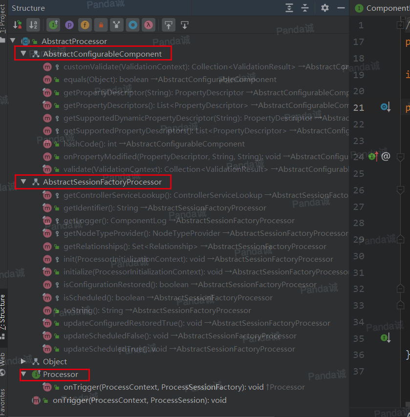

在使用NIFI的过程中，我们经常需要创建自定义Processor，而通常情况下，我们只需要在覆盖onTrigger方法中实现我们的需求即可，但有时候是不够的，这里我们就来了解一下Processor的那些方法。

## onTrigger 

我们自定义Processor时最常用的是继承AbstractProcessor，首先看一下AbstractProcessor的继承关系:



```java
public abstract class AbstractProcessor extends AbstractSessionFactoryProcessor {

    // 控制器是先调用的这个onTrigger方法，然后再调用用户自定义实现的(下面的)onTrigger
    @Override
    public final void onTrigger(final ProcessContext context, final ProcessSessionFactory sessionFactory) throws ProcessException {
        final ProcessSession session = sessionFactory.createSession();
        try {
            onTrigger(context, session);
            session.commit();
        } catch (final Throwable t) {
            session.rollback(true);
            throw t;
        }
    }
    //这个onTrigger方法就是我们最常见的 需要去实现功能逻辑的了
    public abstract void onTrigger(final ProcessContext context, final ProcessSession session) throws ProcessException;
}
```
那么onTrigger方法是怎么被调用的呢？这个就源码而言就忒复杂了，而且偏离主题，这里就先不探究了。

## UI画布上创建一个Processor的过程

我们先看在画布上拖拽出一个新的Processor会发什么。

在浏览器中创建一个Processor我们可以看到调用的API是

源码(部分省略)ProcessGroupResource.java如下：
```java 
    /**
     * 创建一个新的processor.
     *
     * @param httpServletRequest request
     * @param groupId            The group id
     * @param requestProcessorEntity    A processorEntity.
     * @return A processorEntity.
     */
    @POST
    ...
    public Response createProcessor(
            @Context final HttpServletRequest httpServletRequest,
            @ApiParam(
                    value = "The process group id.",
                    required = true
            )
            @PathParam("id") final String groupId,
            @ApiParam(
                    value = "The processor configuration details.",
                    required = true
            ) final ProcessorEntity requestProcessorEntity) {
        final ProcessorDTO requestProcessor = requestProcessorEntity.getComponent();
        ...省略校验逻辑
        //先为Processor生成一个坐标
        final PositionDTO proposedPosition = requestProcessor.getPosition();
        ...省略坐标校验逻辑
        ...省略groupId校验逻辑
        requestProcessor.setParentGroupId(groupId);
        //集群下 复制操作请求
        if (isReplicateRequest()) {
            return replicate(HttpMethod.POST, requestProcessorEntity);
        } else if (isDisconnectedFromCluster()) {
            //集群断开的校验处理
            verifyDisconnectedNodeModification(requestProcessorEntity.isDisconnectedNodeAcknowledged());
        }
        //通过serviceFacade服务执行操作。
        return withWriteLock(
                serviceFacade,//nifi-web-api-context.xml配置文件中的StandardNiFiServiceFacade，注入到ProcessGroupResource中
                requestProcessorEntity,//POST请求传入的数据
                lookup -> {//在serviceFacade.authorizeAccess()中使用，验证当前用户创建组件的权限
                    final NiFiUser user = NiFiUserUtils.getNiFiUser();
                    final Authorizable processGroup = lookup.getProcessGroup(groupId).getAuthorizable();
                    processGroup.authorize(authorizer, RequestAction.WRITE, user);
                    ComponentAuthorizable authorizable = null;
                    try {
                        authorizable = lookup.getConfigurableComponent(requestProcessor.getType(), requestProcessor.getBundle());
                        if (authorizable.isRestricted()) {
                            authorizeRestrictions(authorizer, authorizable);
                        }
                        final ProcessorConfigDTO config = requestProcessor.getConfig();
                        if (config != null && config.getProperties() != null) {
                            AuthorizeControllerServiceReference.authorizeControllerServiceReferences(config.getProperties(), authorizable, authorizer, lookup);
                        }
                    } finally {
                        if (authorizable != null) {
                            authorizable.cleanUpResources();
                        }
                    }
                },
                () -> serviceFacade.verifyCreateProcessor(requestProcessor),
                processorEntity -> {
                    final ProcessorDTO processor = processorEntity.getComponent();
                    // 设置ID
                    processor.setId(generateUuid());
                    // 创建新的processor
                    final Revision revision = getRevision(processorEntity, processor.getId());
                    final ProcessorEntity entity = serviceFacade.createProcessor(revision, groupId, processor);
                    processorResource.populateRemainingProcessorEntityContent(entity);
                    // 返回201
                    String uri = entity.getUri();
                    return generateCreatedResponse(URI.create(uri), entity).build();
                }
        );
    }
```
核心代码是**serviceFacade.createProcessor(revision, groupId, processor);**，接下来看StandardNiFiServiceFacade中的createProcessor方法
```java
    @Override
    public ProcessorEntity createProcessor(final Revision revision, final String groupId, final ProcessorDTO processorDTO) {
        final RevisionUpdate<ProcessorDTO> snapshot = createComponent(
                revision,
                processorDTO,
                // 核心创建Processor在这 processorDAO由nifi-web-api-context.xml文件中配置注入
                () -> processorDAO.createProcessor(groupId, processorDTO),
                processor -> {
                    awaitValidationCompletion(processor);
                    return dtoFactory.createProcessorDto(processor);
                });
        ...其他代码
        return entityFactory.createProcessorEntity(snapshot.getComponent(), dtoFactory.createRevisionDTO(snapshot.getLastModification()), permissions, operatePermissions, status, bulletinEntities);
    }
```
接着StandardProcessorDAO.createProcessor方法
```java
@Override
    public ProcessorNode createProcessor(final String groupId, ProcessorDTO processorDTO) {
        ...省略校验逻辑
        //获取Processor的Group
        ProcessGroup group = locateProcessGroup(flowController, groupId);
        try {
            // 尝试新建Processor
            ProcessorNode processor = flowController.createProcessor(processorDTO.getType(), processorDTO.getId(), BundleUtils.getBundle(processorDTO.getType(), processorDTO.getBundle()));
            // 在添加到group之前校验是否可以更新
            verifyUpdate(processor, processorDTO);
            // 将Processor添加到Group中
            group.addProcessor(processor);
            // 配置我们新建的processor
            configureProcessor(processor, processorDTO);
            return processor;
        } ...异常处理代码
    }
```
代码跟到这里 **flowController.createProcessor(...)**
flowController.java
```java
public ProcessorNode createProcessor(final String type, final String id, final BundleCoordinate coordinate) throws ProcessorInstantiationException {
        return createProcessor(type, id, coordinate, true);
    }
```
```java
public ProcessorNode createProcessor(final String type, String id, final BundleCoordinate coordinate, final boolean firstTimeAdded) throws ProcessorInstantiationException {
        return createProcessor(type, id, coordinate, Collections.emptySet(), firstTimeAdded, true);
    }
```
```java
public ProcessorNode createProcessor(final String type, String id, final BundleCoordinate coordinate, final Set<URL> additionalUrls,
                                         final boolean firstTimeAdded, final boolean registerLogObserver) throws ProcessorInstantiationException {
        ...
        try {
            processor = instantiateProcessor(type, id, coordinate, additionalUrls);
            creationSuccessful = true;
        } catch (final ProcessorInstantiationException pie) {
            ...
```
```java
private LoggableComponent<Processor> instantiateProcessor(final String type, final String identifier, final BundleCoordinate bundleCoordinate, final Set<URL> additionalUrls)
            throws ProcessorInstantiationException {
        final Bundle processorBundle = ExtensionManager.getBundle(bundleCoordinate);
        ...
        final ClassLoader ctxClassLoader = Thread.currentThread().getContextClassLoader();
        try {
            final ClassLoader detectedClassLoaderForInstance = ExtensionManager.createInstanceClassLoader(type, identifier, processorBundle, additionalUrls);
            final Class<?> rawClass = Class.forName(type, true, detectedClassLoaderForInstance);
            Thread.currentThread().setContextClassLoader(detectedClassLoaderForInstance);
            //示例实现了Processor接口的名字为type的类
            final Class<? extends Processor> processorClass = rawClass.asSubclass(Processor.class);
            final Processor processor = processorClass.newInstance();
            final ComponentLog componentLogger = new SimpleProcessLogger(identifier, processor);
            final TerminationAwareLogger terminationAwareLogger = new TerminationAwareLogger(componentLogger);
            final ProcessorInitializationContext ctx = new StandardProcessorInitializationContext(identifier, terminationAwareLogger, this, this, nifiProperties);
            //创建完Processor后先初始化
            processor.initialize(ctx);

            LogRepositoryFactory.getRepository(identifier).setLogger(terminationAwareLogger);

            return new LoggableComponent<>(processor, bundleCoordinate, terminationAwareLogger);
        } catch (final Throwable t) {
        ...
```

## initialize

initialize是Processor接口定义的一个方法，顾名思义初始化，在FlowController中实例化Processor后就调用，旨在为处理器提供对可能在整个处理器生命周期中使用的对象的访问，其实现在AbstractSessionFactoryProcessor中:
```java
    @Override
    public final void initialize(final ProcessorInitializationContext context) {
        identifier = context.getIdentifier();
        logger = context.getLogger();
        serviceLookup = context.getControllerServiceLookup();
        nodeTypeProvider = context.getNodeTypeProvider();
        init(context);

        description = getClass().getSimpleName() + "[id=" + identifier + "]";
    }
```
我们可以看到，这个方法在进行了一番固定工作之外，还调用了一个 init()方法

## init
AbstractSessionFactoryProcessor源码中init方法是留给子类去覆盖实现的，所以，我们如果有一些工作需要在Processor刚刚实例化完就要做的，代码就在init里添加，比如说给组件添加配置属性和路由关系。
```java
    protected void init(final ProcessorInitializationContext context) {
        // Provided for subclasses to override
    }
```
举个例子，GenerateFlowFile组件中的init:
```java
    @Override
    protected void init(final ProcessorInitializationContext context) {
        //设置组件的属性(我们在UI一个组件上看到的，配置的项目)
        final List<PropertyDescriptor> descriptors = new ArrayList<>();
        descriptors.add(FILE_SIZE);
        descriptors.add(BATCH_SIZE);
        descriptors.add(DATA_FORMAT);
        descriptors.add(UNIQUE_FLOWFILES);
        descriptors.add(CUSTOM_TEXT);
        descriptors.add(CHARSET);
        this.descriptors = Collections.unmodifiableList(descriptors);
        //设置组件路由关系 这里只有一个成功
        final Set<Relationship> relationships = new HashSet<>();
        relationships.add(SUCCESS);
        this.relationships = Collections.unmodifiableSet(relationships);
    }
```
一般而言，组件的属性和路由关系都是在这个init方法中配置的(当然了，在组建类的构造函数中完成效果也是一样的)，相应的，有配置set也就有get,
    getSupportedPropertyDescriptors 
    getRelationships 
这两个方法很简单的，之前返回你定义好的relationships和descriptors句柄就可以了
```java
    @Override
    public Set<Relationship> getRelationships() {
        return relationships;
    }
    @Override
    protected List<PropertyDescriptor> getSupportedPropertyDescriptors() {
        return descriptors;
    }
```
这里提到了getSupportedPropertyDescriptors固定属性，那么紧接着应该就是动态属性了
## getSupportedDynamicPropertyDescriptor
这个方法定义在AbstractProcessor的父类AbstractSessionFactoryProcessor的父类AbstractConfigurableComponent中
```java
    protected PropertyDescriptor getSupportedDynamicPropertyDescriptor(final String propertyDescriptorName) {
        return null;
    }
```
子类覆盖实现getSupportedDynamicPropertyDescriptor可以实现动态属性的功能，比如GenerateFlowFile组件
```java
    @Override
    protected PropertyDescriptor getSupportedDynamicPropertyDescriptor(final String propertyDescriptorName) {
        return new PropertyDescriptor.Builder()
            .name(propertyDescriptorName)
            .required(false)
            .addValidator(StandardValidators.createAttributeExpressionLanguageValidator(AttributeExpression.ResultType.STRING, true))
            .addValidator(StandardValidators.ATTRIBUTE_KEY_PROPERTY_NAME_VALIDATOR)
            .expressionLanguageSupported(ExpressionLanguageScope.VARIABLE_REGISTRY)
            .dynamic(true)
            .build();
    }
```
我们知道在组件(Processor，ControllerService，ReportingTask)的属性配置中右上角会有一个加号，点击加号会增加一行配置

首先，每个组件都是支持这个自定义添加属性，我们都是能够点击加号增加一行的，只是有没有意义而已。我们手动点击加号填写的东西都会传到后台，由后台逻辑来判断它有没有意义

比如我们点击加号后点击apply，会先发出一个Get请求,这个过程会有调用getSupportedDynamicPropertyDescriptor()方法

返回的json
```json
{
    "propertyDescriptor": {
        "name": "11",
        "displayName": "11",
        "description": "",
        "required": false,
        "sensitive": false,
        "dynamic": true,
        "supportsEl": false,
        "expressionLanguageScope": "Not Supported"
    }
}
```
然后前端带着我们get得到的数据组装后才put请求更新此组件信息

最后是否有意思比如GenerateFlowFile组件onTrigger方法中:
```java
    @Override
    public void onTrigger(final ProcessContext context, final ProcessSession session) {
        ...准备flowfile内容代码
        //在调用context.getProperties()拿到所有属性(原本有的和用户自定义添加的)
        Map<PropertyDescriptor, String> processorProperties = context.getProperties();
        Map<String, String> generatedAttributes = new HashMap<String, String>();
        for (final Map.Entry<PropertyDescriptor, String> entry : processorProperties.entrySet()) {
            PropertyDescriptor property = entry.getKey();
            //如果是自定义动态属性，就添加到flowfile属性中  那么这个组件配置动态自定义属性就是有意义的
            if (property.isDynamic() && property.isExpressionLanguageSupported()) {
                String dynamicValue = context.getProperty(property).evaluateAttributeExpressions().getValue();
                generatedAttributes.put(property.getName(), dynamicValue);
            }
        }
        ...输出流内容代码
        }
    }
```
## onScheduled
在[nifi注解](./010-nifi注解.md)一文中我们提到了@OnScheduled，它的意思是指示在计划运行组件时调用此方法。它将在任何对“onTrigger”的调用之前被调用，并且将在计划运行组件时被调用一次。

onScheduled方法一般都是被注解@onScheduled标注了的，没有这样的需求的组件可以不用写。

举个例子GenerateFlowFile组件中的onScheduled
```java
    @OnScheduled
    public void onScheduled(final ProcessContext context) {
        //在调用onTrigger方法之前先判断UNIQUE_FLOWFILES配置是否为true，如果为true就设置data为null
        if (context.getProperty(UNIQUE_FLOWFILES).asBoolean()) {
            this.data.set(null);
        } else if(!context.getProperty(CUSTOM_TEXT).isSet()) {
            this.data.set(generateData(context));
        }
    }
```

## stop shutdown

在[nifi注解](./010-nifi注解.md)一文中我们提到了@OnStopped，指示当组件不再计划运行时应调用某个方法。每次组件停止时，都将调用标记了此注释的方法，并且仅在从onTrigger方法返回最后一个线程后才调用此方法

比如GeneralTableFetch组建中
```java
@OnStopped
    public void stop() {
        // 如果属性发生更改，则重置列类型映射,因为Stop后才能修改配置，修改了配置那么代码中上次运行的一些缓存什么的信息可能就不对了
        setupComplete.set(false);
    }
```
总而言之，用@OnStopped注解标注的stop，shutdown等等方法，就是在停止组件后需要运行的代码逻辑，比如释放、重置等等

## setup

里面通常放一些配置类代码，比如每次调度对state的操作

## customValidate

这个也简单说一下，我们在编写Processor properties(supported和dynamic properties)的时候，会为properties也添加一些属性，比如说默认值、是否必须、校验器等等。架构提供了默认的validate方法去校验组件的这些properties是否合规，如果用户需要在常规检验外还需要自己特殊的校验，就要在Processor覆盖实现customValidate方法了，当然customValidate只有在常规检验成功后才会被调用


