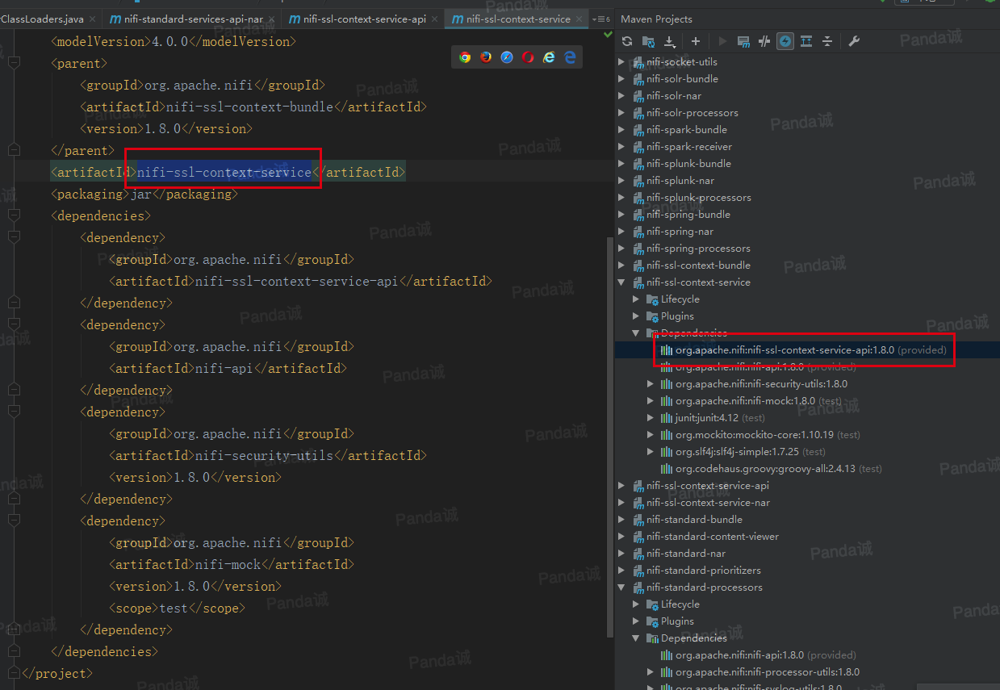
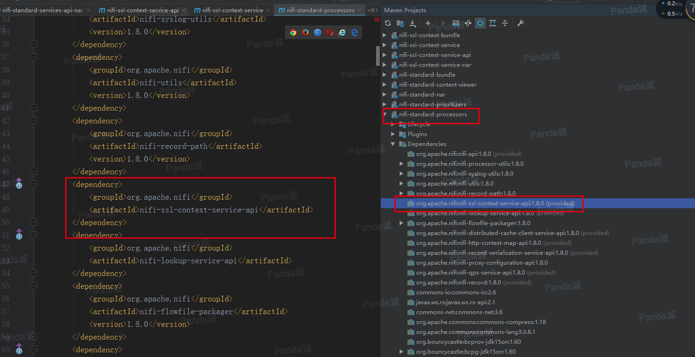
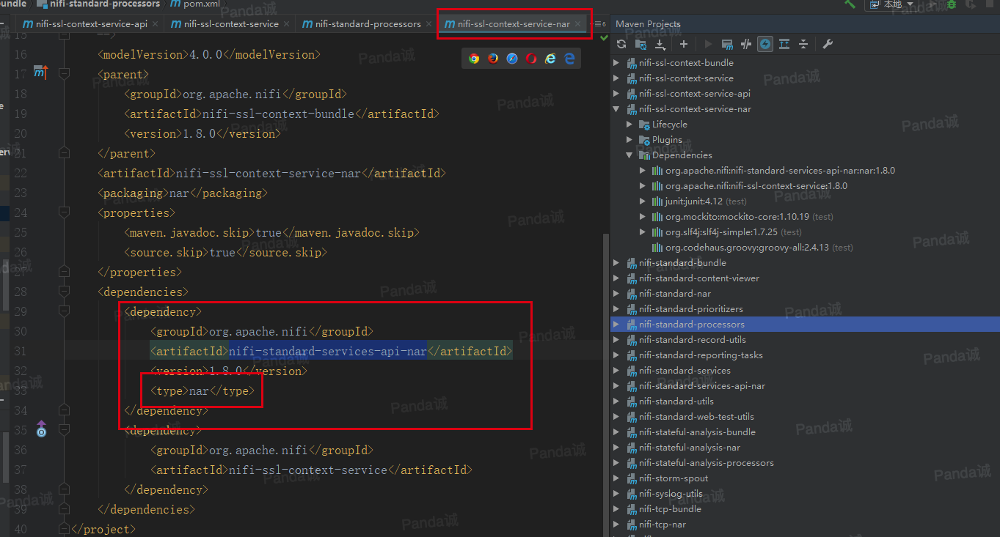

## 本文主要的研究内容

在之前的官方文档Apache NiFi Overview一章我们有看到：对于任何基于组件的系统，涉及依赖的问题时常发生。NiFi通过提供自定义类加载器来解决这个问题，确保每个扩展包都暴露在一组非常有限的依赖中。因此，构建扩展包的时候不必担心它们是否可能与另一个扩展包冲突。这些扩展包的概念称为“NiFi Archives”，在Developer’s Guide中有更详细的讨论。

那么NIFI是怎样为每一个扩展包定义类加载器，以及这些扩展包的加载顺序是如何决定和实现的？

<!-- more -->

## 源码解读

首先，我们启动的是RunNiFi，而在RunNiFi.lava的main()方法中，又启动了NIFI进程（只摘取了核心代码）：
```java
public static void main(String[] args) throws IOException, InterruptedException {
        ...
        switch (cmd.toLowerCase()) {
            case "start":
                runNiFi.start();
                break;
            case "run":
                runNiFi.start();
                break;
            case "stop":
                runNiFi.stop();
                break;
            case "status":
                exitStatus = runNiFi.status();
                break;
            case "restart":
                runNiFi.stop();
                runNiFi.start();
                break;
            case "dump":
                runNiFi.dump(dumpFile);
                break;
            case "env":
                runNiFi.env();
                break;
        }
        if (exitStatus != null) {
            System.exit(exitStatus);
        }
    }

```
runNiFi.start()中（只摘取了核心代码）：
```java
public void start() throws IOException, InterruptedException {
        ...
        //用于启动系统进程
        final ProcessBuilder builder = new ProcessBuilder();
        ...
        //builder 命令 ：cmd
        final String classPath = classPathBuilder.toString();
        String javaCmd = props.get("java");
        if (javaCmd == null) {
            javaCmd = DEFAULT_JAVA_CMD;
        }
        if (javaCmd.equals(DEFAULT_JAVA_CMD)) {
            String javaHome = System.getenv("JAVA_HOME");
            if (javaHome != null) {
                String fileExtension = isWindows() ? ".exe" : "";
                File javaFile = new File(javaHome + File.separatorChar + "bin"
                        + File.separatorChar + "java" + fileExtension);
                if (javaFile.exists() && javaFile.canExecute()) {
                    javaCmd = javaFile.getAbsolutePath();
                }
            }
        }
        ...
        final List<String> cmd = new ArrayList<>();

        cmd.add(javaCmd);
        cmd.add("-classpath");
        cmd.add(classPath);
        cmd.addAll(javaAdditionalArgs);
        cmd.add("-Dnifi.properties.file.path=" + nifiPropsFilename);
        cmd.add("-Dnifi.bootstrap.listen.port=" + listenPort);
        cmd.add("-Dapp=NiFi");
        cmd.add("-Dorg.apache.nifi.bootstrap.config.log.dir=" + nifiLogDir);
        if (!System.getProperty("java.version").startsWith("1.")) {
            // running on Java 9+, java.xml.bind module must be made available
            cmd.add("--add-modules=java.xml.bind");
        }
        cmd.add("org.apache.nifi.NiFi");
        ...
        builder.command(cmd);
        ...
        //启动NIFI
        Process process = builder.start();
        ...
    }
```
在NIFI.java中，NIFI的构造方法里
```java
public NiFi(final NiFiProperties properties, ClassLoader rootClassLoader)
            throws ClassNotFoundException, IOException, NoSuchMethodException, InstantiationException, IllegalAccessException, IllegalArgumentException, InvocationTargetException {
        ...
        //实例化NarClassLoaders
        NarClassLoaders narClassLoaders = NarClassLoaders.getInstance();
        //在NarClassLoaders类中的初始化方法中，对每一个nar包 创建一个类加载器，并有序得放到一个set中(下面的narBundles)
        narClassLoaders.init(rootClassLoader,
                properties.getFrameworkWorkingDirectory(), properties.getExtensionsWorkingDirectory());
        ...
        //
        final Set<Bundle> narBundles = narClassLoaders.getBundles();
        ...
        //依据narBundles、上下文类加载器、去加载所有nar包
    }
```
然后我们看一下narClassLoaders.getBundles()里面有什么：
```java
public Set<Bundle> getBundles() {
        if (initContext == null) {
            throw new IllegalStateException("Bundles have not been loaded.");
        }
        //获取内部静态类InitContext实例化对象的bundles属性(Map)的values(Set)
        return new LinkedHashSet<>(initContext.bundles.values());
    }
```

下面，我们重点看一下narClassLoaders.init 方法,在init方法中实例化 了内部静态类InitContext，以及初始化InitContext的属性bundles：

```java
public void init(final ClassLoader rootClassloader,
                     final File frameworkWorkingDir, final File extensionsWorkingDir) throws IOException, ClassNotFoundException {
        ...
        //InitContext 是NarClassLoaders的内部类，load()方法实例化InitContext时，在load()方法中会初始化InitContext中的属性Map<String, Bundle> bundles
        InitContext ic = initContext;
        if (ic == null) {
            synchronized (this) {
                ic = initContext;
                if (ic == null) {
                    initContext = ic = load(rootClassloader, frameworkWorkingDir, extensionsWorkingDir);
                }
            }
        }
        ...
    }
```
紧接着看load()方法：
```java
    /**
     * Should be called at most once.
     */
    private InitContext load(final ClassLoader rootClassloader,
                             final File frameworkWorkingDir, final File extensionsWorkingDir)
            throws IOException, ClassNotFoundException {

        // 找到 所有的nar包，并为他们创建类加载器
        final Map<String, Bundle> narDirectoryBundleLookup = new LinkedHashMap<>();
        final Map<String, ClassLoader> narCoordinateClassLoaderLookup = new HashMap<>();
        final Map<String, Set<BundleCoordinate>> narIdBundleLookup = new HashMap<>();
        ...
        // file.listFile() 获得/lib下所有的nar包
        ...

            //narDetails 存着所有的nar包 
            //首次遍历 优先为jetty nar包创建类加载器,存到narDirectoryBundleLookup，并从narDetails移除jetty nar
            ClassLoader jettyClassLoader = null;
            for (final Iterator<BundleDetails> narDetailsIter = narDetails.iterator(); narDetailsIter.hasNext();) {
                final BundleDetails narDetail = narDetailsIter.next();
                // look for the jetty nar
                if (JETTY_NAR_ID.equals(narDetail.getCoordinate().getId())) {
                    // create the jetty classloader
                    jettyClassLoader = createNarClassLoader(narDetail.getWorkingDirectory(), rootClassloader);
                    // remove the jetty nar since its already loaded
                    narDirectoryBundleLookup.put(narDetail.getWorkingDirectory().getCanonicalPath(), new Bundle(narDetail, jettyClassLoader));
                    narCoordinateClassLoaderLookup.put(narDetail.getCoordinate().getCoordinate(), jettyClassLoader);
                    narDetailsIter.remove();
                }
                // populate bundle lookup
                narIdBundleLookup.computeIfAbsent(narDetail.getCoordinate().getId(), id -> new HashSet<>()).add(narDetail.getCoordinate());
            }
            ...
            //为剩余的全部nar包创建处理器，使用双重循环达到了按照依赖关系优先为被依赖nar包创建类加载器的目的
            int narCount;
            do {
                //当前外层循环开始时narDetails中的未被创建类处理器的nar包数量 
                narCount = narDetails.size();

                //内层循环，尝试为narDetails中的每一个nar包创建类加载器
                for (final Iterator<BundleDetails> narDetailsIter = narDetails.iterator(); narDetailsIter.hasNext();) {
                    final BundleDetails narDetail = narDetailsIter.next();
                    //关键！查询当前nar包 是否依赖 与其他 nar包 (在pom.xml中是否depend了其他的nar包)
                    final BundleCoordinate narDependencyCoordinate = narDetail.getDependencyCoordinate();
                    //如果没有依赖，那么直接为当前nar包创建类加载器 
                    ClassLoader narClassLoader = null;
                    if (narDependencyCoordinate == null) {
                        narClassLoader = createNarClassLoader(narDetail.getWorkingDirectory(), jettyClassLoader);
                    } else {
                        //如果有依赖，则执行else中逻辑 
                        final String dependencyCoordinateStr = narDependencyCoordinate.getCoordinate();

                        //查询当前nar所依赖的nar是否已经被创建了类加载器，如果被依赖的nar的类加载器已经创建了，那么直接为当前nar创建类加载器
                        if (narCoordinateClassLoaderLookup.containsKey(dependencyCoordinateStr)) {
                            final ClassLoader narDependencyClassLoader = narCoordinateClassLoaderLookup.get(dependencyCoordinateStr);
                            narClassLoader = createNarClassLoader(narDetail.getWorkingDirectory(), narDependencyClassLoader);
                        } else {
                          //否则，则暂时不为当前nar包创建类加载器，可以简单的理解为延后创建类加载器
                          //此处代码为处理一些可能遇到的异常
                          ...
                        }
                    }

                    // 如果当前nar的类加载器被创建了，则从narDetails中移除当前nar，并存到narDirectoryBundleLookup、narCoordinateClassLoaderLookup
                    final ClassLoader bundleClassLoader = narClassLoader;
                    if (bundleClassLoader != null) {
                        narDirectoryBundleLookup.put(narDetail.getWorkingDirectory().getCanonicalPath(), new Bundle(narDetail, bundleClassLoader));
                        narCoordinateClassLoaderLookup.put(narDetail.getCoordinate().getCoordinate(), narClassLoader);
                        narDetailsIter.remove();
                    }
                }
                //循环终止条件：当内层循环没有为nar创建类加载器(正常的是所有的nar的类加载器都被创建完了，narDetails.size()=0，亦或者有其他情况....) narCount == narDetails.size()，循环终止
            } while (narCount != narDetails.size());

            // see if any nars couldn't be loaded
            ...
            // 实例化InitContext
        return new InitContext(frameworkWorkingDir, extensionsWorkingDir, frameworkBundle, new LinkedHashMap<>(narDirectoryBundleLookup));
    }

```
如上，就实现了 NIFI 为每一个nar创建一个类 加载器，并且将这些类加载器 按依赖关系放到一个Set中，之后 按照这个顺序去加载nar ；并且被依赖的nar的类加载器是直接依赖此nar包的父类加载器，这样我们就可以通过依赖nar的形式使用nar里的那些jar了。

## nar 依赖举例

NIFI的基于接口编程实现的很漂亮，比如 Controller Service API会单独打一个nar包，而API的Service实现会再打一个nar包，而暴露给Processer 的只有API；

比如 NIFI 源码项目中的nifi-standard-services-api-nar，将一些标准的Controller Service API打到一个nar包中：
```xml
...
    <artifactId>nifi-standard-services-api-nar</artifactId>
    <packaging>nar</packaging>
    <properties>
        <maven.javadoc.skip>true</maven.javadoc.skip>
        <source.skip>true</source.skip>
    </properties>
    <dependencies>
        <dependency>
            <groupId>org.apache.nifi</groupId>
            <artifactId>nifi-ssl-context-service-api</artifactId>
            <scope>compile</scope>
        </dependency>
        <dependency>
            <groupId>org.apache.nifi</groupId>
            <artifactId>nifi-distributed-cache-client-service-api</artifactId>
            <scope>compile</scope>
        </dependency>
     ...
```
而nifi-ssl-context-service-api中API的实现nifi-ssl-context-service对这个API的jar依赖是provided：



而在nifi-standard-processors中对对这个API的jar依赖也是provided



那么就是说，在加载ifi-ssl-context-service和 nifi-standard-processors之前，nifi-ssl-context-service-api肯定是要先加载完的。

NIFI就使用了nar包的依赖解决了这个问题：

比如在打nifi-ssl-context-service-nar时，依赖了 nifi-standard-services-api-nar：



注意：type = nar并不会将被依赖的nar包打进当前nar包


