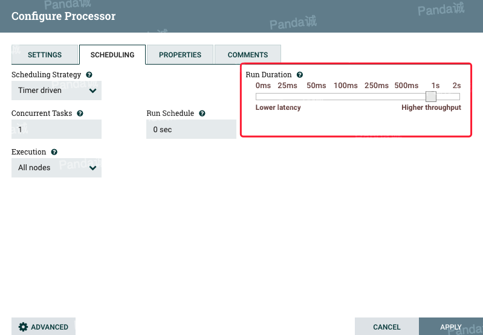
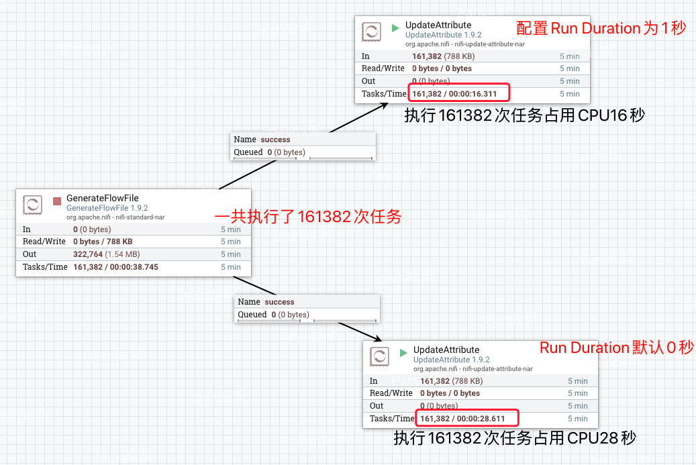

## Run Duration

一些处理器支持配置运行持续时间(`Run Duration`)。此设置告诉处理器在单个任务中继续使用同一task尽可能多地来处理来自传入队列的的FlowFiles(或成批的流文件)。
对于处理单个任务本身非常快并且FlowFile数量也很大的处理器来说，这是一个理想的选择。
<!-- more -->




在上面的示例中，将完全相同的FlowFiles传递到这两个处理器，这些处理器被配置为执行相同的Attribute更新。两者在过去5分钟内处理了相同数量的FlowFiles；但是，配置为运行持续时间的处理器消耗的总体CPU时间更少。并非所有处理器都支持设置`Run Duration`。处理器功能的性质，使用的方法或使用的客户端库可能决定了不支持此功能。这样的话你将无法在此类处理器上设置`Run Duration`。

## 工作原理叙述

1. 处理器已为其任务分配了线程。处理器从传入连接的`Active queue`中获取最高优先级的FlowFile(或一批FlowFile)。如果对FlowFile的处理未超过配置的运行持续时间，则会从`Active queue`中拉出另一个FlowFile(或一批FlowFile)。此过程将在同一线程下继续进行所有操作，直到达到`Run Duration`时间或`Active queue`为空。届时，会话完成，所有处理过的FlowFiles都立即提交给适当的关系。

2. 由于直到整个运行完成才提交所有的FlowFiles，因此在FlowFiles上导致了一些延迟。你配置的`Run Duration`决定了至少要发生多少延迟(`Active queue`不为空的时候)。

3. 如果针对FlowFile执行处理器所需的时间比配置的`Run Duration`更长，那么调整此配置没有任何其他好处。

## 这对于堆使用意味着什么

1. 由于它仅处理`Active queue`中的传入FlowFiles，因此此处没有增加堆压力。(`Active queue`中的FlowFiles已经在堆空间中，关于`Active queue`请看[深入理解Apache NIFI Connection](./011-理解connection.md))。

2. 新生成的FlowFiles(如果有的话，取决于处理器功能)全部保留在堆中，直到最终提交为止。这可能会带来一些额外的堆压力，因为所有新生成的FlowFiles都将保留在堆中，直到在运行时间结束时将它们全部提交给输出关系为止(尤其是新FlowFile的content，还没有刷到repository)。

## 实现

使用`SupportsBatching`注解标注的Processor是支持`Run Duration`的，如果一个处理器使用了这个注释，那么它就允许框架对ProcessSession进行批处理的提交，以及允许框架从后续对ProcessSessionFactory.createSession() 的调用中多次返回相同的ProcessSession

比如`UpdateAttribute`

```java
@EventDriven
@SideEffectFree
@SupportsBatching
...
public class UpdateAttribute extends AbstractProcessor implements Searchable {
```

重点看在哪里处理了这个`SupportsBatching`注解，在(深入解析Apache NIFI的调度策略)[./016-NIFI调度.md]一文中，我们在讲解`Timer driven`的时候有提到`ConnectableTask.invoke`方法，是线程执行调度具体Processor的ontrigger方法前的处理(里面有检测Processor是否有工作可做)，下面我们看一下这个方法：

```java
public InvocationResult invoke() {
        //任务终止
        if (scheduleState.isTerminated()) {
            logger.debug("Will not trigger {} because task is terminated", connectable);
            return InvocationResult.DO_NOT_YIELD;
        }
        ···
        //查看Processor是否有工作可做
        if (!isWorkToDo()) {
            logger.debug("Yielding {} because it has no work to do", connectable);
            return InvocationResult.yield("No work to do");
        }
        //背压机制
        if (numRelationships > 0) {
            final int requiredNumberOfAvailableRelationships = connectable.isTriggerWhenAnyDestinationAvailable() ? 1 : numRelationships;
            if (!repositoryContext.isRelationshipAvailabilitySatisfied(requiredNumberOfAvailableRelationships)) {
                logger.debug("Yielding {} because Backpressure is Applied", connectable);
                return InvocationResult.yield("Backpressure Applied");
            }
        }
        //可以运行
        logger.debug("Triggering {}", connectable);
        //获取 Run Duration的配置
        final long batchNanos = connectable.getRunDuration(TimeUnit.NANOSECONDS);
        final ProcessSessionFactory sessionFactory;
        final StandardProcessSession rawSession;
        final boolean batch;
        //处理SupportsBatching注解
        if (connectable.isSessionBatchingSupported() && batchNanos > 0L) {
            rawSession = new StandardProcessSession(repositoryContext, scheduleState::isTerminated);
            sessionFactory = new BatchingSessionFactory(rawSession);
            batch = true;
        } else {
            rawSession = null;
            sessionFactory = new StandardProcessSessionFactory(repositoryContext, scheduleState::isTerminated);
            batch = false;
        }

        final ActiveProcessSessionFactory activeSessionFactory = new WeakHashMapProcessSessionFactory(sessionFactory);
        scheduleState.incrementActiveThreadCount(activeSessionFactory);

        final long startNanos = System.nanoTime();
        final long finishIfBackpressureEngaged = startNanos + (batchNanos / 25L);
        final long finishNanos = startNanos + batchNanos;
        int invocationCount = 0;

        final String originalThreadName = Thread.currentThread().getName();
        try {
            try (final AutoCloseable ncl = NarCloseable.withComponentNarLoader(flowController.getExtensionManager(), connectable.getRunnableComponent().getClass(), connectable.getIdentifier())) {
                boolean shouldRun = connectable.getScheduledState() == ScheduledState.RUNNING;
                while (shouldRun) {//循环onTrigger处理 直到Run Duration时间到了或者Processor没有工作可做或者触发背压机制了
                    invocationCount++;
                    connectable.onTrigger(processContext, activeSessionFactory);

                    if (!batch) {
                        return InvocationResult.DO_NOT_YIELD;
                    }

                    final long nanoTime = System.nanoTime();
                    if (nanoTime > finishNanos) {
                        return InvocationResult.DO_NOT_YIELD;
                    }

                    if (nanoTime > finishIfBackpressureEngaged && isBackPressureEngaged()) {
                        return InvocationResult.DO_NOT_YIELD;
                    }

                    if (connectable.getScheduledState() != ScheduledState.RUNNING) {
                        break;
                    }

                    if (!isWorkToDo()) {
                        break;
                    }
                    if (isYielded()) {
                        break;
                    }

                    if (numRelationships > 0) {
                        final int requiredNumberOfAvailableRelationships = connectable.isTriggerWhenAnyDestinationAvailable() ? 1 : numRelationships;
                        shouldRun = repositoryContext.isRelationshipAvailabilitySatisfied(requiredNumberOfAvailableRelationships);
                    }
                }
            } catch (final TerminatedTaskException tte) {
                final ComponentLog procLog = new SimpleProcessLogger(connectable.getIdentifier(), connectable.getRunnableComponent());
                procLog.info("Failed to process session due to task being terminated", new Object[] {tte});
            } catch (final ProcessException pe) {
                final ComponentLog procLog = new SimpleProcessLogger(connectable.getIdentifier(), connectable.getRunnableComponent());
                procLog.error("Failed to process session due to {}", new Object[] {pe});
            } catch (final Throwable t) {
                // Use ComponentLog to log the event so that a bulletin will be created for this processor
                final ComponentLog procLog = new SimpleProcessLogger(connectable.getIdentifier(), connectable.getRunnableComponent());
                procLog.error("{} failed to process session due to {}; Processor Administratively Yielded for {}",
                    new Object[] {connectable.getRunnableComponent(), t, schedulingAgent.getAdministrativeYieldDuration()}, t);
                logger.warn("Administratively Yielding {} due to uncaught Exception: {}", connectable.getRunnableComponent(), t.toString(), t);

                connectable.yield(schedulingAgent.getAdministrativeYieldDuration(TimeUnit.NANOSECONDS), TimeUnit.NANOSECONDS);
            }
        } finally {
            try {
                //批量提交
                if (batch) {
                    try {
                        rawSession.commit();
                    } catch (final Throwable t) {
                        final ComponentLog procLog = new SimpleProcessLogger(connectable.getIdentifier(), connectable.getRunnableComponent());
                        procLog.error("Failed to commit session {} due to {}; rolling back", new Object[] { rawSession, t.toString() }, t);

                        try {
                            rawSession.rollback(true);
                        } catch (final Exception e1) {
                            procLog.error("Failed to roll back session {} due to {}", new Object[] { rawSession, t.toString() }, t);
                        }
                    }
                }
        ···
        return InvocationResult.DO_NOT_YIELD;
    }
```

通过这个方法我们看到

1. 设置了`SupportsBatching`注解的Processor并且配置了`Run Duration`时，传到`onTrigger`方法的`ProcessSessionFactory sessionFactory`是不一样的。
2. 批量对应传入的是`BatchingSessionFactory`,这个类的`commit`方法可以简单理解为并没有实际干提交事务的事儿，只是做了一些check
3. 批量的最后对应的是`rawSession.commit()`

所以，如果你自定义的组件想要支持批处理并且符合批处理的特征(简单说就是任务执行快并且FlowFile数量也很大)，只要加一个`SupportsBatching`注解就可以了。

## 注意

理论分析：对于一些源组件来说(source 一个流程的源)，然后是需要`记录状态`的(比如说记录一个增量值到state，再比如是从别的地方取数据或者接受数据，拿到数据后告诉对方数据已到手)，正常来说Processor的实现都是先`session.commit`再干`记录状态`那些事，但如果是批量处理配置`Run Duration`,通过上面的代码分析发现，`processor.onTrigger`里我们写的`session.commit`其实并没有提交，而是等到批处理结束后再提交，如果这个任务是依赖`记录状态`来获取数据的，其实是不保证后面的commit一定执行的(NIFI shutdown了，NIFI宕了)，最终没有commit但是状态已经记录，那么这次批处理的数据是丢失的。

场景模拟描述：现有一个Rest服务，提供类似于`kafka`的功能，消费者可以来注册获取数据，服务端记录客户端消费的offset，然后使用InvokeHttp批处理的去到这个服务获取数据，那么就有概率发生上面说的情况。


