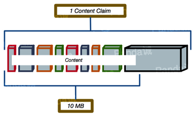
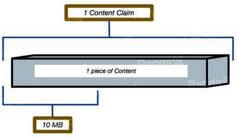

## 什么是内容存储库归档？

nifi.properties文件中有三个属性，用于处理NiFi内容存储库中的内容归档。默认值如下所示：

```
nifi.content.repository.archive.max.retention.period=12 hours
nifi.content.repository.archive.max.usage.percentage=50%
nifi.content.repository.archive.enabled=true
```
<!-- more -->
内容归档的目的是使用户可以通过UI查看和/或重放已经不在数据流中的内容。配置的值对保留的provenance历史记录的数量没有任何影响。如果与特定出处事件相关联的内容不再存在于内容档案中，则在provenance处将仅向用户报告该内容不可用。

内容档案保存在你配置内容存储库存的目录中。当归档“内容声明(content claim)”后，该声明将移入原始位置所在的同一磁盘分区内的归档子目录中。这避免了在将归档文件移动到新的磁盘/分区时，不必要的写操作会影响NiFi的内容存储库性能。

配置的最大保留期限会告诉NiFi从内容存档目录清除存档的“内容声明”之前，应保留多长时间。

配置的最大使用百分比告诉NiFi它应该在什么时候开始清除已归档的内容声明，以使整体磁盘使用率保持在或低于配置的百分比。这是一个软限制。假设内容存储库的使用率为49％。然后，一个4GB的内容声明就可以进行归档了。一次将此内容声明存档后，使用情况可能会超过配置的50％阈值。在下一个检查点，NiFi会删除最旧的归档内容声明，以使总体磁盘使用率退回或低于50％。因此，此值永远不应设置为100％。

以上两个属性是使用or策略强制执行的。无论哪个最大值出现，都会触发清除已归档的内容声明。

让我们看几个例子：
 
范例1：


在这里，你可以看到Content Repository的Content Claims消耗了35％的磁盘，而Content Claims与FlowFiles绑定在一起，该文件仍然在NiFi画布上一个或多个数据流中的某个位置处于活动状态。这将保留磁盘空间的15％用于归档的内容声明。

范例2：


在这里，你可以看到仍在NiFi流中某处仍处于活动状态的内容声明的数量已超过内容存储库中50％的磁盘使用率。因此，可以看到没有归档的内容声明。内容存储库存档设置与数据流中的活动FlowFiles将使用多少的内容存储库磁盘无关。这样一来，内容存储库仍然可以满足100％的磁盘使用率。

这就是为什么最佳做法应该避免将内容存储库与任何其他nifi存储库共存的确切原因。应该隔离到不会影响其他应用程序的磁盘，也不要把它配置成100％。

## 什么是内容声明？

我在本文全文中都提到了“内容声明”。了解内容声明将有助于你了解磁盘使用情况。NiFi将内容存储在声明中的内容存储库中。单个声明可以包含1到多个FlowFiles的内容。在nifi.properties文件中还可以找到控制内容声明构建方式的属性。

默认配置值如下所示：

```
nifi.content.claim.max.appendable.size = 10 MB 
nifi.content.claim.max.flow.files = 100
```
内容声明的目的是最有效地利用磁盘存储。处理许多非常小的文件时尤其如此。

配置的最大可附加大小会告诉NiFi NiFi在开始新声明之前应在什么时候停止将附加内容附加到现有内容声明中。这并不意味着NiFi提取的所有内容都必须小于10 MB。这也不意味着每个内容声明的大小至少为10 MB。

配置的最大流文件会告诉NiFi，在将声明标记为已完成之前，无论总声明大小如何，该声明中可以放入的FlowFiles内容的最大数量。

NiFi不知道在摄取过程中放入FlowFile的内容的最终大小。因此，NiFi只会查看当前声明的大小，如果尚未超过10 MB或100内容，则将下一个完整的内容将追加到该声明中，而不管其大小。

让我们再看几个说明内容声明的示例（每个示例代表一个NiFi内容声明）：

范例1：



在这里可以看到我们有一个包含大大小小内容的单一Content Claim。总体大小已超过10 MB，因为NiFi在开始流式传输该最终内容时声称该大小仍低于10 MB。

范例2：



在这里，我们可以看到我们有一个仅包含一个内容的内容声明。这是因为一旦将内容写入此声明，声明就超出了配置的最大可附加大小。如果您的数据流只处理10 MB以上的文件，则所有内容声明将仅包含一件内容。

范例3：


在这里，我们可以看到一个内容声明，该声明在达到配置的最大可附加大小(10M)之前就被标记为完成。这是因为首先达到了最大流文件数100。

那么，何时将“内容声明”移至存档？

在该声明中的任何内容都没有绑定到在NiFi画布上任何数据流中任何地方都处于活动状态的FlowFile之前，内容声明无法移入内容存储库档案。这意味着报告的数据流中所有FlowFiles的累积大小可能永远不会与内容存储库中的实际磁盘使用情况匹配。


此累积大小不是排队的FlowFile所驻留的内容声明的大小，而是仅报告的各个内容的累积大小。因此，即使NiFi UI报告的总累积排队数据大小小于NiFi内容存储库，NiFi内容存储库也有可能达到100％的磁盘使用率。

从上面看示例1。假设写入该声明的最后一块内容的大小为100 GB，那么只需要将同一声明中的那些很小的内容之一仍存在于数据流中排队，以防止对该声明进行存档。只要FlowFile仍指向内容声明，就不能清除整个内容声明。

在微调NiFi默认配置时，必须始终考虑预期的数据。如果只处理很小的数据或非常大的数据，则不要使用默认值。如果您使用的数据范围非常大，从非常小到非常大，则可能需要减小最大可附加大小和/或最大流文件设置。这样可以减少将FlowFile放入单个声明中的数量。反过来，这降低了单个数据在内容存储库中保持大量数据仍处于活动状态的可能性。


