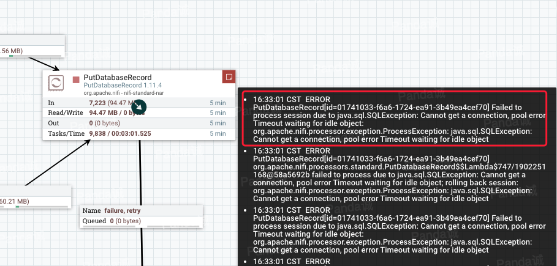

通常我们在NIFI里最常见的使用场景就是读写关系型数据库，一些组件比如GenerateTableFetch、ExecuteSQL、PutSQL、ExecuteSQLRecord、PutDatabaseRecord等等，都会有一个属性配置大概叫`Database Connection Pooling Service`的，对应的接口是`DBCPService`，其实现类有：HiveConnectionPool DBCPConnectionPool DBCPConnectionPoolLookup。我们用的最多的就是DBCPConnectionPool。具体怎么配置这里就不赘述了，看对应的Controller Service文档就可以了。
<!-- more -->
## Database Connection URL

这里大概罗列几个通用的URL(ip+port+db)：
```
  Oracle: jdbc:oracle:thin:@{}:{}:{}
  Oracle 12+: jdbc:oracle:thin:@{}:{}:{}
  MySQL: jdbc:mysql://{}:{}/{}?useUnicode=true&characterEncoding=UTF-8&zeroDateTimeBehavior=convertToNull&tinyInt1isBit=false&useSSL=false
  Greenplum: jdbc:pivotal:greenplum://{}:{};DatabaseName={}
  PostgreSQL: jdbc:postgresql://{}:{}/{}
  DB2: jdbc:db2://{}:{}/{}
  MS SQL 2008: jdbc:sqlserver://{}:{};DatabaseName={}
  MS SQL 2012+: jdbc:sqlserver://{}:{};DatabaseName={}
  Cache: jdbc:Cache://{}:{}/{}
  Ignite: jdbc:ignite:thin://{}:{};schema={}
```
## Database Driver Class Name
```
  Oracle: oracle.jdbc.driver.OracleDriver
  Oracle 12+: oracle.jdbc.driver.OracleDriver
  MySQL: com.mysql.jdbc.Driver
  Greenplum: com.pivotal.jdbc.GreenplumDriver
  PostgreSQL: org.postgresql.Driver
  DB2: com.ibm.db2.jcc.DB2Driver
  MS SQL 2008: com.microsoft.sqlserver.jdbc.SQLServerDriver
  MS SQL 2012+: com.microsoft.sqlserver.jdbc.SQLServerDriver
  Cache: com.intersys.jdbc.CacheDriver
  Ignite: org.apache.ignite.IgniteJdbcThinDriver
```
## Database Driver Location(s)

这里有一个小窍门，我们在部署NIFI的时候，通常应该预置一些JDBC驱动，比如说在NIFI目录下新建一个jdbc的目录，里面是各种数据库的驱动文件。然后在指定驱动的时候，我们使用NIFI表达式语言${NIFI_HOME}来获取NIFI的安装目录，进而就可以通用的去获取指定的驱动包了。(这里是利用NIFI表达式语言读取环境变量的功能，NIFI_HOME是在启动的时候设置的临时环境变量，在window10下可能会有些问题，如果是部署Linux以外的环境，还需要自己测试一番。)
```
  Oracle: ${NIFI_HOME:append('/jdbc/oracle-jdbc-11.2.04.jar')}
  Oracle 12+: ${NIFI_HOME:append('/jdbc/oracle-jdbc-11.2.04.jar')}
  LogMiner: ${NIFI_HOME:append('/jdbc/ojdbc8.jar')}
  MySQL: ${NIFI_HOME:append('/jdbc/mysql-connector-java-5.1.46.jar')}
  Greenplum: ${NIFI_HOME:append('/jdbc/greenplum-1.0.jar')}
  PostgreSQL: ${NIFI_HOME:append('/jdbc/postgresql-9.4.1212.jar')}
  MS SQL 2008: ${NIFI_HOME:append('/jdbc/mssql-jdbc-6.5.4.jre8-preview.jar')}
  MS SQL 2012+: ${NIFI_HOME:append('/jdbc/mssql-jdbc-6.5.4.jre8-preview.jar')}
  Cache: ${NIFI_HOME:append('/jdbc/cache-jdbc-2.0.0.jar')}
  Ignite: ${NIFI_HOME:append('/jdbc/ignite-core-2.8.0.jar')}
```
## 底层连接池的选择

```xml
 <dependency>
    <groupId>org.apache.commons</groupId>
    <artifactId>commons-dbcp2</artifactId>
</dependency>
```

## 几个研究

研究1：获取数据库连接会有什么异常？

首先我们看一下接口`DBCPService.java`，这里我们只看到了`ProcessException`异常，还得看具体实现类。这里额外说一下，`getConnection(Map<String,String> attributes)`最终是在`DBCPConnectionPoolLookup`里实现的，作用是根据属性`database.name`的值去查找对应的`DBCPConnectionPool`.

```java
Connection getConnection() throws ProcessException;
/**
* Allows a Map of attributes to be passed to the DBCPService for use in configuration, etc.
* An implementation will want to override getConnection() to return getConnection(Collections.emptyMap()),
* and override this method (possibly with its existing getConnection() implementation).
* @param attributes a Map of attributes to be passed to the DBCPService. The use of these
*                   attributes is implementation-specific, and the source of the attributes
*                   is processor-specific
* @return a Connection from the specifed/configured connection pool(s)
* @throws ProcessException if an error occurs while getting a connection
*/
default Connection getConnection(Map<String,String> attributes) throws ProcessException {
    // default implementation (for backwards compatibility) is to call getConnection()
    // without attributes
    return getConnection();
}
```
`DBCPConnectionPool`里，使用的是`commons-dbcp2`获取数据库连接，当`if a database access error occurs`或超时，会抛出`SQLException`
```java
@Override
public Connection getConnection() throws ProcessException {
    try {
        final Connection con;
        if (kerberosUser != null) {
            KerberosAction<Connection> kerberosAction = new KerberosAction<>(kerberosUser, () -> dataSource.getConnection(), getLogger());
            con = kerberosAction.execute();
        } else {
            con = dataSource.getConnection();
        }
        return con;
    } catch (final SQLException e) {
        throw new ProcessException(e);
    }
}
```

研究2：在某些原因下(IP ping不通、数据库挂了)，抛出异常了，组件的流文件怎么办？

这里因为最后抛出的是`ProcessException`异常，是一个`RuntimeException`，而获取连接这个动作是在被调度的方法`onTrigger`里的。先看简单的比如`ExecuteSQL`，这类组件都是继承`AbstractProcessor`:
```java
@Override
public final void onTrigger(final ProcessContext context, final ProcessSessionFactory sessionFactory) throws ProcessException {
    final ProcessSession session = sessionFactory.createSession();
    try {
        onTrigger(context, session);
        session.commit();
    } catch (final Throwable t) {
        session.rollback(true);
        throw t;
    }
}
```
看到了`session.rollback(true)`大概我们就比较明朗了，获取连接异常，被捕获然后NIFI事务回滚了，流文件是回到组件的上游去了。而比如`GenerateTableFetch`这种的
```java
try (final Connection con = dbcpService.getConnection(finalFileToProcess == null ? Collections.emptyMap() : finalFileToProcess.getAttributes());
            final Statement st = con.createStatement()) {
        ...
    } catch (SQLException e) {
        ...
    }
    ...
} catch (final ProcessException pe) {
    // Log the cause of the ProcessException if it is available
    Throwable t = (pe.getCause() == null ? pe : pe.getCause());
    logger.error("Error during processing: {}", new Object[]{t.getMessage()}, t);
    session.rollback();
    context.yield();
}
```
最终也会在自己的`onTrigger`里`session.rollback()`的。比较麻烦的是`PutSQL`这一类，函数式编程有些绕的
```java
public void onTrigger(ProcessContext context, ProcessSession session, FC functionContext) throws ProcessException {
    ....
    // Pass the FlowFiles to initialize a connection
    try (C connection = initConnection.apply(context, session, functionContext, flowFiles)) {
        ......
    } catch (ProcessException e) {
        throw e;
    } catch (Exception e) {
        // Throw uncaught exception as RuntimeException so that this processor will be yielded.
        final String msg = String.format("Failed to execute due to %s", e);
        logger.error(msg, e);
        throw new RuntimeException(msg, e);
    }
}
```
上面这段是抽象出去的函数，在PutSQL里被这段代码`process.onTrigger(context, session, functionContext)`调用
```java
@Override
public void onTrigger(ProcessContext context, ProcessSessionFactory sessionFactory) throws ProcessException {
    final Boolean rollbackOnFailure = context.getProperty(RollbackOnFailure.ROLLBACK_ON_FAILURE).asBoolean();
    final FunctionContext functionContext = new FunctionContext(rollbackOnFailure);
    functionContext.obtainKeys = context.getProperty(OBTAIN_GENERATED_KEYS).asBoolean();
    RollbackOnFailure.onTrigger(context, sessionFactory, functionContext, getLogger(), session -> process.onTrigger(context, session, functionContext));
}
```
RollbackOnFailure又传了一段函数`(session, t) -> {}` ，我们看到`session.rollback(shouldPenalize)`，也是NIFI事务回滚的。
```java
PartialFunctions.onTrigger(context, sessionFactory, logger, onTrigger, (session, t) -> {
    // If RollbackOnFailure is enabled, do not penalize processing FlowFiles when rollback,
    // in order to keep those in the incoming relationship to be processed again.
    final boolean shouldPenalize = !functionContext.isRollbackOnFailure();
    session.rollback(shouldPenalize);

    // However, keeping failed FlowFile in the incoming relationship would retry it too often.
    // So, administratively yield the process.
    if (functionContext.isRollbackOnFailure()) {
        logger.warn("Administratively yielding {} after rolling back due to {}", new Object[]{context.getName(), t}, t);
        context.yield();
    }
});
```
总体上看，与数据库连接池相关组件在遇到获取数据库连接抛出`ProcessException`时都是会NIFI回滚事务的，流文件会重返组件上游Connection。

这个疑问再啰嗦一句，这里纠结的是获取数据库连接获得异常，抛出`ProcessException`后，流文件会回滚到上游还是传输到下游的问题，不要与执行SQL异常混淆了(执行SQL抛出的SQLExeception各个代码都有处理，但毫无疑问流文件都是流向下游的)。然后`PutSQL` `PutDatabaseRecord`之类的`Rollback On Failure`，设置为true的时候，执行SQL报错抛出的SQLExeception也会NIFI回滚事务。

疑问3：多组件多线程，获取数据库连接的总线程数多过数据库连接池里的连接，会怎么样？

我们直接看DBCP2里的核心获取Connection的方法，没有连接了就返回NULL
```java
@Override
public Connection getConnection() throws SQLException {
    try {
        final C conn = pool.borrowObject();
        if (conn == null) {
            return null;
        }
        return new PoolGuardConnectionWrapper<>(conn);
    } ....
}
```
然后在默认情况下连接池是阻塞队列，当连接池中的连接都被使用，无法立即获取到可用的连接，其中数据库连接池`Max Wait Time`配置会影响阻塞等待时间(-1是无限阻塞)，阻塞等待超过这个时间还没有可用的连接，就会抛出异常。抛出异常后，NIFI回滚事务，流文件还是回到上游。



但是，`Max Wait Time`设置成-1无限阻塞显然是不合适的，我们可以酌情设置一个时间(估计一下一般一个Connection拿出来，执行SQL，还回池里需要的事件)。最好是建流程的时候，衡量处理器和线程的数量与此连接池的最大连接数，在数据库连接的时候，让处理器处理数据的时候总是可以获取到一个连接，毕竟阻塞在那里，还是耗服务器的资源的。

## DBCPConnectionPoolLookup

`DBCPConnectionPoolLookup`这个Controller Service很简单，也非常有用，说白了，它就是保存了一个我们使用者定义的Map，key是我们自己命名的，value是我们选择的当前流程可用的`DBCPConnectionPool`,然后在流程运行过程中，`DBCPConnectionPoolLookup`根据FlowFile中一个叫`database.name`的属性去这个Map里查找`DBCPConnectionPool`。使用`DBCPConnectionPoolLookup`的最大优点是什么？灵活啊！组件不绑定于一个数据库，根据流文件中的属性动态去查找对应的数据库。


