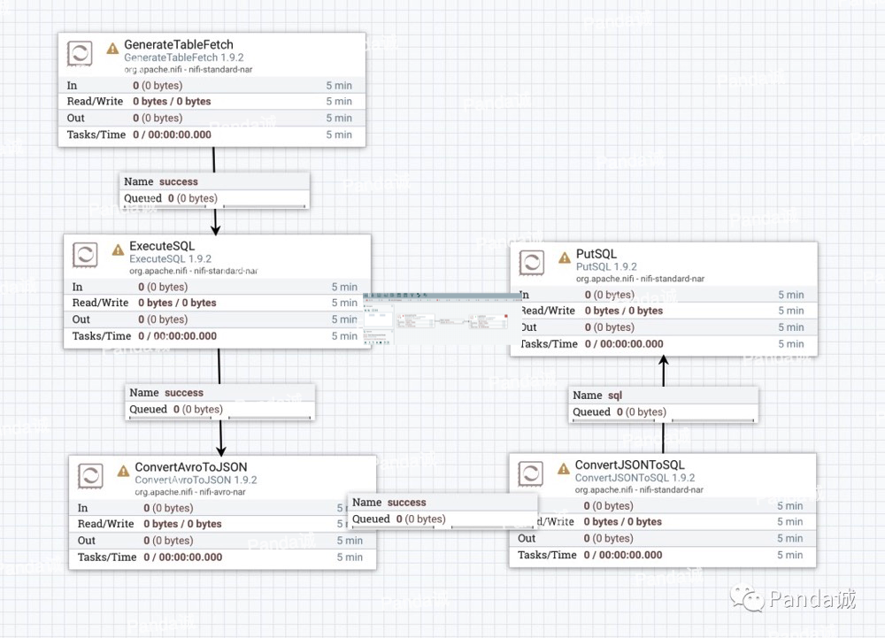

## 引子

许多第一次接触使用NIFI的同学在同步关系型数据库的某一张表的时候，可能会拖拽出类似于下面的一个流程。



这个流程大体的作用就是：监听增量字段并生成查询SQL，执行SQL，转换成JSON数据，将JOSN转换成插入SQL语句，在目标库执行SQL。
<!-- more -->
这显然是没什么问题的，但是如果让我来设计，就只是下面这样的流程。


## 为什么建议使用NIFI里的Record

首先，NIFI是在框架的基础上，作为扩展功能，为我们提供了面向record数据、处理record数据的能力。这种设计的初衷是无论我们底层是什么格式的数据(json?csv?avro?xml?等等)，我们在处理这些数据的时候，都可以使用一套通用的格式或者说规则，即record。

那么使用record有什么好处呢？

### 好处1-流程设计使用组件更少

我们可以使用更少的组件来设计流程，来满足我们的需求。通常我们在使用NIFI的时候，会选择让它中间落地，而对中间落地的数据IO操作相对而言肯定是耗时的，所以我们在设计流程的时候，尽可能的做到减少不必要的处理FlowFIle的组件。通过使用record类的组件，我们不用关心数据的格式是什么，只需要在组件的配置上选择相应的RecordSetWriter和RecordReader就可以了，也不用再去特意的转换数据格式，甚至在极致的情况下，我们只需关心数据从哪里来，到哪里去就可以了。这样就会使我们的流程的数据处理速度更快、NIFI消耗的资源更少。

### 好处2-RecordPath


NIFI在Record的基础上，为我们提供了一套处理Record的EL表达式，提供RecordPath我们可以更灵活的去处理record数据。

关于RecordPath请查看作者NIFI中文文档[https://nifichina.github.io/general/RecordPathGuide.html](https://nifichina.github.io/general/RecordPathGuide.html)

### 好处3-资源消耗少

我们这里先不关注具体的实现，只看下Record的接口定义
```java
public interface RecordSet {

    /**
     * @return the {@link RecordSchema} that applies to the records in this RecordSet
     */
    RecordSchema getSchema() throws IOException;

    /**
     * @return the next {@link Record} in the set or <code>null</code> if there are no more records
     */
    Record next() throws IOException;
    ...
}
```
```java
public interface RecordReader extends Closeable {
    /**
     * Returns the next record in the stream or <code>null</code> if no more records are available. Types will be coerced and any unknown fields will be dropped.
     *
     * @return the next record in the stream or <code>null</code> if no more records are available.
     *
     * @throws IOException if unable to read from the underlying data
     * @throws MalformedRecordException if an unrecoverable failure occurs when trying to parse a record
     * @throws SchemaValidationException if a Record contains a field that violates the schema and cannot be coerced into the appropriate field type.
     */
    default Record nextRecord() throws IOException, MalformedRecordException {
        return nextRecord(true, false);
    }
}
```
看到`next()` `nextRecord()`方法我们基本可以猜测，它是不需要把所有的数据都加载到内存中的，而是类似于我们常见的ResultSet一样有个游标，可以一条一条返回record，这样的话，我们使用Record方式去处理一个json数组直接`next()`循环读取，进行处理，使用对应的RecordSetWriter写进FlowFIle，对比直接加载json数据到内存，然后在循环处理每一条json，显然是record方式内存占用更少，更不容易引起OOM。

这里简单看下json的JsonPathReader的代码实现，JsonPathReader里
```java
@Override
public RecordReader createRecordReader(final Map<String, String> variables, final InputStream in, final long inputLength, final ComponentLog logger)
        throws IOException, MalformedRecordException, SchemaNotFoundException {
    final InputStream bufferedIn = new BufferedInputStream(in);
    final RecordSchema schema = getSchema(variables, bufferedIn, null);
    return new JsonPathRowRecordReader(jsonPaths, schema, bufferedIn, logger, dateFormat, timeFormat, timestampFormat);
}
```
核心的RecordReader实现类是这个`JsonPathRowRecordReader`，
```java
@Override
public Record nextRecord(final boolean coerceTypes, final boolean dropUnknownFields) throws IOException, MalformedRecordException {
    final JsonNode nextNode = getNextJsonNode();
    if (nextNode == null) {
        return null;
    }
    final RecordSchema schema = getSchema();
    try {
        return convertJsonNodeToRecord(nextNode, schema, coerceTypes, dropUnknownFields);
    } ...
}

protected JsonNode getNextJsonNode() throws IOException, MalformedRecordException {
    if (!firstObjectConsumed) {
        firstObjectConsumed = true;
        return firstJsonNode;
    }
    while (true) {
        final JsonToken token = jsonParser.nextToken();
        if (token == null) {
            return null;
        }
        switch (token) {
            case END_OBJECT:
                continue;
            case START_OBJECT:
                return jsonParser.readValueAsTree();
            case END_ARRAY:
            case START_ARRAY:
                continue;
            default:
                throw new MalformedRecordException("Expected to get a JSON Object but got a token of type " + token.name());
        }
    }
}
```
而jsonParser是jackson工具包里的，简单来说根据输入流和token(`{,[,],}`等)来一条一条读取json。


