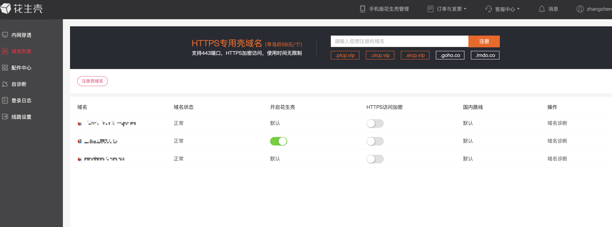
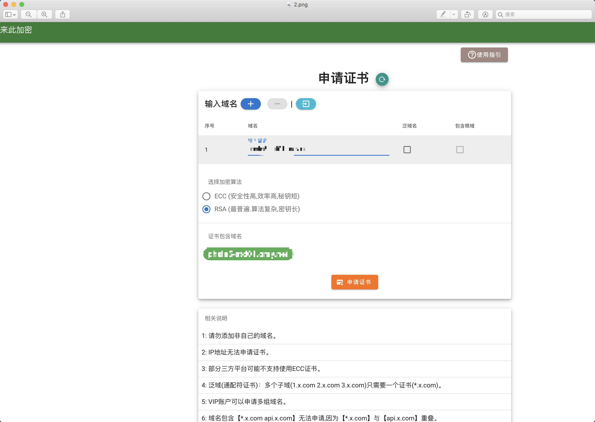
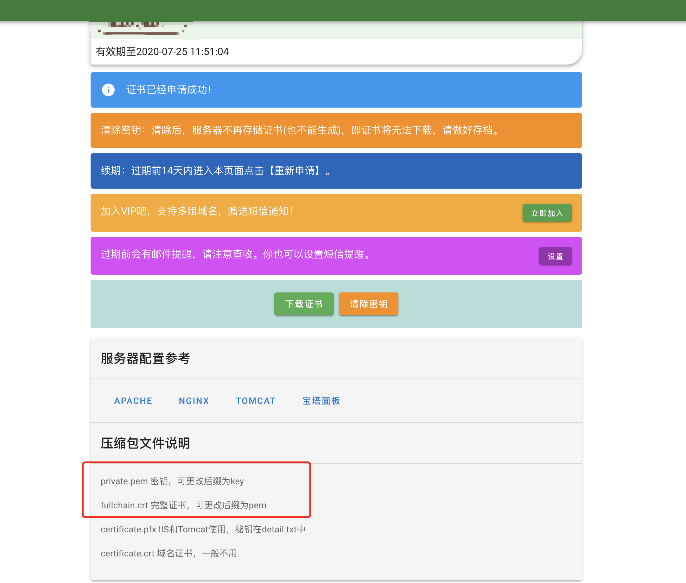
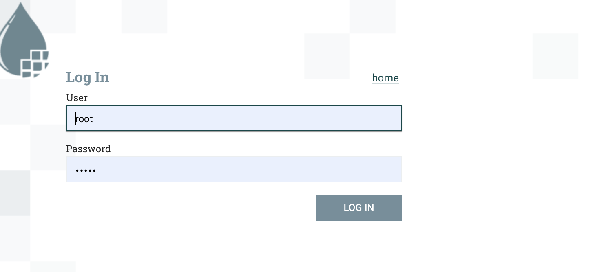
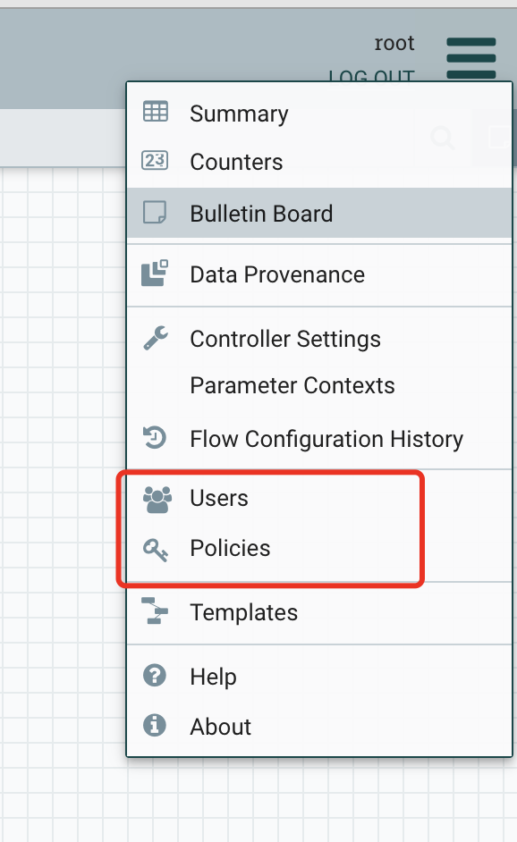
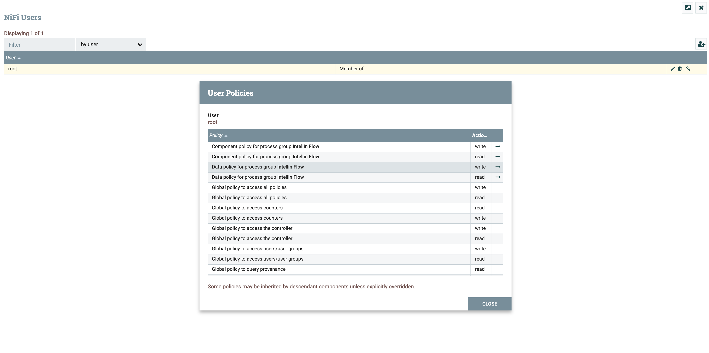

前言：Apache NIFI是自带用户验证、权限验证模块的，对用户和权限的模块都有详细的设计和划分。但默认配置下我们使用的是NIFI的HTTP服务，HTTP模式下，NIFI是不启用用户管理和权限管理模块的。

本文就带领大家来早本地开发环境下，配置NIFI的HTTPS模式，启用用户和权限模块，以下为示例说明，先不做原理阐述。
<!-- more -->
## Step1

准备keystore.jks truststore.jks。这两个文件是什么，自行百度。关于使用jdk工具生产jks的文档网上有很多，此处就不赘述。

作者在这里使用了另一种方式获取了证书，仅供参考。

1. 使用内外穿透工具 花生壳(自行下载安装)，获取映射到本地的一个域名。



2. 带着这个域名去[来此加密](https://letsencrypt.osfipin.com/)上申请一个正式的证书(3个月得有效期)




3. 本地起一个简单的80端口的Spring Boot ,做一个Get请求


4. 验证成功后获取证书



5. 生产jks文件

用到了这三个文件 fullchain.pem private.pem certificate.pem(crt直接改成pem即可)，然后在证书目录使用以下三个命令，获取keystore.jks truststore.jks

```
openssl pkcs12 -export -in fullchain.pem -inkey private.pem -out fullchain_and_key.p12 -name nifi -passout pass:123456

keytool -importkeystore -deststorepass 123456   -destkeystore keystore.jks -srckeystore fullchain_and_key.p12 -srcstoretype PKCS12 -srcstorepass 123456  -alias nifi

keytool -importcert -alias rootCA -trustcacerts -file certificate.pem -keystore truststore.jks -storepass 123456
```

## step2

自定义provider NIFI原生支持的 ldap-provider kerberos-provider,但搭建和配置起来比较麻烦，我们只想在本地体验一下NIFI HTTPS，最简单的方法就是自定义一个provider(可以直接在nifi-ldap-iaa-providers那个项目里定义，也可以自定义子Moudle，打nar包放到lib下)

```java
/**
 * 自定义用户登陆验证
 *
 * @author zhangcheng
 */
public class CustomLoginIdentityProvider implements LoginIdentityProvider {

    private final Map<String, String> users;

    public CustomLoginIdentityProvider() {
        users = new HashMap<>();
        users.put("root", "admin");
    }

    private void checkUser(final String user, final String password) {
        if (!users.containsKey(user)) {
            throw new InvalidLoginCredentialsException("Unknown user");
        }

        if (!users.get(user).equals(password)) {
            throw new InvalidLoginCredentialsException("Invalid password");
        }
    }

    @Override
    public AuthenticationResponse authenticate(LoginCredentials credentials) throws InvalidLoginCredentialsException, IdentityAccessException {
        checkUser(credentials.getUsername(), credentials.getPassword());
        return new AuthenticationResponse(credentials.getUsername(), credentials.getUsername(), TimeUnit.MILLISECONDS.convert(1, TimeUnit.DAYS), getClass().getSimpleName());
    }

    @Override
    public void initialize(LoginIdentityProviderInitializationContext initializationContext) throws ProviderCreationException {
    }

    @Override
    public void onConfigured(LoginIdentityProviderConfigurationContext configurationContext) throws ProviderCreationException {
    }

    @Override
    public void preDestruction() {
    }

}

```
resource下的org.apache.nifi.authentication.LoginIdentityProvider文件添加CustomLoginIdentityProvider
```
org.apache.nifi.authentication.LoginIdentityProvider
org.apache.nifi.authentication.CustomLoginIdentityProvider
```

## Step3

关闭花生壳，把上面的域名修改本地HOSTS

配置NIFI 修改nifi.properties ，配置你的域名、端口、jks文件、自定义provider

```
nifi.web.war.directory=./lib
nifi.web.http.host=
nifi.web.http.port=
nifi.web.http.network.interface.default=

# 修改host
nifi.web.https.host=你的域名
nifi.web.https.port=443
nifi.web.https.network.interface.default=

#添加jks
nifi.security.keystore=本地目录/keystore.jks
nifi.security.keystoreType=JKS
nifi.security.keystorePasswd=123456
nifi.security.keyPasswd=
nifi.security.truststore=本地目录/truststore.jks
nifi.security.truststoreType=JKS
nifi.security.truststorePasswd=123456
nifi.security.user.authorizer=managed-authorizer

#自定义provider配置
nifi.security.user.login.identity.provider=custom-provider
```


login-identity-providers.xml添加

```xml
 <provider>
    <identifier>custom-provider</identifier>
    <class>org.apache.nifi.authentication.CustomLoginIdentityProvider</class>
</provider>
```

authorizers.xml修改

```xml
 <userGroupProvider>
        <identifier>file-user-group-provider</identifier>
        <class>org.apache.nifi.authorization.FileUserGroupProvider</class>
        <property name="Users File">./conf/users.xml</property>
        <property name="Legacy Authorized Users File"></property>
<!-- 添加root -->
        <property name="Initial User Identity 1">root</property>
    </userGroupProvider>
<accessPolicyProvider>
        <identifier>file-access-policy-provider</identifier>
        <class>org.apache.nifi.authorization.FileAccessPolicyProvider</class>
        <property name="User Group Provider">file-user-group-provider</property>
        <property name="Authorizations File">./conf/authorizations.xml</property>
        <!-- 添加root -->
        <property name="Initial Admin Identity">root</property>
        <property name="Legacy Authorized Users File"></property>
        <property name="Node Identity 1"></property>
        <property name="Node Group"></property>
    </accessPolicyProvider>
```

# step4

启动NIFI 即可进入登录页面 root/admin 开始使用用户管理模块 权限管理模块






