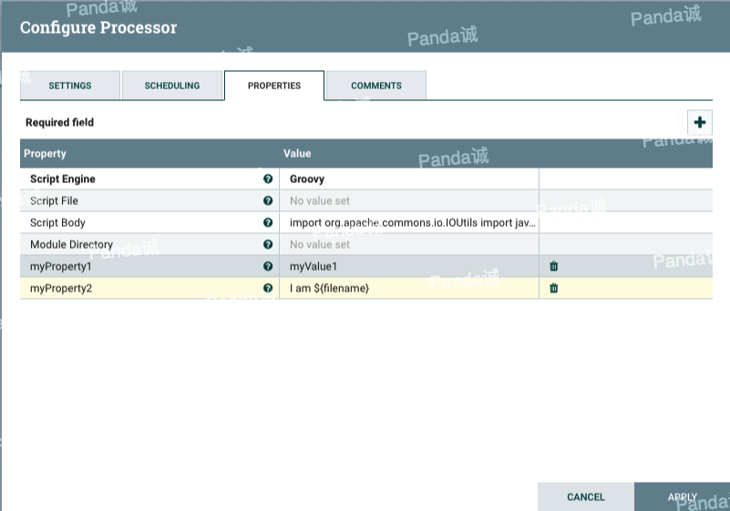
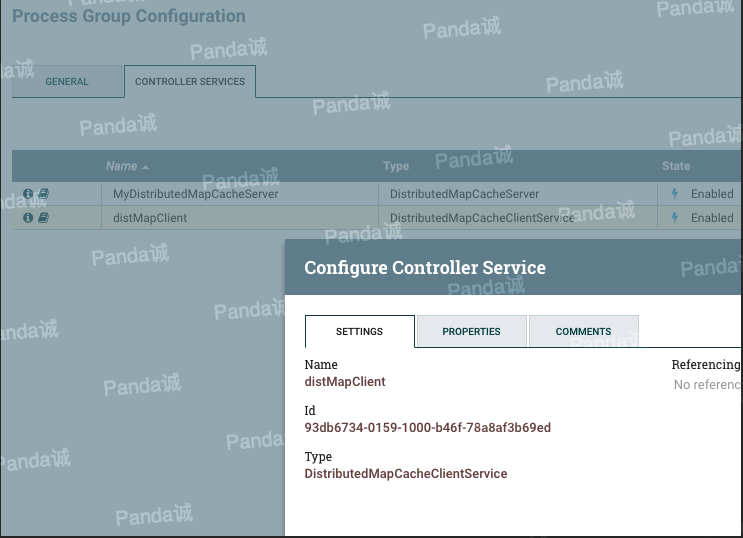
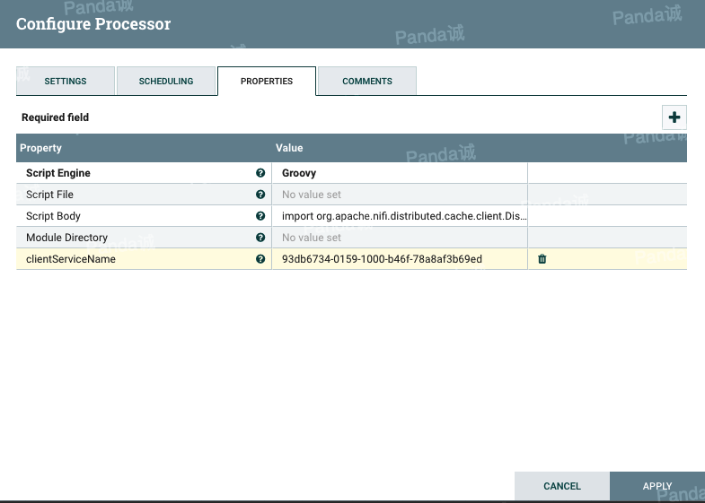

本文通过Groovy，Jython，Javascript(Nashorn)和JRuby中的代码示例，介绍了有关如何使用Apache NiFi处理器ExecuteScript完成某些任务的各种方法。本文中的内容包括：

<!-- more -->

_**Introduction to the NiFi API and FlowFiles**_

* 从传入队列中获取流文件
* 创建新的流文件
* 使用流文件属性
* 传输流文件
* 日志

_**FlowFile I/O and Error Handling**_

* 读取流文件
* 写入流文件
* 读写流文件
* 错误处理

_**Advanced Features**_

* 使用动态属性
* 添加模块
* State管理
* 访问Controller Service

## Introduction to the NiFi API and FlowFiles

ExecuteScript是一种多功能处理器，它使用户可以使用特定的编程语言编写自定义逻辑，每次触发ExecuteScript处理器都会执行用户自定义逻辑。脚本提供了以下变量绑定，以允许访问NiFi组件：

**session**: 这是对分配给处理器的ProcessSession的引用。你可以通过这个`session`对流文件执行操作，例如create()，putAttribute()和transfer()以及read()和write()。

**context**: 这是对处理器的ProcessContext的引用。它可用于检索处理器的属性(properties)，关系(relationships)，Controller Services和StateManager。

**log**:这是对处理器的ComponentLog的引用。使用它可以将消息记录到NiFi，例如log.info('Hello world！')

**REL_SUCCESS**:这是为处理器定义的"success"关系的引用。也可以通过引用父类(ExecuteScript)的静态成员来继承它，但是某些引擎(例如Lua)不允许引用静态成员，因此使用它就很方便了。

**REL_FAILURE**: 这是为处理器定义的"failure"关系的引用。与**REL_SUCCESS**一样，也可以通过引用父类的静态成员(ExecuteScript)来继承它，但是某些引擎(例如Lua)不允许引用静态成员，因此使用它就很方便了。

**Dynamic Properties**: ExecuteScript中定义的任何动态属性,都将作为相对应的PropertyValue对象传递到脚本引擎。这样一来，你不仅可以获取属性的String值，还可以根据NiFi表达式语言评估属性，将值转换为适当的数据类型(例如Boolean等)，**因为动态属性名称会变为脚本的变量名**，你必须了解所选脚本引擎的变量命名属性。例如，Groovy不允许在变量名称中使用英文的句点(.)，因此如果`my.property`是动态属性名称，则会发生错误。

这些变量的交互是通过NiFi Java API完成的，下面会介绍相关的API调用，比如对流文件执行各种功能(读/写属性，路由关系，记录等)。请注意，这些示例只是demo，不能按原样运行。例如，如果已使用session.get()从队列中检索流文件，则必须将其路由到下游关系中或将其删除，否则将发生错误。

### 从session中获取一个流文件

示例说明: ExecuteScript有传入连接，我们想要从队列中检索一个流文件以进行处理。

方法: 使用会话对象中的get()方法。此方法返回要处理的下一个具有最高优先级的FlowFile。如果没有FlowFile要处理，则该方法将返回null。请注意，即使有FlowFiles稳定流入处理器，也可能返回null(如果处理器有多个并发任务，而其他任务已经检索到FlowFiles，则可能发生这种情况。)如果脚本要求有FlowFile才能继续处理，则当session.get()返回null时，自定义的逻辑应立即return。

Examples:

**Groovy**
```groovy
flowFile = session.get()
if(!flowFile) return
```

**Jython**
```python
flowFile = session.get() 
if (flowFile != None):
    # All processing code starts at this indent
# implicit return at the end
```

**Javascript**
```javascript
var flowFile = session.get();
if (flowFile != null) {
  // All processing code goes here
}
```

**JRuby**
```ruby
flowFile = session.get()
if flowFile != nil
   # All processing code goes here
end
```

### 从会话中获取多个流文件

示例说明: ExecuteScript有传入连接，我们想要从队列中检索多个流文件以进行处理。

方法: 使用会话对象中的get(maxResults)方法。此方法从工作队列最多返回maxResults个FlowFiles。如果没有FlowFiles可用，则返回一个空列表(该方法不返回null)。注意：如果存在多个传入队列，则在一次呼叫中轮询所有队列还是仅轮询单个队列方面，行为是不确定的。话虽如此，这里描述了观察到的行为(对于NiFi 1.1.0+及之前版本)。

Examples:

**Groovy**
```groovy
flowFileList = session.get(100)
if(!flowFileList.isEmpty()) {
   flowFileList.each { flowFile -> 
      // Process each FlowFile here
   }
}
```

**Jython**
```python
flowFileList = session.get(100)
if not flowFileList.isEmpty():
    for flowFile in flowFileList: 
         # Process each FlowFile here
```

**Javascript**
```javascript
flowFileList = session.get(100)
if(!flowFileList.isEmpty()) {
  for each (var flowFile in flowFileList) { 
      // Process each FlowFile here
  }
}
```

**JRuby**
```ruby
flowFileList = session.get(100)
if !(flowFileList.isEmpty())
   flowFileList.each { |flowFile| 
       # Process each FlowFile here
   }
end
```

### 创建一个流文件

方法：使用session对象中的create()方法。此方法返回一个新的FlowFile对象，你可以在该对象上进行进一步处理

Examples:

**Groovy**
```groovy
flowFile = session.create()
// Additional processing here
```

**Jython**
```python
flowFile = session.create() 
# Additional processing here
```

**Javascript**
```javascript
var flowFile = session.create();
// Additional processing here
```

**JRuby**
```ruby
flowFile = session.create()
# Additional processing here
```

### 继承父FlowFIle创建一个新的FlowFIle

示例说明：我们想新建一个流文件，这个流文件继承了其他流文件

方法：使用session对象中的create(parentFlowFile)方法。此方法采用父FlowFile引用，并返回新的子FlowFile对象。新创建的FlowFile将继承父对象的除UUID以外的所有属性(attribute)。(此方法将自动生成Provenance FORK事件或Provenance JOIN事件，具体取决于在提交ProcessSession之前是否从同一父对象生成了其他FlowFiles。)

Examples:

**Groovy**
```groovy
flowFile = session.get()
if(!flowFile) return
newFlowFile = session.create(flowFile)
// Additional processing here
```

**Jython**
```python
flowFile = session.get() 
if (flowFile != None):
    newFlowFile = session.create(flowFile) 
    # Additional processing here
```

**Javascript**
```javascript
var flowFile = session.get();
if (flowFile != null) {
  var newFlowFile = session.create(flowFile);
 // Additional processing here
}
```

**JRuby**
```ruby
flowFile = session.get()
if flowFile != nil
  newFlowFile = session.create(flowFile)
  # Additional processing here
end
```

### 为流文件增加一个属性

方法：使用session对象中的putAttribute(flowFile，attributeKey，attributeValue)方法。此方法使用给定的键/值对更新给定的FlowFile的属性。

注意：UUID属性对于FlowFile是固定的，无法修改；

注意：FlowFile对象是不可变的。这意味着，如果你通过API更新FlowFile的属性(或以其他方式更改)，则会获得对FlowFile新版本的新引用(返回的引用指向的是一个新对象)。在将FlowFiles传输到关系时，这非常重要。你必须保留对FlowFile最新版本的引用，并且必须传输或删除从session检索或由session创建的所有FlowFiles的最新版本，否则在执行时会出现错误。通常，用于存储FlowFile引用的变量将被更改FlowFile的方法返回的最新版本覆盖(中间的FlowFile引用将被自动丢弃)。

注意：putAttribute方法使用String作为值；如果你有一个Object，则必须将其序列化为String。

注意：如果要添加多个属性，最好创建一个Map并改用putAllAttributes()(有关详细信息，请参见下一节)。

Examples:

**Groovy**
```groovy
flowFile = session.get()
if(!flowFile) return
flowFile = session.putAttribute(flowFile, 'myAttr', 'myValue')
```

**Jython**
```python
flowFile = session.get() 
if (flowFile != None):
    flowFile = session.putAttribute(flowFile, 'myAttr', 'myValue')
# implicit return at the end
```

**Javascript**
```javascript
var flowFile = session.get();
if (flowFile != null) {
   flowFile = session.putAttribute(flowFile, 'myAttr', 'myValue')
}
```

**JRuby**
```ruby
flowFile = session.get()
if flowFile != nil
   flowFile = session.putAttribute(flowFile, 'myAttr', 'myValue')
end
```

### 为流文件添加多个属性

方法：使用会话对象中的putAllAttributes(flowFile，attributeMap)方法。此方法使用给定Map中的键/值对更新给定FlowFile的属性。

注意：UUID属性对于FlowFile是固定的，无法修改；

这里的技术是为要更新的属性键/值对创建一个Map(在Jython中又称为dictionary，在JRuby中为hash)，然后在其上调用putAllAttributes()。这比为每个键/值对调用putAttribute()更为有效。(上一节提过FlowFIle是不可变的)

Examples:

**Groovy**
```groovy
attrMap = ['myAttr1': '1', 'myAttr2': Integer.toString(2)]
flowFile = session.get()
if(!flowFile) return
flowFile = session.putAllAttributes(flowFile, attrMap)
```

**Jython**
```python
attrMap = {'myAttr1':'1', 'myAttr2':str(2)}
flowFile = session.get() 
if (flowFile != None):
    flowFile = session.putAllAttributes(flowFile, attrMap)
# implicit return at the end
```

**Javascript**
```javascript
var number2 = 2;
var attrMap = {'myAttr1':'1', 'myAttr2': number2.toString()}
var flowFile = session.get() 
if (flowFile != null) {
    flowFile = session.putAllAttributes(flowFile, attrMap)
}
```

**JRuby**
```ruby
attrMap = {'myAttr1' => '1', 'myAttr2' => 2.to_s}
flowFile = session.get() 
if flowFile != nil
    flowFile = session.putAllAttributes(flowFile, attrMap)
end
```

### 从流文件读取一个属性

方法：使用FlowFile对象的getAttribute(attributeKey)方法. 此方法返回给定attributeKey的字符串值，如果找不到attributeKey，则返回null。

Examples:

**Groovy**
```groovy
flowFile = session.get()
if(!flowFile) return
myAttr = flowFile.getAttribute('filename')
```

**Jython**
```python
flowFile = session.get() 
if (flowFile != None):
    myAttr = flowFile.getAttribute('filename')
# implicit return at the end
```

**Javascript**
```javascript
var flowFile = session.get() 
if (flowFile != null) {
    var myAttr = flowFile.getAttribute('filename')
}
```

**JRuby**
```ruby
flowFile = session.get() 
if flowFile != nil
    myAttr = flowFile.getAttribute('filename')
end
```

### 获取一个流文件的所有属性

方法：使用FlowFile对象中的getAttributes()方法。此方法返回包含字符串键和字符串值的Map，表示流文件的属性的键/值对。

Examples:

**Groovy**
```groovy
flowFile = session.get()
if(!flowFile) return
flowFile.getAttributes().each { key,value ->
 // Do something with the key/value pair
}
```

**Jython**
```python
flowFile = session.get() 
if (flowFile != None):
    for key,value in flowFile.getAttributes().iteritems():
       # Do something with key and/or value
# implicit return at the end
```

**Javascript**
```javascript
var flowFile = session.get() 
if (flowFile != null) {
    var attrs = flowFile.getAttributes();
    for each (var attrKey in attrs.keySet()) { 
      // Do something with attrKey (the key) and/or attrs[attrKey] (the value)
  }
}
```

**JRuby**
```ruby
flowFile = session.get() 
if flowFile != nil
    flowFile.getAttributes().each { |key,value| 
       # Do something with key and/or value
   }
end
```

### 将FlowFIle路由传送到一个RelationShip

示例说明： 在处理流文件(新的或传入的)之后，您希望将流文件传输到关系("success"或"failure")。

注意：ExecuteScript将在每次执行结束时执行session.commit，以确保提交操作。在脚本中您不需要(也不应该)执行session.commit。

Examples:

**Groovy**
```groovy
flowFile = session.get()
if(!flowFile) return
// Processing occurs here
if(errorOccurred) {
  session.transfer(flowFile, REL_FAILURE)
}
else {
  session.transfer(flowFile, REL_SUCCESS)
}
```

**Jython**
```python
flowFile = session.get() 
if (flowFile != None):
    # All processing code starts at this indent
    if errorOccurred:
        session.transfer(flowFile, REL_FAILURE)
    else:
        session.transfer(flowFile, REL_SUCCESS)
# implicit return at the end
```

**Javascript**
```javascript
var flowFile = session.get();
if (flowFile != null) {
  // All processing code goes here
   if(errorOccurred) {
     session.transfer(flowFile, REL_FAILURE)
   }
   else {
     session.transfer(flowFile, REL_SUCCESS)
   }
}
```

**JRuby**
```ruby

flowFile = session.get()
if flowFile != nil
   # All processing code goes here
   if errorOccurred
     session.transfer(flowFile, REL_FAILURE)
   else
     session.transfer(flowFile, REL_SUCCESS)
   end
end
```

### 设置日志级别，打印日志

方法：将日志变量log与warn()、trace()、debug()、info()或error()方法一起使用。这些方法可以采用单个字符串，或者一个字符串后跟一个对象数组，或者一个字符串后跟一个对象数组后跟一个可抛出对象。第一个用于输出简单的日志消息。第二种是当您有一些要记录的动态对象/值时使用。要在字符串中引用它们，请在消息中使用`{}`。这些`{}`与对象数组是按照顺序对应的，比如"Found These things:{}{}{}{}"，对象数组为['Hello'，1，true]，则记录的消息将为"Found These things:Hello 1 true"。日志记录方法的第三种形式还采用一个可抛出的参数，当捕获到异常并希望对其进行日志记录时非常有用。

Examples:

**Groovy**
```groovy
log.info('Found these things: {} {} {}', ['Hello',1,true] as Object[])
```

**Jython**
```python
from java.lang import Object
from jarray import array
objArray = ['Hello',1,True]
javaArray = array(objArray, Object)
log.info('Found these things: {} {} {}', javaArray)
```

**Javascript**
```javascript
var ObjectArrayType = Java.type("java.lang.Object[]");
var objArray = new ObjectArrayType(3);
objArray[0] = 'Hello';
objArray[1] = 1;
objArray[2] = true;
log.info('Found these things: {} {} {}', objArray)
```

**JRuby**
```ruby
log.info('Found these things: {} {} {}', ['Hello',1,true].to_java)
```

## Introduction to FlowFile I/O

NiFi中的流文件由两个主要组件组成：属性和内容。属性是关于内容/流文件的元数据，我们在上一章看到了如何使用ExecuteScript来操作它们。流文件的内容只是字节的集合，而没有固有的结构、模式、格式等。各种NiFi处理器假定传入的流文件具有特定的模式/格式(或根据诸如mime.type类型或者以其他方式推断)。然后，这些处理器可以基于文件确实具有该格式的假设对内容进行操作(如果没有，则通常会转移到"failure"关系)。处理器也可以以指定的格式输出流文件，具体的可以参考NIFI文档。

流文件内容的输入和输出(I/O)是通过ProcessSession API提供的，因此ExecuteScript的"session"变量也是如此。一种机制是将回调对象传递到session.read()(session.write())。FlowFile对象会创建InputStream和/或OutputStream，然后传入InputStream和/或OutputStream引用，使用相应的回调接口调用回调对象。

有三个主要回调接口，每个都有自己的用途案例：

**InputStreamCallback**

session.read(flow file，inputStreamCallback)方法使用此接口，接口方法需要提供读取流文件内容的InputStream。接口只有一个方法：

```java
void process(InputStream in) throws IOExceptionvoid
```
这里的InputStream将自动管理打开和关闭，当然也可以手动关闭该流。如果你只是读取流文件内容，那就使用这个回调接口。

**OutputStreamCallback**

session.write(flow file，outputStreamCallback)方法使用此接口，接口方法需要提供写流文件内容的OutputStream。接口只有一个方法：

```java
void process(OutputStream out) throws IOException 
```

这里的OutputStream将自动管理打开和关闭，当然也可以手动关闭该流。

**StreamCallback**

session.write(flowFile, streamCallback) 方法使用此接口，接口方法需要提供读写流文件内容的InputStream和OutputStream。接口只有一个方法：

```java
void process(InputStream in, OutputStream out) throws IOException
```

这里的InputStream、OutputStream将自动管理打开和关闭，当然也可以手动关闭流。

由于这些回调是Java对象，脚本必须创建一个并将其传递到session方法中，具体会在示例中加以说明。还有其他读取和写入流文件的方法，包括：

- 使用session.read(flowFile)返回InputStream。这减少了对inputstreamback的需求，它返回一个可以从流文件中读取内容的InputStream。作为交换，您必须手动管理(例如关闭)InputStream。
- 使用session.importFrom(inputStream，flowFile)从inputStream写入流文件。这减少了对OutputStreamCallback的需求。

### 使用回调读取一个流文件的内容

方法： 使用session对象中的read(flowFile，inputStreamCallback)方法。需要将InputStreamCallback对象传递给read()方法。请注意，由于InputStreamCallback是一个对象，因此默认情况下，内容仅对该对象可见。如果需要在read()方法之外使用数据，请使用全局范围更广的变量。

下面这些示例将传入流文件的全部内容存储到一个String中(使用Apache Commons的IOUtils类)。

注意：对于大型流文件，这不是最佳方法；您应该只读取所需的数据，并进行适当的处​​理。比如对于类似SplitText的东西，您可以一次读入一行并在InputStreamCallback中对其进行处理，或者使用前面提到的session.read(flowFile)方法来获取要在回调外部使用的InputStream引用。

Examples:

**Groovy**
```groovy
import org.apache.commons.io.IOUtils
import java.nio.charset.StandardCharsets
flowFile = session.get()
if(!flowFile)return
def text = ''
// Cast a closure with an inputStream parameter to InputStreamCallback
session.read(flowFile, {inputStream ->
  text = IOUtils.toString(inputStream, StandardCharsets.UTF_8)
 // Do something with text here
} as InputStreamCallback)
```

**Jython**
```python
from org.apache.commons.io import IOUtils
from java.nio.charset import StandardCharsets
from org.apache.nifi.processor.io import InputStreamCallback

# Define a subclass of InputStreamCallback for use in session.read()
class PyInputStreamCallback(InputStreamCallback):
  def __init__(self):
        pass
  def process(self, inputStream):
    text = IOUtils.toString(inputStream, StandardCharsets.UTF_8)
    # Do something with text here
# end class
flowFile = session.get()
if(flowFile != None):
    session.read(flowFile, PyInputStreamCallback())
# implicit return at the end
```

**Javascript**
```javascript
var InputStreamCallback =  Java.type("org.apache.nifi.processor.io.InputStreamCallback")
var IOUtils = Java.type("org.apache.commons.io.IOUtils")
var StandardCharsets = Java.type("java.nio.charset.StandardCharsets")

var flowFile = session.get();
if(flowFile != null) {
 // Create a new InputStreamCallback, passing in a function to define the interface method
  session.read(flowFile,
    new InputStreamCallback(function(inputStream) {
        var text = IOUtils.toString(inputStream, StandardCharsets.UTF_8);
       // Do something with text here
    }));
}
```

**JRuby**
```ruby
java_import org.apache.commons.io.IOUtils
java_import org.apache.nifi.processor.io.InputStreamCallback

# Define a subclass of InputStreamCallback for use in session.read()
class JRubyInputStreamCallback
  include InputStreamCallback
  def process(inputStream)
    text = IOUtils.toString(inputStream)
    # Do something with text here
  end
end
jrubyInputStreamCallback = JRubyInputStreamCallback.new
flowFile = session.get()
if flowFile != nil
  session.read(flowFile, jrubyInputStreamCallback)
end
```

### 使用回调向流文件写内容

方法：使用session对象中的write(flowFile，outputStreamCallback)方法。需要将OutputStreamCallback对象传递给write()方法。

注意，由于OutputStreamCallback是一个对象，因此默认情况下，内容仅对该对象可见。如果需要在write()方法之外使用数据，请使用全局范围更广的变量。

这些示例将示例字符串写入flowFile。

Examples:

**Groovy**
```groovy
import org.apache.commons.io.IOUtils
import java.nio.charset.StandardCharsets

flowFile = session.get()
if(!flowFile) return
def text = 'Hello world!'
// Cast a closure with an outputStream parameter to OutputStreamCallback
flowFile = session.write(flowFile, {outputStream ->
  outputStream.write(text.getBytes(StandardCharsets.UTF_8))
} as OutputStreamCallback)
```

**Jython**
```python
from org.apache.commons.io import IOUtils
from java.nio.charset import StandardCharsets
from org.apache.nifi.processor.io import OutputStreamCallback

# Define a subclass of OutputStreamCallback for use in session.write()
class PyOutputStreamCallback(OutputStreamCallback):
  def __init__(self):
        pass
  def process(self, outputStream):
    outputStream.write(bytearray('Hello World!'.encode('utf-8')))
# end class
flowFile = session.get()
if(flowFile != None):
    flowFile = session.write(flowFile, PyOutputStreamCallback())
# implicit return at the end
```

**Javascript**
```javascript
var OutputStreamCallback =  Java.type("org.apache.nifi.processor.io.OutputStreamCallback");
var IOUtils = Java.type("org.apache.commons.io.IOUtils");
var StandardCharsets = Java.type("java.nio.charset.StandardCharsets");

var flowFile = session.get();
if(flowFile != null) {
 // Create a new OutputStreamCallback, passing in a function to define the interface method
  flowFile = session.write(flowFile,
    new OutputStreamCallback(function(outputStream) {
        outputStream.write("Hello World!".getBytes(StandardCharsets.UTF_8))
    }));
}
```

**JRuby**
```ruby
java_import org.apache.commons.io.IOUtils
java_import java.nio.charset.StandardCharsets
java_import org.apache.nifi.processor.io.OutputStreamCallback

# Define a subclass of OutputStreamCallback for use in session.write()
class JRubyOutputStreamCallback
  include OutputStreamCallback
  def process(outputStream)
    outputStream.write("Hello World!".to_java.getBytes(StandardCharsets::UTF_8))
  end
end
jrubyOutputStreamCallback = JRubyOutputStreamCallback.new
flowFile = session.get()
if flowFile != nil
  flowFile = session.write(flowFile, jrubyOutputStreamCallback)
end
```

### 使用回调修改流文件内容

方法：使用session对象中的write(flowFile，streamCallback)方法。需要将一个StreamCallback对象传递给write()方法。 StreamCallback同时提供InputStream(来自传入流文件)和outputStream(用于该流文件的下一版本)，因此您可以使用InputStream获取流文件的当前内容，然后对其进行修改并写回到流文件。这将覆盖流文件的内容，因此如果你只是想追加流文件内容，需要使用session.append()而不是session.write()来处理。

注意，由于StreamCallback是一个对象，因此默认情况下，内容仅对该对象可见。如果需要在write()方法之外使用数据，请使用全局范围更广的变量。

这些示例将反转传入的flowFile的内容(假定为String)，并将反转的字符串写出到flowFile的新版本。

Examples:

**Groovy**
```groovy
import org.apache.commons.io.IOUtils
import java.nio.charset.StandardCharsets

flowFile = session.get()
if(!flowFile) return
def text = 'Hello world!'
// Cast a closure with an inputStream and outputStream parameter to StreamCallback
flowFile = session.write(flowFile, {inputStream, outputStream ->
  text = IOUtils.toString(inputStream, StandardCharsets.UTF_8)
  outputStream.write(text.reverse().getBytes(StandardCharsets.UTF_8))
} as StreamCallback)
session.transfer(flowFile, REL_SUCCESS)
```

**Jython**
```python
from org.apache.commons.io import IOUtils
from java.nio.charset import StandardCharsets
from org.apache.nifi.processor.io import StreamCallback

# Define a subclass of StreamCallback for use in session.write()
class PyStreamCallback(StreamCallback):
  def __init__(self):
        pass
  def process(self, inputStream, outputStream):
    text = IOUtils.toString(inputStream, StandardCharsets.UTF_8)
    outputStream.write(bytearray('Hello World!'[::-1].encode('utf-8')))
# end class
flowFile = session.get()
if(flowFile != None):
    flowFile = session.write(flowFile, PyStreamCallback())
# implicit return at the end
```

**Javascript**
```javascript
var StreamCallback =  Java.type("org.apache.nifi.processor.io.StreamCallback");
var IOUtils = Java.type("org.apache.commons.io.IOUtils");
var StandardCharsets = Java.type("java.nio.charset.StandardCharsets");

var flowFile = session.get();
if(flowFile != null) {
 // Create a new StreamCallback, passing in a function to define the interface method
  flowFile = session.write(flowFile,
    new StreamCallback(function(inputStream, outputStream) {
        var text = IOUtils.toString(inputStream, StandardCharsets.UTF_8)
        outputStream.write(text.split("").reverse().join("").getBytes(StandardCharsets.UTF_8))
    }));
}
```

**JRuby**
```ruby
java_import org.apache.commons.io.IOUtils
java_import java.nio.charset.StandardCharsets
java_import org.apache.nifi.processor.io.StreamCallback

# Define a subclass of StreamCallback for use in session.write()
class JRubyStreamCallback
  include StreamCallback
  def process(inputStream, outputStream)
    text = IOUtils.toString(inputStream)
    outputStream.write((text.reverse!).to_java.getBytes(StandardCharsets::UTF_8))
  end
end
jrubyStreamCallback = JRubyStreamCallback.new
flowFile = session.get()
if flowFile != nil
  flowFile = session.write(flowFile, jrubyStreamCallback)
end
```

### 处理脚本运行过程中的错误

示例说明：脚本运行过程中发生了错误，我们想要对错误进行处理

方法：对于异常，请使用脚本语言的异常处理机制(通常是try/catch块)。但对于数据验证，您可以使用if/else块，而不是try/catch子句。 

ExecuteScript定义"success"和"failure"关系；通常，你应该讲将"好"流程文件转移到成功，将"坏"流程文件转移到失败。

Examples:

**Groovy**
```groovy
flowFile = session.get()
if(!flowFile) return
try {
 // Something that might throw an exception here

 // Last operation is transfer to success (failures handled in the catch block)
  session.transfer(flowFile, REL_SUCCESS)
} catch(e) {
  log.error('Something went wrong', e)
  session.transfer(flowFile, REL_FAILURE)
}
```

**Jython**
```python
flowFile = session.get()
if(flowFile != None):
    try:
        # Something that might throw an exception here
       
        # Last operation is transfer to success (failures handled in the catch block)
        session.transfer(flowFile, REL_SUCCESS)
    except:
        log.error('Something went wrong', e)
        session.transfer(flowFile, REL_FAILURE)
# implicit return at the end
```

**Javascript**
```javascript
var flowFile = session.get();
if(flowFile != null) {
  try {
   // Something that might throw an exception here

   // Last operation is transfer to success (failures handled in the catch block)
    session.transfer(flowFile, REL_SUCCESS)
} catch(e) {
  log.error('Something went wrong', e)
  session.transfer(flowFile, REL_FAILURE)
}
}
```

**JRuby**
```ruby
flowFile = session.get()
if flowFile != nil
  begin
    # Something that might raise an exception here
    
    # Last operation is transfer to success (failures handled in the rescue block)
    session.transfer(flowFile, REL_SUCCESS)
  rescue Exception => e 
    log.error('Something went wrong', e)
    session.transfer(flowFile, REL_FAILURE)
  end
end
```

## Advanced Features

前两章介绍了流文件操作的基础知识，例如读/写属性和内容，以及使用session(ProcessSession对象)检索和传输流文件。 我将在这里介绍其中的一些ExecuteScript的其他功能。

### 动态属性

动态属性，也称为用户定义的属性。这些动态属性都是处理器的属性，用户可以为其设置属性名称和值(并非所有处理器都支持/使用动态属性)，但是ExecuteScript会将动态属性作为变量传递，这些变量引用指向了该属性值相对应的PropertyValue对象。这里有两件重要的事情要注意：

1. 因为属性名称按原样绑定到变量名称，所以指定的编程语言必须支持动态属性的命名约定。例如，Groovy不支持使用句点(.)作为有效的可变字符，因此动态属性(例如"my.value")将导致处理器失败。在这种情况下，有效的替代方法是"myValue"。
2. 使用PropertyValue对象(而不是值的字符串表示形式)来允许脚本在将属性值评估为字符串之前对属性值执行各种操作。如果已知该属性包含文字值，则可以在变量上调用getValue()方法以获取其String表示形式。如果取而代之的是该值可能包含表达式语言，或者您想将该值转换为String以外的其他值(例如布尔对象的值"true")，那么也可以使用这些方法进行操作。

下面的示例中假设我们有两个定义为"myProperty1"和"myProperty2"的属性:



### 获取一个动态属性的值

方法：使用变量的PropertyValue对象中的getValue()方法。此方法返回动态属性值的String表示形式。请注意，如果值中包含表达式语言，则getValue()不会对其进行评估计算。

Examples:

**Groovy**
```groovy
def myValue1 = myProperty1.value
```

**Jython**
```python
myValue1 = myProperty1.getValue()
```

**Javascript**
```javascript
var myValue1 = myProperty1.getValue()
```

**JRuby**
```ruby
myValue1 = myProperty1.getValue()
```

### 计算NIFI表达式语言后获取动态属性的值

方法：使用变量的PropertyValue对象中的EvaluationAttributeExpressions(flowFile)方法。评估计算表达式语言后，再调用getValue()返回动态属性值的String表示形式。如果流文件不可用，但已在环境或变量注册表中定义了变量，则可以使用不带参数的valuateAttributeExpressions()

Examples:

**Groovy**
```groovy
def myValue1 = myProperty1.value
def myValue2 = myProperty2.evaluateAttributeExpressions(flowFile).value
```

**Jython**
```python
myValue1 = myProperty1.getValue()myValue2 = myProperty2.evaluateAttributeExpressions(flowFile).getValue()
```

**Javascript**
```javascript
var myValue1 = myProperty1.getValue()var myValue2 = myProperty2.evaluateAttributeExpressions(flowFile).getValue()
```

**JRuby**
```ruby
myValue1 = myProperty1.getValue()myValue2 = myProperty2.evaluateAttributeExpressions(flowFile).getValue()
```

### 添加第三方库

ExecuteScript的另一个功能是可以向类路径中添加外部"模块"，这使您可以利用各种第三方库，脚本等。但是，每个脚本引擎对模块的概念都有不同的处理，因此我将对其分别进行讨论。通常，模块有两种类型，即Java库(JAR)和脚本(使用与ExecuteScript中相同的语言编写)。以下是各种脚本引擎处理这些模块的方式：

**Groovy**

Groovy脚本引擎(至少是对ExecuteScript中的引擎来说)不支持其他Groovy脚本的导入，而是允许将JAR添加到其类路径中。因此，对于外部Groovy项目，请考虑编译为字节码文件并指向classes文件夹或打包为JAR。

使用Groovy时，可以将`Module Directory`属性设置为以逗号分隔的文件(JAR)和文件夹的列表。如果指定了文件夹，则ExecuteScript将在该文件夹中找到所有JAR，并将其添加。这使您可以包括由大量JAR组成的第三方软件。

**Jython**

Jython脚本引擎(至少是对ExecuteScript中的引擎来说)当前仅支持导入纯Python模块，而不支持诸如numpy或scipy之类的本机编译模块(例如CPython)的导入。尽管在以后的发行版中可能会发生变化，但它目前也不支持JAR。在后台，`Module Directory`属性中的条目在执行之前会先添加到脚本中，对于每个指定的模块位置，使用"import sys"后跟"sys.path.append"。

如果已安装Python，则可以通过将其site-packages文件夹添加到`Module Directory`属性中来使用其所有已安装的纯Python模块，例如

```python
/usr/local/lib/python2.7/site-packages
```
然后，您可以在脚本中从各种包中导入，例如
```python
from user_agents import parse
```

**Javascript**

Javascript脚本引擎(至少是对ExecuteScript中的引擎来说)允许与Groovy引擎使用相同类型的JAR/文件夹方式来引入第三方库。

**JRuby**

目前，JRuby脚本引擎(至少是对ExecuteScript中的引擎来说)仅允许指定单个JAR，如果指定了文件夹，则该文件夹中必须包含class文件(与Java编译器希望看到的类相同)，如果该文件夹包含JAR，它们不会被自动提取。同样，目前还不能导入纯Ruby模块。

### State Management

NiFi(0.5.0起)为处理器和其他NiFi组件提供了持久存储某些信息的功能。例如，QueryDatabaseTable处理器会跟踪它在指定列中看到的最大值，这样，下次运行时，它只会获取其值大于到目前为止所看到的值,这些信息由state存储管理。

Scope是state管理的重要概念。 NiFi组件可以选择将其状态存储在**集群**级别或**本地**级别。

注意，在独立的NiFi实例中，"集群范围"与"本地范围"相同。范围的选择通常与流中每个节点上的相同处理器是否可以共享状态数据有关。如果集群中的实例不需要共享状态，请使用本地范围。在Java中，这些选项作为称为Scope的枚举提供，引用Scope.CLUSTER和Scope.LOCAL时，分别表示集群和本地范围。

要在ExecuteScript中使用状态管理功能(下面是特定于语言的示例)，您可以通过调用ProcessContext的getStateManager()方法(请注意，每个引擎都获得一个带有ProcessContext实例的名为" context"的变量)来引用StateManager。然后，您可以在StateManager对象上调用以下方法：

**void setState(`Map<String, String>` state, Scope scope)** ：在给定范围内更新组件状态的值，将其设置为给定值。请注意，该state值为Map； 这个方法会更新state中的全部值，这样是保证了操作的原子性。

**StateMap getState(Scope scope)** ：返回给定范围内组件的当前状态。此方法从不返回null，它返回的是一个StateMap对象，如果尚未设置状态，则StateMap的版本将为-1，并且值的映射将为空。通常会创建一个新的`Map<String，String>`来存储更新的值，然后将调用setState()或replace()方法。

**boolean replace(StateMap oldValue, `Map<String, String>` newValue, Scope scope)**: 当且仅当当前值与给定的oldValue相同时，才将组件状态的值(在给定的范围内)更新为新值。如果状态已更新为新值，则返回true；否则，返回true。如果状态的值不等于oldValue，则返回false。

**void clear(Scope scope)** : 在给定范围内，从组件状态清除所有键和值。

#### 获取当前state中的键值对

方法：使用ProcessContext中的getStateManager()方法，然后使用StateManager中的getStateMap()，然后使用toMap()转换为键/值对的`Map<String，String>`。

Examples:

**Groovy**
```groovy
import org.apache.nifi.components.state.Scope
def oldMap = context.stateManager.getState(Scope.LOCAL).toMap()import org.apache.nifi.components.state.Scope
def oldMap = context.stateManager.getState(Scope.LOCAL).toMap()
```

**Jython**
```python
from org.apache.nifi.components.state import Scope
oldMap = context.stateManager.getState(Scope.LOCAL).toMap()
```

**Javascript**
```javascript
var Scope = Java.type('org.apache.nifi.components.state.Scope');
var oldMap = context.stateManager.getState(Scope.LOCAL).toMap();
```

**JRuby**
```ruby
java_import org.apache.nifi.components.state.Scope
oldMap = context.stateManager.getState(Scope::LOCAL).toMap()
```

注意：在脚本中仅显式引用了Scope类，因此它是唯一导入的类。如果引用StateManager，StateMap等，则也需要导入这些类。

#### 更新state中的键值对

方法：要获取当前的StateMap对象，请再次使用ProcessContext中的getStateManager()方法，然后使用StateManager中的getStateMap()。这些示例假定使用一个新Map(使用toMap()方法就会copy一个新的Map)，也使用现有值创建一个新Map，然后仅更新所需的条目。

注意，如果没有当前映射(即StateMap.getVersion()返回-1)，则replace()将不起作用，因此示例将在检查校验后再相应地调用setState()或replace()。

ExecuteScript的新实例运行时，StateMap版本将为-1，因此，在一次执行后，如果右键单击ExecuteScript处理器并选择"查看状态"，则应该看到类似以下内容：


Examples:

**Groovy**
```groovy
import org.apache.nifi.components.state.Scope
def stateManager = context.stateManager
def stateMap = stateManager.getState(Scope.CLUSTER)
def newMap = ['myKey1': 'myValue1']
if (stateMap.version == -1) {
  stateManager.setState(newMap, Scope.CLUSTER);
} else {
  stateManager.replace(stateMap, newMap, Scope.CLUSTER);
}
```

**Jython**
```python
from org.apache.nifi.components.state import Scope
stateManager = context.stateManager
stateMap = stateManager.getState(Scope.CLUSTER)
newMap = {'myKey1': 'myValue1'}
if stateMap.version == -1:
    stateManager.setState(newMap, Scope.CLUSTER)
else:
    stateManager.replace(stateMap, newMap, Scope.CLUSTER)
```

**Javascript**
```javascript
var Scope = Java.type('org.apache.nifi.components.state.Scope');
var stateManager = context.stateManager;
var stateMap = stateManager.getState(Scope.CLUSTER);
var newMap = {'myKey1': 'myValue1'};
if (stateMap.version == -1) {
  stateManager.setState(newMap, Scope.CLUSTER);
} else {
  stateManager.replace(stateMap, newMap, Scope.CLUSTER);
}
```

**JRuby**
```ruby
java_import org.apache.nifi.components.state.Scope
stateManager = context.stateManager
stateMap = stateManager.getState(Scope::CLUSTER)
newMap = {'myKey1'=> 'myValue1'}
if stateMap.version == -1
    stateManager.setState(newMap, Scope::CLUSTER)
else
    stateManager.replace(stateMap, newMap, Scope::CLUSTER)
end
```

#### 清空state

方法：使用ProcessContext中的getStateManager()方法，然后调用StateManager的clear(scope)方法。

Examples:

**Groovy**
```groovy
import org.apache.nifi.components.state.Scope
context.stateManager.clear(Scope.LOCAL)
```

**Jython**
```python
from org.apache.nifi.components.state import Scope
context.stateManager.clear(Scope.LOCAL)
```

**Javascript**
```javascript
var Scope = Java.type('org.apache.nifi.components.state.Scope');
context.stateManager.clear(Scope.LOCAL);
```

**JRuby**
```ruby
java_import org.apache.nifi.components.state.Scope
context.stateManager.clear(Scope::LOCAL)
```

### 访问Controller Services

在NiFi ARchive(NAR)结构中，控制器服务通常作为接口暴露在API JAR中。例如，DistributedCacheClient是从ControllerService接口的扩展，它位于nifi-standard-services-api-nar NAR包中的nifi-distributed-cache-client-service-api JAR中。(自定义开发时希望引用接口的其他NAR(例如，以创建新型的客户端实现)必须将nifi-standard-services-api-nar指定为其父NAR，然后引用处理器中提供的API JAR实例子模块)。

上面简单的说明使用Controller Services所需的底层细节，谈及这些主要有两个原因：

1. 在NiFi 1.0.0之前，脚本NAR(包括ExecuteScript和InvokeScriptedProcessor)未将nifi-standard-services-api-nar指定为其父级。这意味着只能将隐式引用用于ControllerServices接口(及其实现)，并且出于相同的原因，只能使用不需要其他不可用类的接口方法。这限制了ExecuteScript在使用Controller Services方面的用途。
2. 从NiFi 1.0.0开始，脚本处理器可以访问nifi-standard-services-api-nar中的某些Controller Service接口(和关联的类)。这些包括DBCPService，DistributedMapCacheClient，DistributedSetCacheClient，HttpContextMap和SSLContextService。

需要使用Controller Service实例的处理器会创建一个属性(即PropertyDescriptor对象)并在其上调用identificationControllerService(class)。其呈现的UI界面是十分有好的(下拉框选择)。

但是，对于ExecuteScript，我们需要让用户指定Controller Service的名称或ID，从而让用户选择Controller Service实例。如果我们允许用户指定名称，则脚本将必须执行查找，以尝试将该名称与该类型的Controller Service实例列表中的(只能是一个)元素进行匹配。如果用户输入实例的ID，则(从NiFi 1.0.0开始)，访问该对象要容易得多。

如下所示。这些示例将使用一个名为"distMapClient"的DistributedMapCacheClientService实例(缓存服务)，连接到一个DistributedMapCacheServer实例(标准默认值为localhost：4557，本地启动的一个缓存服务器)，其中该客户端实例的ID为93db6734-0159-1000-b46f-78a8af3b69ed：



在ExecuteScript配置中，创建一个动态属性，称为"clientServiceId"，并将其设置为93db6734-0159-1000-b46f-78a8af3b69ed：



然后，我们可以使用clientServiceId.asControllerService(DistributedMapCacheClient)，方法中的参数是对DistributedMapCacheClient的Class对象的引用。

一旦有了DistributedMapCacheClient实例，则可以调用其get(key，serializer，deserializer)方法来检索值。

在我们的例子中，因为键和值是字符串，所以我们只需要`Serializer <String>`和`Deserializer <String>`的实例即可传递给get()方法。所有语言的方法都类似于本文第2章中描述的StreamCallback实例的创建。这些示例将从预先填充的缓存服务器中获取键"a"的值并以日志的形式记录结果("Result = hello")

#### 获取存储在DistributedMapCacheServer中的属性的值

方法：使用上述方法，创建一个StringSerializer和StringDeserializer对象，然后通过ID获取DistributedMapCacheClientService实例，然后在服务上调用get()。

为了方便起见，这里直接使用日志的形式打印出结果。

Examples:

**Groovy**
```groovy
import org.apache.nifi.distributed.cache.client.DistributedMapCacheClient
import org.apache.nifi.distributed.cache.client.Serializer
import org.apache.nifi.distributed.cache.client.Deserializer
import java.nio.charset.StandardCharsets

def StringSerializer = {value, out -> out.write(value.getBytes(StandardCharsets.UTF_8))} as Serializer<String>
def StringDeserializer = { bytes -> new String(bytes) } as Deserializer<String>

def myDistClient = clientServiceId.asControllerService(DistributedMapCacheClient)
def result = myDistClient.get('a', StringSerializer, StringDeserializer)
log.info("Result = $result")
```

**Jython**
```python
from org.python.core.util import StringUtil
from org.apache.nifi.distributed.cache.client import DistributedMapCacheClient, Serializer, Deserializer

# Define a subclass of Serializer for use in the client's get() method
class StringSerializer(Serializer):
  def __init__(self):
        pass
  def serialize(self, value, out):
       out.write(value)

# Define a subclass of Deserializer for use in the client's get() method
class StringDeserializer(Deserializer):
  def __init__(self):
        pass
  def deserialize(self,  bytes):
        return StringUtil.fromBytes(bytes)

myDistClient = clientServiceId.asControllerService(DistributedMapCacheClient)
result = myDistClient.get('a', StringSerializer(), StringDeserializer())
log.info('Result = ' + str(result))
```

**Javascript**
```javascript
var DistributedMapCacheClient = Java.type('org.apache.nifi.distributed.cache.client.DistributedMapCacheClient');
var Serializer = Java.type('org.apache.nifi.distributed.cache.client.Serializer');
var Deserializer = Java.type('org.apache.nifi.distributed.cache.client.Deserializer');
var StandardCharsets = Java.type('java.nio.charset.StandardCharsets');

var StringSerializer = new Serializer(function(value, out) {
  out.write(value.getBytes(StandardCharsets.UTF_8));
})
var StringDeserializer = new Deserializer(function(arr) {
 // For some reason I had to build a string from the character codes in the "arr" array
  var s = "";
  for(var i = 0; i < arr.length; i++) {
    s = s + String.fromCharCode(arr[i]);
  }
  return s;
})

var myDistClient = clientServiceId.asControllerService(DistributedMapCacheClient.class);
var result = myDistClient.get('a', StringSerializer, StringDeserializer);
log.info("Result = "+ result);
```

**JRuby**
```ruby
java_import org.apache.nifi.distributed.cache.client.DistributedMapCacheClient
java_import org.apache.nifi.distributed.cache.client.Serializer
java_import org.apache.nifi.distributed.cache.client.Deserializer
java_import java.nio.charset.StandardCharsets

# Define a subclass of Serializer for use in the client's get() method
class StringSerializer
  include Serializer
  def serialize(value, out)
       out.write(value.to_java.getBytes(StandardCharsets::UTF_8))
  end
end

# Define a subclass of Deserializer for use in the client's get() method
class StringDeserializer
  include Deserializer
  def deserialize(bytes)
       bytes.to_s
  end
end

myDistClient = clientServiceId.asControllerService(DistributedMapCacheClient.java_class)
result = myDistClient.get('a', StringSerializer.new, StringDeserializer.new)
log.info('Result = ' + result)
```


