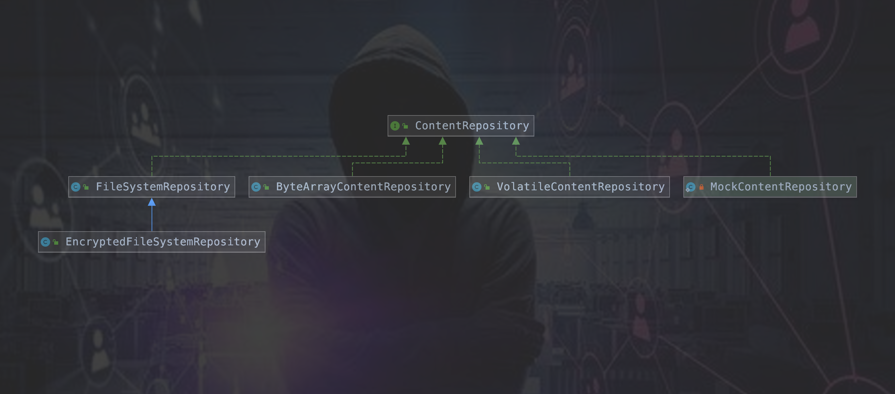
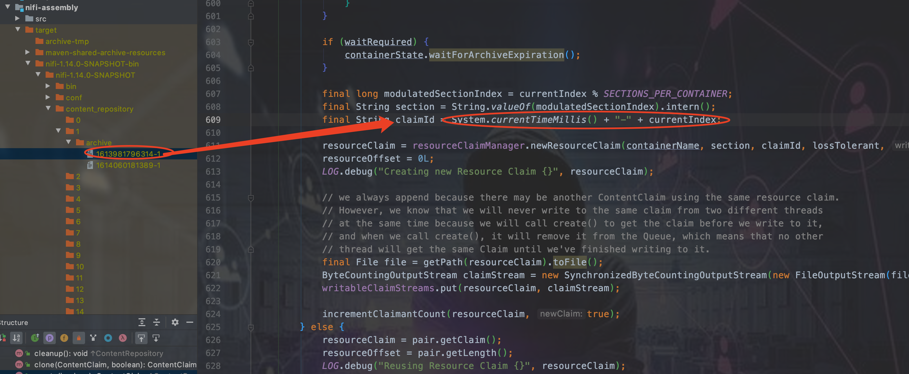

## Content Repository

内容存储库就是本地存储所有FlowFiles内容的地方，通常是三个存储库中最大的。该存储库利用不变性和写时复制来最大提升读写速度和保证线程安全性。Content Repo的核心设计是将FlowFile的内容保存在磁盘上，并仅在需要时才将其读入JVM内存。 这使NiFi可以处理大量小的对象，而无需生产者和消费者处理器将完整的对象保存在内存中。因此，在不损害内存的情况下，非常容易执行诸如拆分，聚合和转换非常大的对象之类的操作。

与JVM Heap具有垃圾回收过程一样，当需要空间时可以回收无法访问的对象，在NiFi中存在一个专用线程来分析内容存储库中未使用的内容。将FlowFile的内容标识为不再使用后，它将被删除或存档。如果在`nifi.properties`中启用了归档，则FlowFile的内容将一直存在于Content Repo中，直到过期（一定时间后删除）或由于Content Repo占用太多空间而将其删除。

## Content Claim

通常，在谈论FlowFile时，对其内容的引用可以简单地称为对该内容的`指针`。但是，FlowFile Content引用的底层实现具有多层复杂性。内容存储库由磁盘上的文件集合组成，这些文件被打包到`Containers`和`Sections`中。`Section`是`Container`的子目录。可以将`Container`视为内容存储库的根目录。但是，内容存储库可以由许多`Container`组成。这样做是为了使NiFi可以并行利用多个物理分区。然后，NiFi能够并行读取和写入所有这些磁盘，以便在单个节点上实现每秒数百兆字节甚至千兆字节的磁盘吞吐量的数据速率。`Resource Claims`是指向磁盘上特定文件的Java对象(这是通过跟踪文件ID，文件所在的Section以及该Section所属的Container).

为了跟踪FlowFile的内容，FlowFile具有一个`Content Claim`对象。 该`Content Claim`声明引用了包含内容、文件中内容的偏移量和内容长度的`Resource Claims`。 要访问内容，内容存储库会使用`Resource Claims`的属性向下钻取到磁盘上的特定文件，然后在从文件流式传输内容之前寻找资源声明指定的偏移量。

完成这一抽象层（`Resource Claims`）是为了确保并非每个FlowFile的内容在磁盘上都一一对应一个文件。 不变性的概念是实现这一点的关键。由于一旦写入内容就永远不会更改（使用`copy on write`进行更改），因此，如果FlowFile的内容发生更改，则不会出现内存碎片或移动数据。 通过利用磁盘上的单个文件来保存许多FlowFiles的内容，NiFi能够提供更好的吞吐量，通常接近磁盘所提供的最大数据速率。

## 源码追踪

### ContentRepository接口

首先肯定要看的是`ContentRepository`接口，在以下的接口中，我们可能更想关注的是如何创建和读取`ContentClaim`：
- create方法
- read方法
- write方法
并且在接口方法定义中我们发现我们需要去读另外几个接口：
- ResourceClaimManager接口
- ContentClaim接口
```java
/**
 * 定义内容存储库的功能。Append选项在方法上不可用，但是提供了一个合并功能。
 */
public interface ContentRepository {

    void initialize(ResourceClaimManager claimManager) throws IOException;
    void shutdown();
    Set<String> getContainerNames();
    long getContainerCapacity(String containerName) throws IOException;
    long getContainerUsableSpace(String containerName) throws IOException;
    String getContainerFileStoreName(String containerName);

    /**
     * 创建新的内容声明
     */
    ContentClaim create(boolean lossTolerant) throws IOException;

    int incrementClaimaintCount(ContentClaim claim);
    int getClaimantCount(ContentClaim claim);
    int decrementClaimantCount(ContentClaim claim);
    boolean remove(ContentClaim claim);
    ContentClaim clone(ContentClaim original, boolean lossTolerant) throws IOException;

    /**
     * 创建一个新的内容项，它是给定声明的所有内容按迭代顺序的合并
     */
    long merge(Collection<ContentClaim> claims, ContentClaim destination, byte[] header, byte[] footer, byte[] demarcator) throws IOException;

    /**
     * 从给定路径导入内容，并在存储库中创建新的内容对象和声明。
     */
    long importFrom(Path content, ContentClaim claim) throws IOException;
    long importFrom(InputStream content, ContentClaim claim) throws IOException;
    long exportTo(ContentClaim claim, Path destination, boolean append) throws IOException;
    long exportTo(ContentClaim claim, Path destination, boolean append, long offset, long length) throws IOException;
    long exportTo(ContentClaim claim, OutputStream destination) throws IOException;
    long exportTo(ContentClaim claim, OutputStream destination, long offset, long length) throws IOException;
    long size(ContentClaim claim) throws IOException;

    /**
     * 提供对给定声明的输入流的访问
     */
    InputStream read(ContentClaim claim) throws IOException;

    /**
     * 获取给定声明内容的OutputStream。
     */
    OutputStream write(ContentClaim claim) throws IOException;

    /**
     * 清除存储库的内容，就像存储库是新创建的一样。
     */
    void purge();

    /**
     * 执行系统重新启动时可能需要执行的任何清理操作。例如，如果内容在重新启动之前已部分写入存储库，则存储库将有机会处理此数据
     */
    void cleanup();

    /**
     * @return 返回一个布尔值，指示是否可以读取给定声明指定的内容，而不管内容是否已存档。如果ContentRepository没有实现存档功能，此方法将返回<code>false</code>
     */
    boolean isAccessible(ContentClaim contentClaim) throws IOException;

    default Set<ResourceClaim> getActiveResourceClaims(String containerName) throws IOException {
        throw new UnsupportedOperationException();
    }
    default boolean isActiveResourceClaimsSupported() {
        return false;
    }
}
```



### FileSystemRepository

#### write方法

通过上面的接口方法我们看到，write主要是获取到指定ContentClaim的OutputStream，而通过OutputStream我们就可以写内容了。那么首先应该关注的就是OutputStream是怎么获取到的。
```java
@Override
public OutputStream write(final ContentClaim claim) throws IOException {
    return write(claim, false);
}

private OutputStream write(final ContentClaim claim, final boolean append) {
    // 检验并将其强转为实现类StandardContentClaim
    StandardContentClaim scc = validateContentClaimForWriting(claim);
    // writableClaimStreams是一个ConcurrentMap<ResourceClaim, ByteCountingOutputStream>
    // ByteCountingOutputStream就是简单包了一下OutputStream，加了个计数的功能 写一个byte就+1
    ByteCountingOutputStream claimStream = writableClaimStreams.get(scc.getResourceClaim());
    final int initialLength = append ? (int) Math.max(0, scc.getLength()) : 0;

    final ByteCountingOutputStream bcos = claimStream;

    // TODO: Refactor OS implementation out (deduplicate methods, etc.)
    // 自定义的继承OutputStream的ContentRepositoryOutputStream，写的时候主要还是调用的ByteCountingOutputStream
    final OutputStream out = new ContentRepositoryOutputStream(scc, bcos, initialLength);

    LOG.debug("Writing to {}", out);
    if (LOG.isTraceEnabled()) {
        LOG.trace("Stack trace: ", new RuntimeException("Stack Trace for writing to " + out));
    }

    return out;
}
```
首先会检验`ContentClaim clai`并将其强转为实现类StandardContentClaim对象，然后根据StandardContentClaim里的ResourceClaim获取到ByteCountingOutputStream，将StandardContentClaim对象和ByteCountingOutputStream打包成一个ContentRepositoryOutputStream并返回。那么接下来，我们应该重点关注ByteCountingOutputStream是如何创建的，即`ConcurrentMap<ResourceClaim, ByteCountingOutputStream> writableClaimStreams`是什么时候存的元素，相应的元素是怎么创建的。

#### create方法

发现`writableClaimStreams`是在`create`方法里`put`元素的。

```java
@Override
public ContentClaim create(final boolean lossTolerant) throws IOException {
    ResourceClaim resourceClaim;

    final long resourceOffset;
    // 保持了写状态的声明的队列 
    // 理想情况下，这将至少与同时更新存储库的线程数一样大，但我们不想太大，因为它将保持对这么多FileOutputStreams的开放。
    // 队列用于确定要写入哪个声明，然后相应的映射可用于获取可用于写入声明的OutputStream。
    // ClaimLengthPair:ResourceClaim + length
    final ClaimLengthPair pair = writableClaimQueue.poll();
    if (pair == null) {
        // 原子自增
        final long currentIndex = index.incrementAndGet();

        String containerName = null;
        boolean waitRequired = true;
        ContainerState containerState = null;
        for (long containerIndex = currentIndex; containerIndex < currentIndex + containers.size(); containerIndex++) {
            final long modulatedContainerIndex = containerIndex % containers.size();
            // 容器名称就是我们在nifi.properties里面配置的内容存储库相关决定的
            containerName = containerNames.get((int) modulatedContainerIndex);
            // 根据容器的名称查看容器状态
            containerState = containerStateMap.get(containerName);
            // 按照containerName创建Container的声明是否需要等待，取决于Container是否到达了背压阀值
            if (!containerState.isWaitRequired()) {
                waitRequired = false;
                break;
            }
        }

        if (waitRequired) {
            containerState.waitForArchiveExpiration();
        }

        final long modulatedSectionIndex = currentIndex % SECTIONS_PER_CONTAINER;
        final String section = String.valueOf(modulatedSectionIndex).intern();
        final String claimId = System.currentTimeMillis() + "-" + currentIndex;
        // 调用resourceClaimManager创建resourceClaim
        resourceClaim = resourceClaimManager.newResourceClaim(containerName, section, claimId, lossTolerant, true);
        resourceOffset = 0L;
        LOG.debug("Creating new Resource Claim {}", resourceClaim);
        // containerName+'/'+section+'/'+claimId
        final File file = getPath(resourceClaim).toFile();
        // 总是追加写(顺序写入，减少了磁盘寻道的开销)，因为可能有另一个ContentClaim使用相同的ResourceClaim。
        // 我们永远不会同时从两个不同的线程写入同一个声明，因为我们将在写入之前调用create来获取该声明，
        // 而当我们调用create时，它将从队列中删除该声明，这意味着在我们完成对该声明的写入之前，其他线程都不会获取相同的声明。
        // 获取ResourceClaim对应的文件的FileOutputStream，并包装成SynchronizedByteCountingOutputStream
        // SynchronizedByteCountingOutputStream是在ByteCountingOutputStream的write方法上都加了synchronized声明
        ByteCountingOutputStream claimStream = new SynchronizedByteCountingOutputStream(new FileOutputStream(file, true), file.length());
        writableClaimStreams.put(resourceClaim, claimStream);

        incrementClaimantCount(resourceClaim, true);
    } else {
        resourceClaim = pair.getClaim();
        resourceOffset = pair.getLength();
        LOG.debug("Reusing Resource Claim {}", resourceClaim);

        incrementClaimantCount(resourceClaim, false);
    }

    final StandardContentClaim scc = new StandardContentClaim(resourceClaim, resourceOffset);
    return scc;
}
```
首先，有一个`writableClaimQueue`队列，这里面存了还可以写入的`ResourceClaim`(前面我们说过，一个ResourceClaim可以对应好几个流文件，所以运行时会有还没写满的ResourceClaim等待着继续写入)。尝试从队列里取出一个`ResourceClaim`，如果取不到，我们就只能新建一个。新建一个`ResourceClaim`我们就得先找一个可用的`Container`

另外，如果读过相关的文档，你会知道内容存储库是可以指定多个目录的。比如
```
nifi.content.repository.directory.default=./content_repository
nifi.content.repository.directory.c1=./content_repository1
nifi.content.repository.directory.c2=./content_repository2
...
```
就是说如果你使用的是默认配置的话，你的`containerName`就只有一个叫`default`，你的内容存储库就只有一个`Container`，对应的文件目录叫`content_repository`。

拿到状态OK的`Container`,那我们就着手建`resourceClaim`(比如说在`content_repository`目录下建子目录，子目录中建文件)，那些数字目录就是`Section`，文件名称就是`claimId`。


至于为什么还有有一个`archive`目录，因为默认开启内容存储库归档功能(用于存一些历史，重播，血缘关系查看时看流内容)。

看着这里我们发现，核心代码时这个`resourceClaim = resourceClaimManager.newResourceClaim(containerName, section, claimId, lossTolerant, true);`，然后从`resourceClaim`可以找到对应的`File`建对应的`FileOutputStream`,然后将`resourceClaim`和包裹了`FileOutputStream`的`ByteCountingOutputStream`放到`writableClaimStreams`这个Map存起来。当在上一章节写到的`write`方法里调用的时候就可以根据对应的`resourceClaim`直接拿到输出流了。

而`final File file = getPath(resourceClaim).toFile();`文件直指`containerName+'/'+section+'/'+claimId`，用对应的输出流写就可以了。

那么接下来，我们就应该看看`resourceClaim = resourceClaimManager.newResourceClaim`是怎么创建的了。

### ResourceClaimManager接口

`ResourceClaimManager`接口负责管理当前NIFI节点所有的`ResourceClaim`，而`StandardResourceClaimManager`是`ResourceClaimManager`实现类，由`FlowController`创建的单例。
```java
/**
 * 负责管理应用程序中使用的所有Resource Claims
 */
public interface ResourceClaimManager {
    /**
     * 使用给定的id，container，section和损失容忍度创建一个新的ResourceClaim。
     */
    ResourceClaim newResourceClaim(String container, String section, String id, boolean lossTolerant, boolean writable);
    /**
     * 返回具有给定id，容器和部分的ResourceClaim，如果存在，则为null
     */
    ResourceClaim getResourceClaim(String container, String section, String id);

    int getClaimantCount(ResourceClaim claim);
    int decrementClaimantCount(ResourceClaim claim);
    int incrementClaimantCount(ResourceClaim claim);
    int incrementClaimantCount(ResourceClaim claim, boolean newClaim);
    void markDestructable(ResourceClaim claim);
    void drainDestructableClaims(Collection<ResourceClaim> destination, int maxElements);
    void drainDestructableClaims(Collection<ResourceClaim> destination, int maxElements, long timeout, TimeUnit unit);
    /**
     * 清除管理器的内存中它所知道的所有资源声明
     */
    void purge();

    /**
     * 冻结资源声明，使其无法再写入
     */
    void freeze(ResourceClaim claim);

    /**
     * 指示给定的资源声明是否正在等待销毁
     */
    boolean isDestructable(ResourceClaim claim);
}
```
接下来就接着上一节`resourceClaim = resourceClaimManager.newResourceClaim(containerName, section, claimId, lossTolerant, true);`看看`StandardResourceClaimManager`是如何创建的`resourceClaim`的。
```java
@Override
public ResourceClaim newResourceClaim(final String container, final String section, final String id, final boolean lossTolerant, final boolean writable) {
    final StandardResourceClaim claim = new StandardResourceClaim(this, container, section, id, lossTolerant);
    if (!writable) {
        claim.freeze();
    }
    return claim;
}
```
好吧，看来是直接`new`了一个`StandardResourceClaim`。

### ResourceClaim接口
`ResourceClaim`接口很简单，基本上就是提供了查询我们`newResourceClaim(containerName, section, claimId, lossTolerant, true);`传入的那些参数的查询方法。

```java
/**
 * 表示可以由ContentRepository提供的资源
 * 线程安全
 */
public interface ResourceClaim extends Comparable<ResourceClaim> {
    
    String getId();
    String getContainer();
    String getSection();
    boolean isLossTolerant();
    boolean isWritable();
    /**
     * 指示资源声明是否正在使用中。如果资源声明是可写的，或者至少有一个内容声明仍然引用该资源声明，则称该资源声明正在使用中
     */
    boolean isInUse();
    /**
     * 提供ResourceClaim对象的自然顺序。默认情况下，它们按id、Container和Section进行排序
     *
     * @param other other claim
     * @return x such that x <= -1 if this is less than other;
     *         x=0 if this.equals(other);
     *         x >= 1 if this is greater than other
     */
    @Override
    default int compareTo(final ResourceClaim other) {
        final int idComparison = getId().compareTo(other.getId());
        if (idComparison != 0) {
            return idComparison;
        }

        final int containerComparison = getContainer().compareTo(other.getContainer());
        if (containerComparison != 0) {
            return containerComparison;
        }

        return getSection().compareTo(other.getSection());
    }
}
```
`StandardResourceClaim`的构建函数也很简单。
```java
public StandardResourceClaim(final ResourceClaimManager claimManager, final String container, final String section, final String id, final boolean lossTolerant) {
        this.claimManager = claimManager;
        this.container = container.intern();
        this.section = section.intern();
        this.id = id;
        this.lossTolerant = lossTolerant;

        hashCode = 17 + 19 * id.hashCode() + 19 * container.hashCode() + 19 * section.hashCode();
    }
```

总而言之，言而总之，`ResourceClaim`就是存了一些信息的简单对象: container名称，section数字，claim号等等。

### ContentClaim接口

最后，我们经常在UI上就能看到，一个FlowFile保留的是`ContentClaim`，如下接口，`ContentClaim`里保存着它所在的`ResourceClaim`，并且还记录了偏移量，这样我们从`FlowFile`对象可以获得`ContentClaim`,再得到`ResourceClaim`，进而获取`OutputStream`进而根据偏移量继续写流文件内容到存储库中。

```java
/**
 * 对{@link ResourceClaim}的一部分的引用，该部分可能包含也可能不包含整个ResourceClaim。多个FlowFiles可以通过具有相同的内容声明来引用相同的内容。
 * 必须是线程安全的
 */
public interface ContentClaim extends Comparable<ContentClaim> {

    /**
     * @return the 该ContentClaim引用的ResourceClaim
     */
    ResourceClaim getResourceClaim();

    /**
     * @return 此声明内容开始的ResourceClaim中的偏移量
     */
    long getOffset();

    /**
     * @return 此ContentClaim的长度
     */
    long getLength();
}
```
至于读操作，就很简单了
```java
@Override
public InputStream read(final ContentClaim claim) throws IOException {
    if (claim == null) {
        return new ByteArrayInputStream(new byte[0]);
    }
    final Path path = getPath(claim, true);
    final FileInputStream fis = new FileInputStream(path.toFile());
    if (claim.getOffset() > 0L) {
        try {
            // 从InputStream跳过指定的字节数
            StreamUtils.skip(fis, claim.getOffset());
        } ....
```

额外的，归档文件：




