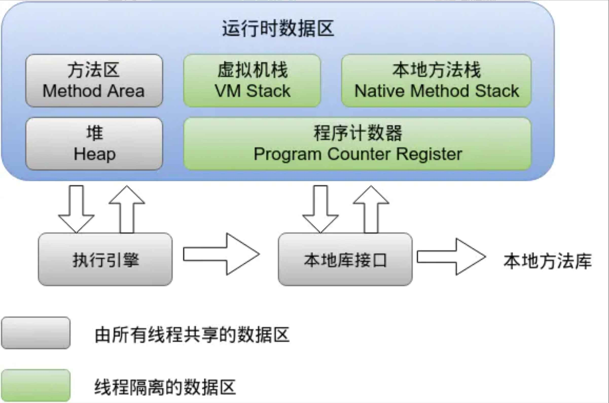
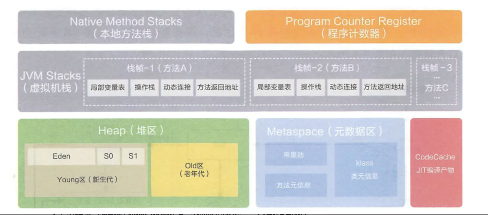
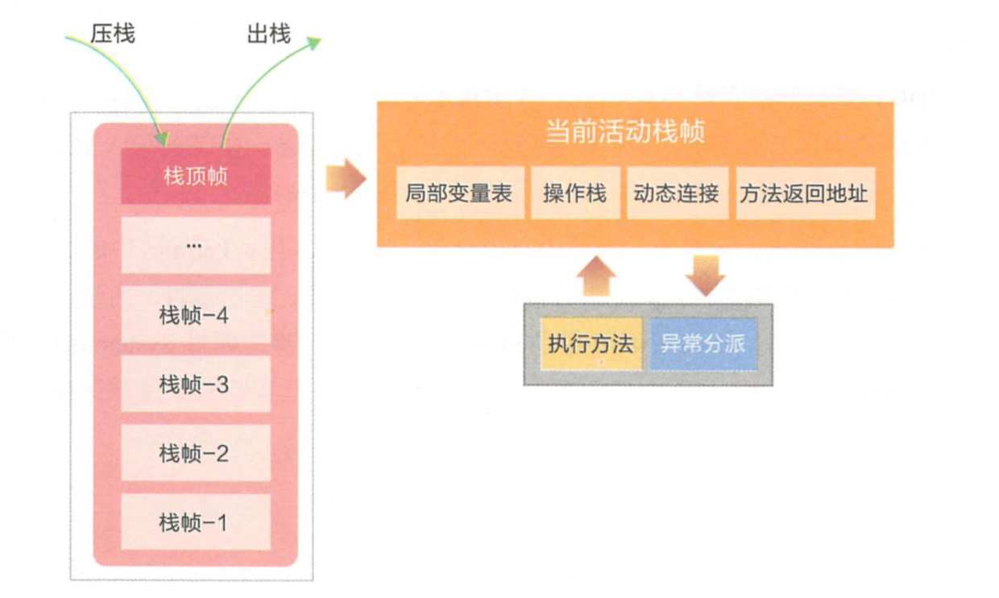
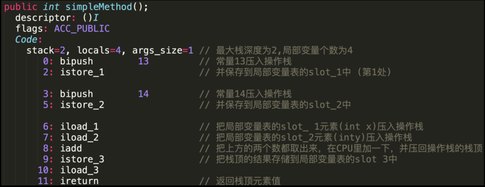
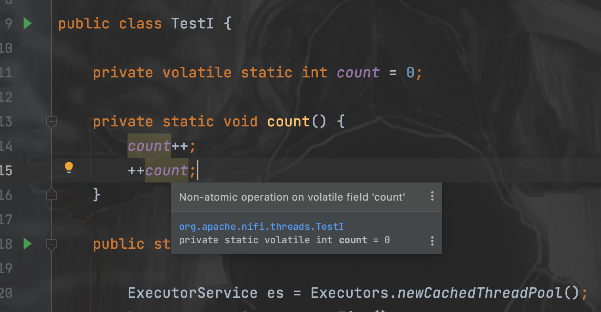
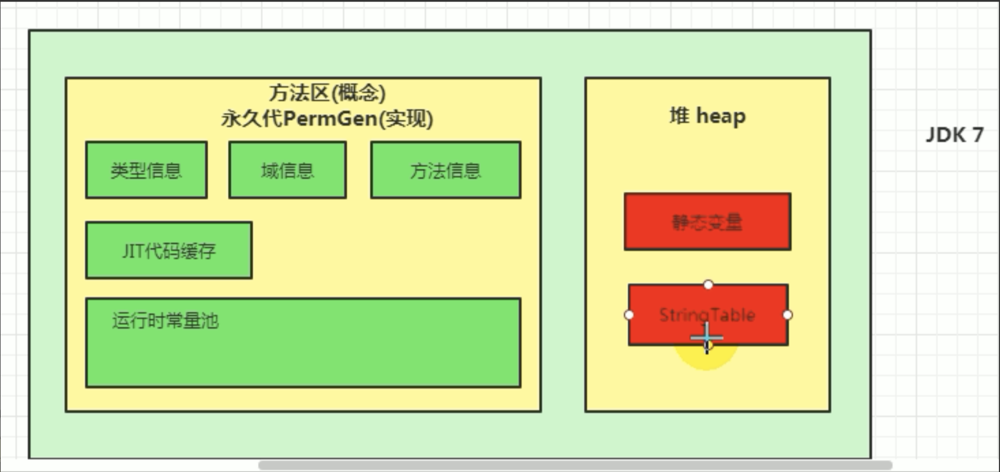

## Program Counter Register

Register 的命名源于CPU的寄存器，CPU只有把数据装载到寄存器才能够运行。

寄存器存储指令相关的现场信息，由于CPU时间片轮限制，众多线程在并发执行过程中，任何一个确定的时刻，一个处理器或者多核处理器中的一个内核，只会执行某个线程中的一条指令。这样必然导致经常中断或恢复，如何保证分毫无差呢?。

每个线程在创建后，都会产生自己的程序计数器和栈帧，程序计数器用来存放执行指令的偏移量和行号指示器等，线程执行或恢复都要依赖程序计数器。程序计数器在各个线程之间互不影响，此区域也不会发生内存溢出异常。

### 定义

程序计数器（Program Counter Register）是一块**较小的内存空间**，它可以看作是**当前线程所执行的字节码的行号指示器**。在虚拟机概念模型里（概念模型，各种虚拟机可能会通过一些更高效的方式实现），字节码解释器工作时就是通过改变这个计数器的值来选取下一条需要执行的字节码指令：分支、跳转、循环、异常处理、线程恢复等基础操作都会依赖这个计数器来完成。**每个线程都有独立的程序计数器，用来在线程切换后能恢复到正确的执行位置，各条线程之间的计数器互不影响，独立存储**。所以它是一个“**线程私有**”的内存区域。此内存区域是唯一一个在JVM规范中没有规定任何OutOfMemoryError情况的区域。

如果当前线程正在执行的是
- Java方法：计数器记录的就是当前线程正在执行的字节码指令的地址
- 本地方法：那么程序计数器值为undefined

### 作用

- 字节码解释器通过改变程序计数器来依次读取指令，从而实现代码的流程控制，如：顺序执行、选择、循环、异常处理
- 在多线程的情况下，程序计数器用于记录当前线程执行的位置，从而当线程被切换回来的时候能够知道该线程上次运行到哪儿了。

### 特点
- 一块较小的内存空间
- 线程私有。每条线程都有一个独立的程序计数器。
- 是唯一一个不会出现OOM的内存区域。
- 生命周期随着线程的创建而创建，随着线程的结束而死亡。


## JVM Stacks

JVM栈是线程私有的内存区域。它描述的是**java方法执行**的内存模型，**每个方法执行的同时都会创建一个栈帧（Stack Frame）用于存储局部变量表、操作数栈、动态链接、方法出口等信息**。

每个方法从调用直至完成的过程，都对应着一个栈帧从入栈到出栈的过程。在活动线程中，只有位于栈顶的帧才是有效的，称为当前栈帧

每当一个方法执行完成时，该栈帧就会弹出栈帧的元素作为这个方法的返回值，并且清除这个栈帧，Java栈的栈顶的栈帧就是当前正在执行的活动栈，也就是当前正在执行的方法。就像是组成动画的一帧一帧的图片，方法的调用过程也是由栈帧切换来产生结果。

虚拟机栈通过压/出栈的方式，对每个方法对应的活动栈帧进行运算处理，方法正常执行结束，肯定会跳转到另一个栈帧上。在执行的过程中，如果出现异常，会进行异常回溯，返回地址通过异常处理表确定



>注意：人们常说，Java的内存空间分为“栈”和“堆”，栈中存放局部变量，堆中存放对象。
这句话不完全正确！这里的“堆”可以这么理解，但这里的“栈”就是现在讲的虚拟机栈,或者说Java虚拟机栈中的局部变量表部分.
真正的Java虚拟机栈是由一个个栈帧组成，而每个栈帧中都拥有：局部变量表、操作数栈、动态链接、方法出口信息.

### 局部变量表

局部变量表是一组变量值的存储空间，用于存放**方法参数**和**方法内部定义的局部变量**，在Java程序被编译为Class文件时，就在方法的Code属性的max_locals数据项中确定了该方法所需分配的局部变量表的最大容量。

>**局部变量表**存放了编译器可知的各种**基本数据类型**（int、short、byte、char、double、float、long、boolean）、**对象引用**（reference类型，它不等同于对象本身，可能是一个指向对象起始地址的引用指针，也可能是指向一个代表对象的句柄或其他与此对象相关的位置）和returnAddress类型（指向了一跳字节码指令的地址==）。

相对于类属性变量的准备阶段和初始化阶段来说，局部变量没有准备阶段，必须显式初始化。


在JVM规范中，对这个区域规定了两种异常情况：如果线程请求的栈深度大于虚拟机允许的深度，将抛出[StackOverflowError](https://note.youdao.com/s/WtJvWFVk)异常(通常出现在递归方法中)；如果虚拟机栈可以动态扩展，在扩展时无法申请到足够的内存，就会抛出[OutOfMemoryError](https://note.youdao.com/s/DMMPudjP)异常。

>字节码指令中的STORE指令就是将操作栈中计算完成的局部变量写回局部变量表的存储空间内。

### 操作栈

- 操作栈是一个初始状态为空的桶式结构栈
- 在方法执行过程中，会有各种指令往栈中写入和提取信息
- ==JVM的执行引擎是基于栈的执行引擎，其中的栈指的就是操作栈==
- 字节码指令集的定义都是基于栈类型的,栈的深度在方法元信息的stack属性中

下面用一段简单的代码说明操作栈与局部变量表的交互




局部变量表就像个中药柜，里面有很多抽屉,依次编号为0, 1, 2,3，.,. n，字节码指令istore_ 1就是打开1号抽屉，把栈顶中的数13存进去。

某些指令可以直接在抽屉里进行，比如inc指令，直接对抽屉里的数值进行+1操作
程序员面试过程中，常见的i++和++i的区别，可以从字节码上对比出来：


- iload_ 1从局部变量表的第1号抽屉里取出一个数,压入栈顶，下一步直接在抽屉里实现+1的操作，而这个操作对栈顶元素的值没有影响，所以istore_ 2只是把栈顶元素赋值给a
- 表格右列，先在第1号抽屉里执行+1操作，然后通过iload_ 1把第1号抽屉里的数压入栈顶，所以istore_ 2存入的是+1之后的值

>这里延伸一个信息，i++(++i)并非原子操作。即使通过volatile关键字进行修饰，多个线程同时写的话，也会产生数据互相覆盖的问题。
>

### 动态连接

- 动态链接主要就是==指向运行时常量池的方法引用==
- 每一个栈帧内存都包含一个指向运行时常量池中该栈帧所属方法的引用，包含这个引用的目的就是为了支持当前方法的代码能够实现动态链接(Dynamic Linking)。比如invokedynamic 指令
- 在Java源文件被编译到字节码文件中时，所有的变量和方法引用都作为符号引用(Symbolic Reference )保存在class文件的常量池里。比如，描述一个方法调用其他方法时，就是通过常量池中指向方法的符号引用来表示的，那么==动态链接的作用就是为了将这些符号引用转换为调用方法的直接引用==

#### 方法的调用

在JVM中，将符号引用转换为调用方法的直接引用与方法的绑定机制有关

**方法的静态链接与动态链接**

* **静态链接**：当一个字节码文件被装在进JVM内存时，如果被调用的目标方法在编译期可知，且运行期保持不变时，这种情况下将调用方法的符号引用转换为直接而引用的过程称之为静态链接。 例如，super()方法
* **动态链接**：如果被调用的方法无法在编译期确定下来，也就是说，只能够在程序运行期将调用方法的符号引用转换为直接引用，由于这种引用转换过程中具备动态性，因此也被称之为动态链接。对应着接口回调，多态动态绑定等

与之对应的则是方法的绑定机制。早期绑定(Early Binding)和晚期绑定(late Binding)。绑定是一个字段、方法或者类在符号引用被替换为直接引用的过程，这里仅仅发生一次。

* **早期绑定**：早期绑定就是被调用的目标函数如果在编译期可知，且运行期间保持不变，即可将这个方法与所属的类型进行绑定。
* **晚期绑定**：如果被调用的方法在编译期无法被确定下来，只能够在程序运行期根据实际的类型确定相关的方法，被称之为晚期绑定。其实也就是动态绑定

#### 虚方法与非虚方法

1.  对应着进行早期绑定和静态链接的定义，即在编译期就确定了具体的调用版本，在运行时不可变，称之为非虚方法
2.  静态方法、私有方法、final方法、实例构造器、父类方法都是非虚方法
3.  其他方法称之为虚方法
4.  子类对象的多态性使用的前提为：类的继承关系，方法的重写
5.  可以简单的理解为自己写的方法就是虚方法。
    * 在面向对象的编程中，会很频繁的使用到动态分派，如果在每次动态分派的过程中都要重新在类的方法元数据中搜索合适的目标的话可能影响到执行效率，因此，为了提高性能，JVM采用在类的方法区建立一个虚方法表(virtual method table)(非虚方法不会出现在表中)来实现，使用索引表来替代查找
    * 每个类中都有一个虚方法表，表中存放着各个方法的实际入口
    * 虚方法表会在类加载的链接阶段被创建并开始初始化，类的变量初始值准备完成以后，JVM会把该类的方法表也初始化完毕

#### 方法的调用指令

* 普通调用指令

    * invokestatic：调用静态方法，解析阶段确定唯一方法版本
    * invokesopecial：调用`<init>`方法、私有即父类犯法，解析阶段确定唯一方法版本
    * invokevirtual：调用所有虚方法
    * invokeinterface：调用接口方法

* 动态调用指令:

    * invokedynamic：动态解析出所有需要的方法，然后执行，(lamble表达式)，和python一样，变量不需要自己执行，运行时才知道

#### 方法重写的本质

1.  找到操作数栈顶的第一个元素所执行的对象的实际类型，记作C
2.  如果在类型C中找到与常量中的描述符合简单名称都相符的方法，则进行访问权限校验，如果通过则放回这个方法的直接引用，查找过程结束；如果不通过，则返回==java.lang.illegalAccessError==异常
3.  否则，按照继承关系从上往下依次对C的各个父类进行第2步的搜索和验证过程
4.  如果始终没有找到合适的方法，则抛出==java.lang.AbstactMethodErro==r异常

### 方法返回地址

* 方法执行时有两种退出情况

    * 正常退出，正常执行到任何方法的返回字节码指令，如RETURN、IRETURN、ARETURN等
    * 异常退出

无论何种退出情况，都将返回至方法当前被调用的位置。方法退出的过程相当于弹出当前栈帧

退出可能有三种方式:

* 返回值压入，上层调用栈帧
* 异常信息抛给能够处理的栈帧
* PC计数器指向方法调用后的下一条指令


## Native Method Stack

虚拟机栈“主内”，而本地方法栈“主外”,这个“内外”是针对JVM来说的，本地方法栈为Native方法服务。Sun HotSpot 直接就把本地方法栈和虚拟机栈合二为一。本地方法栈也会抛出StackOverflowError和OutOfMemoryError异常。

线程开始调用本地方法时，会进入一个不再受JVM约束的世界,本地方法可以通过JNI(Java Native Interface)来访问虚拟机运行时的数据区，甚至可以调用寄存器,具有和JVM相同的能力和权限。当大量本地方法出现时,势必会削弱JVM对系统的控制力,因为它的出错信息都比较黑盒.对于内存不足的情况，本地方法栈还是会拋出native heap OutOfMemory。

最著名的本地方法应该是System.currentTimeMillis()，JNI 使Java深度使用OS的特性功能，复用非Java代码，但是在项目过程中，如果大量使用其他语言来实现JNI,就会丧失跨平台特性，威胁到程序运行的稳定性。
假如需要与本地代码交互，就可以用中间标准框架进行解耦，这样即使本地方法崩溃也不至于影响到JVM的稳定。当然，如果要求极高的执行效率、偏底层的跨进程操作等，可以考虑设计为JNI调用方式

## 堆Heap

Heap是OOM故障最主要的发源地，它存储着几乎所有的实例对象，堆由垃圾收集器自动回收，堆区由各子线程共享使用；通常情况下，它占用的空间是所有内存区域中最大的，但如果无节制地创建大量对象，也容易消耗完所有的空间；堆的内存空间既可以固定大小，也可运行时动态地调整，通过如下参数设定初始值和最大值，比如


```
-Xms256M. -Xmx1024M
```

其中-X表示它是JVM运行参数

- ms是memorystart的简称 最小堆容量
- mx是memory max的简称 最大堆容量

但是在通常情况下，服务器在运行过程中，堆空间不断地扩容与回缩，势必形成不必要的系统压力，所以在线上生产环境中，JVM的Xms和Xmx设置成一样大小，避免在GC后调整堆大小时带来的额外压力。

对于大多数应用来说，Java堆（Heap）是JVM所管理的内存中最大的一块。它是被所有线程共享的一块内存区域，在虚拟机启动时创建。

堆主要用来存放对象实例，所有的对象实例以及数组都要在堆上分配。堆是垃圾收集器管理的主要区域，也被称为“GC堆”。

>JVM 新生代、老年代的默认比值跟选择的 GC 回收器有关!不仅仅只是有关，同时还决定着新生代、老年代的概念是否存在。

从内存回收的角度来看，堆可以细分为：**新生代**和**老年代**（从配置上讲默认空间分配比例是1：2）；再细致一点新生代可分为：**Eden空间**、**From Survivor空间**、**To Survivor空间**（从配置上讲默认空间分配比例是8：1：1）。如果在堆中没有内存完成实例分配，并且堆也无法再扩展时，将抛出OutOfMemoryError异常。

>在 JDK 1.3 及之前，-XX:+UseSerialGC 是回收器的唯一选择。当时来说，JVM 新生代、老年代的默认比值的的确确是 1：2。

>从 -XX:+UseParallelGC 取代 -XX:+UseSerialGC 成为默选项起，JVM 新生代、老年代的默认比值早已不再是 1：2 了，而是比值可被动态调整，比如目前市场占有率最高的 JDK8。

>有一个非常重要的UseAdaptiveSizePolicy 参数,该参数默认开启，该参数对应的是 GC 自适应的调节策略(GC Ergonomics)，如果开启，那么 JVM 会根据系统的运行情况，动态调整一些参数，包括：新生代和老年代的比值。Eden、Survivor From、Survivor To 的比值;大对象直接进入老年代的阈值等，以达到吞吐量优先的目标。

>从 JDK9 开始，-XX:+UseG1GC 取代 -XX:+UseParallelGC 成为默认选项。或者是今后 -XX:+UseZGC 或 -XX:+UseShenandoahGC 可能成为默认选项(毕竟设计目标就是针对 G1 的不足)。

>G1 回收器也是遵循分代收集理论的，但是会把连续的 Java 堆不区分新生代、老年代的情况下而划分为大小相等的 Region，每个 Region 都会根据需要扮演新生代或老年代的空间。G1 仍然保留了新生代、老年代，并且新生代也区分 Eden 和 Survivor，只是 Survivor 不再区分 From 和 To。

>而 ZGC 和 ShenandoahGC 的话，颠覆的比较彻底，已经不再区分新生代和老年代了，也就是说不再使用分代收集，默认比值多少的问题已经没有意义了。

绝大部分对象在Eden区生成，当Eden区装填满的时候，会触发Young GC。垃圾回收的时候，在Eden区实现清除策略，没有被引用的对象则直接回收。依然存活的对象会被移送到Survivor区，这个区真是名副其实的存在。

Survivor 区分为S0和S1两块内存空间，送到哪块空间呢?每次Young GC的时候，将存活的对象复制到未使用的那块空间，然后将当前正在使用的空间完全清除，交换两块空间的使用状态。==如果YGC要移送的对象大于Survivor区容量上限，则直接移交给老年代==。假如一些没有进取心的对象以为可以一直在新生代的Survivor区交换来交换去，那就错了。==每个对象都有一个计数器，每次YGC都会加1==。

```
-XX:MaxTenuringThreshold
```
参数能配置计数器的值到达某个阈值的时候，对象从新生代晋升至老年代。如果该参数配置为1,那么从新生代的Eden区直接移至老年代。默认值是15，可以在Survivor 区交换14次之后，晋升至老年代。

若Survivor区无法放下，或者超大对象的阈值超过上限，则尝试在老年代中进行分配;如果老年代也无法放下，则会触发Full Garbage Collection(Full GC);
如果依然无法放下，则抛OOM。

堆出现OOM的概率是所有内存耗尽异常中最高的,出错时的堆内信息对解决问题非常有帮助，所以给JVM设置运行参数
```
XX:+HeapDumpOnOutOfMemoryError
```

## 方法区

《Java虚拟机规范》中明确说明：“尽管所有的方法区在逻辑上是属于堆的一部分，但一些简单的实现可能不会选择去进行垃圾收集或者进行压缩。”但对于HotSpotJVM而言，方法区还有一个别名叫做Non-Heap(非堆）,目的就是要和堆分开。所以，方法区看作是一块独立于Java堆的内存空间。

方法区中存放已经被虚拟机加载的类信息、常量、静态变量、即时编译器编译后的代码等数据。其中类相关的信息,如类名,访问修饰符,常量池,字段描述,方法描述等。

>《Java虚拟机规范》只是规定了有方法区这么个概念和它的作用，并没有规定如何去实现它。那么，在不同的JVM上方法区的实现肯定是不同的了。永久代和元空间是HotSpot虚拟机中对JVM规范中方法区的实现，而永久代和元空间的区别在JVM不同版本中对方法区的实现。

- 在JDK1.7之前：永久代是方法区的实现，存放了运行时常量池，包含字符串常量池，静态变量等。
- 在JDK1.7：永久代是方法区的实现，存放的字符串常量池、静态变量等移出至堆内存。运行时常量池等剩下的东西还在永久代（方法区）。
- 在JDK1.8中，永久代已经不存在，存储的**类信息、编译后的代码数据**等已经移动到了==MetaSpace(元空间)中==，**元空间并没有处于堆内存上，而是直接占用的本地内存（NativeMemory）**。

### 元空间

- 元空间的本质和永久代类似，都是**对JVM规范中方法区的实现**。
- 不过元空间与永久代之间最大的区别在于：元空间并不在虚拟机中，而是使用本地内存。
- 元空间的大小仅受本地内存限制，可以通过以下参数来指定元空间大小：
- -XX:MetaspaceSize，初始空间大小，达到该值就会触发垃圾收集进行类型卸载，同时GC会对该值进行调整：如果释放了大量的空间，就适当降低该值；如果释放了很少的空间，那么在不超过MaxMetaspaceSize时，适当提高该值
- -XX:MaxMetaspaceSize，最大空间，默认是没有限制的
- -XX:MinMetaspaceFreeRatio，在GC之后，最小的Metaspace剩余空间容量的百分比，减少为分配空间所导致的垃圾收集
- -XX:MaxMetaspaceFreeRatio，在GC之后，最大的Metaspace剩余空间容量的百分比，减少为释放空间所导致的垃圾收集

>元空间(Metaspace),将类元数据放到本地内存中，将字符常量池和静态变量放到Java堆里。虚拟机会为类的元数据明确分配和释放本地内存。

### Class文件常量池

Class 文件常量池指的是编译生成的 class 字节码文件，其结构中有一项是常量池（Constant Pool Table），用于存放编译期生成的各种字面量和符号引用，这部分内容将在类加载后进入方法区的运行时常量池中存放。

* 这里的字面量是指字符串字面量和声明为 final 的（基本数据类型）常量值，这些字符串字面量除了类中所有双引号括起来的字符串(包括方法体内的)，还包括所有用到的类名、方法的名字和这些类与方法的字符串描述、字段(成员变量)的名称和描述符；声明为final的常量值指的是成员变量，不包含本地变量，本地变量是属于方法的。这些都在常量池的 UTF-8 表中(逻辑上的划分)；
* 符号引用，就是指指向 UTF-8 表中向这些字面量的引用，包括类和接口的全限定名(包括包路径的完整名)、字段的名称和描述符、方法的名称和描述符。只不过是以一组符号来描述所引用的目标，和内存并无关，所以称为符号引用，直接指向内存中某一地址的引用称为直接引用；

### 运行时常量池

运行时常量池是方法区的一部分，是一块内存区域。Class 文件常量池将在类加载后进入方法区的运行时常量池中存放。一个类加载到 JVM 中后对应一个运行时常量池，运行时常量池相对于 Class 文件常量池来说具备动态性，Class 文件常量只是一个静态存储结构，里面的引用都是符号引用。而运行时常量池可以在运行期间将符号引用解析为直接引用。可以说运行时常量池就是用来索引和查找字段和方法名称和描述符的。给定任意一个方法或字段的索引，通过这个索引最终可得到该方法或字段所属的类型信息和名称及描述符信息，这涉及到方法的调用和字段获取。

### 字符串常量池

字符串常量池是全局的，JVM 中独此一份，因此也称为全局字符串常量池。运行时常量池中的字符串字面量若是成员的，则在类的加载初始化阶段就使用到了字符串常量池；若是本地的，则在使用到的时候（执行此代码时）才会使用到字符串常量池。其实，“使用常量池”对应的字节码是一个 ldc 指令，在给 String 类型的引用赋值的时候会先执行这个指令，看常量池中是否存在这个字符串对象的引用，若有就直接返回这个引用，若没有，就在堆里创建这个字符串对象并在字符串常量池中记录下这个引用（jdk1.7)。String 类的 intern() 方法还可在运行期间把字符串放到字符串常量池中。JVM 中除了字符串常量池，8种基本数据类型中除了两种浮点类型剩余的6种基本数据类型的包装类，都使用了缓冲池技术，但是 Byte、Short、Integer、Long、Character 这5种整型的包装类也只是在对应值在 [-128,127] 时才会使用缓冲池，超出此范围仍然会去创建新的对象。其中：

* 在 jdk1.6（含）之前也是方法区的一部分，并且其中存放的是字符串的实例；
* 在 jdk1.7（含）之后是在堆内存之中，存储的是字符串对象的引用，字符串实例是在堆中；
* jdk1.8 已移除永久代，字符串常量池是在本地内存当中，存储的也只是引用。





### Java8为什么要将永久代替换成Metaspace？

1. 字符串存在永久代中，容易出现性能问题和内存溢出。
2. 类及方法的信息等比较难确定其大小，因此对于永久代的大小指定比较困 难，太小容易出现永久代溢出，太大则容易导致老年代溢出。
3. 永久代会为 GC 带来不必要的复杂度，并且回收效率偏低。
4. Oracle 可能会将HotSpot 与 JRockit 合二为一。


