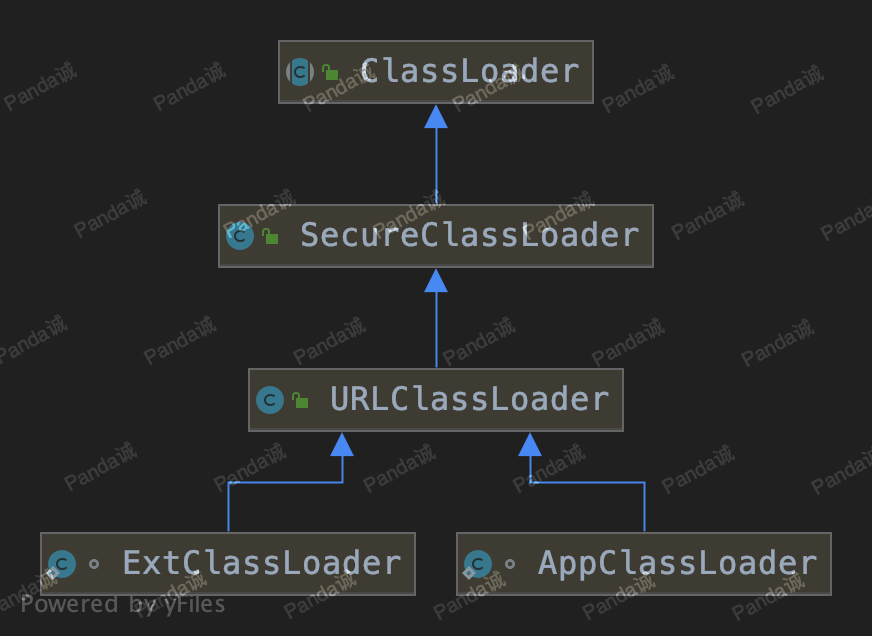

## 什么是类加载器

通过一个类的全限定名来获取描述此类的二进制字节流这个动作放到Java虚拟机外部去实现，以便让应用程序自己决定如何去获取所需要的类。实现这个动作的代码模块称为“类加载器”。

## 有哪几种类加载器

JVM预定义的三种类型类加载器：

- 启动(Bootstrap)类加载器(BootstrapClassLoader)：是用本地代码实现的类加载器，它负责将 %JRE_HOME%/lib下面的类库加载到内存中（比如rt.jar、resources.jar、charsets.jar、class文件等等）。另外需要注意的是可以通过启动jvm时指定-Xbootclasspath和路径来改变Bootstrap ClassLoader的加载目录。由于引导类加载器涉及到虚拟机本地实现细节，开发者无法直接获取到启动类加载器的引用，所以不允许直接通过引用进行操作。
- 标准扩展(Extension)类加载器：是由ExtClassLoader（sun.misc.Launcher$ExtClassLoader）实现的。它负责将JRE/lib/ext或者由系统变量java.ext.dir指定位置中的类库加载到内存中。开发者可以直接使用标准扩展类加载器。
- 系统(System)类加载器：是由AppClassLoader（sun.misc.Launcher$AppClassLoader）实现的。它负责将系统类路径（CLASSPATH）中指定的类库加载到内存中。开发者可以直接使用系统类加载器。


除了以上列举的三种类加载器，还有一种比较特殊的类型叫`线程上下文类加载器`。线程上下文类加载器，它不是一个新的类型，更像一个类加载器的角色，ThreadContextClassLoader可以是上述类加载器的任意一种，但往往是AppClassLoader。

Java虚拟机的第一个类加载器是Bootstrap，这个加载器很特殊，它不是Java类，因此它不需要被别人加载，它嵌套在Java虚拟机内核里面，也就是JVM启动的时候Bootstrap就已经启动，它是用C++写的二进制代码（不是字节码），它可以去加载别的类。然后BootstrapClassLoader去加载ExtClassLoader、AppClassLoader，并将AppClassLoader的parent设置为ExtClassLoader，并设置线程上下文类加载器。

这也是我们在测试时为什么发现System.class.getClassLoader()结果为null的原因，这并不表示System这个类没有类加载器，而是它的加载器比较特殊，是BootstrapClassLoader，由于它不是Java类，因此获得它的引用肯定返回null。

Launcher是JRE中用于启动程序入口main()的类，让我们看下Launcher的代码(jdk8)

```java
public Launcher() {
    //Launcher.ExtClassLoader 和 Launcher.AppClassLoader是protected的，他们都是单例模式。
    Launcher.ExtClassLoader var1;
    try {
        //加载扩展类类加载器
        var1 = Launcher.ExtClassLoader.getExtClassLoader();
    } catch (IOException var10) {
        throw new InternalError("Could not create extension class loader", var10);
    }

    try {
         //加载应用程序类加载器，并设置parent为extClassLoader
        this.loader = Launcher.AppClassLoader.getAppClassLoader(var1);
    } catch (IOException var9) {
        throw new InternalError("Could not create application class loader", var9);
    }
    //设置默认的线程上下文类加载器为AppClassLoader
    Thread.currentThread().setContextClassLoader(this.loader);
    String var2 = System.getProperty("java.security.manager");
    if (var2 != null) {
        //java安全管理器
        SecurityManager var3 = null;
        if (!"".equals(var2) && !"default".equals(var2)) {
            try {
                var3 = (SecurityManager)this.loader.loadClass(var2).newInstance();
            } catch (IllegalAccessException var5) {
            } catch (InstantiationException var6) {
            } catch (ClassNotFoundException var7) {
            } catch (ClassCastException var8) {
            }
        } else {
            var3 = new SecurityManager();
        }

        if (var3 == null) {
            throw new InternalError("Could not create SecurityManager: " + var2);
        }

        System.setSecurityManager(var3);
    }

}
```

## 委托加载机制

某个特定的类加载器在接到加载类的请求时，首先将加载任务委托给父 类加载器(不是父类)，依次递归，如果父 类加载器可以完成类加载任务，就成功返回；只有父类加载器无法完成此加载任务时，才自己去加载。

当Java虚拟机要加载一个类时，到底派出哪个类加载器去加载呢？

- 首先当前线程的类加载器去加载线程中的第一个类（假设为类A）。
- 如果类A中引用了类B，Java虚拟机将使用加载类A的类加载器去加载类B。
- 还可以直接调用ClassLoader.loadClass()方法来指定某个类加载器去加载某个类。

委托机制的意义是什么？

委托加载机制能保证基础类仅加载一次，不会让jvm中存在重名的类。比如String.class，每次加载都委托给父 类加载器，最终都是BootstrapClassLoader，都保证java核心类都是BootstrapClassLoader加载的，保证了java的安全与稳定性。

委托加载机制的实现是在ClassLoader的loadClass方法里

```java
 protected Class<?> loadClass(String name, boolean resolve)
    throws ClassNotFoundException
{
    synchronized (getClassLoadingLock(name)) {
        // First, check if the class has already been loaded
        Class<?> c = findLoadedClass(name);
        if (c == null) {
            long t0 = System.nanoTime();
            try {
                if (parent != null) {
                    //委托给父 类加载器去加载
                    c = parent.loadClass(name, false);
                } else {
                    c = findBootstrapClassOrNull(name);
                }
            } catch (ClassNotFoundException e) {
                // ClassNotFoundException thrown if class not found
                // from the non-null parent class loader
            }

            if (c == null) {
                // If still not found, then invoke findClass in order
                // to find the class.
                long t1 = System.nanoTime();
                c = findClass(name);

                // this is the defining class loader; record the stats
                sun.misc.PerfCounter.getParentDelegationTime().addTime(t1 - t0);
                sun.misc.PerfCounter.getFindClassTime().addElapsedTimeFrom(t1);
                sun.misc.PerfCounter.getFindClasses().increment();
            }
        }
        if (resolve) {
            resolveClass(c);
        }
        return c;
    }
}
```

## ClassLoader里的主要方法

`Class<?> loadClass(String name)`和`Class<?> loadClass(String name, boolean resolve)`方法，根据类的二进制名称去加载类，返回Class对象。

`protected Class<?> findClass(String name)` 方法，由loadClass调用，根据类的二进制名称查找返回Class对象，此方法需要被子类覆盖实现。

`protected final Class<?> defineClass` 将二进制数据转换成一个Class对象，底层是native方法，通常是findClass方法里查找到二进制数据然后调用此方法，返回Class对象。

## 自定义类加载器

继承`ClassLoader`类并覆写实现`findClass`方法，这样的自定义是遵循委托加载机制的。如下例子还覆写了`loadClass`方法，打破了委托加载机制。

```java
public class MyClassLoader extends ClassLoader {
    //用于读取.Class文件的路径
    private String swapPath;
    //用于标记这些name的类是先由自身加载的
    private Set<String> useMyClassLoaderLoad;

    public MyClassLoader(String swapPath, Set<String> useMyClassLoaderLoad) {
        this.swapPath = swapPath;
        this.useMyClassLoaderLoad = useMyClassLoaderLoad;
    }

    @Override
    public Class<?> loadClass(String name) throws ClassNotFoundException {
        Class<?> c = findLoadedClass(name);
        if (c == null && useMyClassLoaderLoad.contains(name)) {
            //特殊的类让我自己加载  打破委托加载机制
            c = findClass(name);
            if (c != null) {
                return c;
            }
        }
        return super.loadClass(name);
    }

    @Override
    protected Class<?> findClass(String name) {
        //根据文件系统路径加载class文件，并返回byte数组
        byte[] classBytes = getClassByte(name);
        //调用ClassLoader提供的方法，将二进制数组转换成Class类的实例
        return defineClass(name, classBytes, 0, classBytes.length);
    }

    private byte[] getClassByte(String name) {
        String className = name.substring(name.lastIndexOf('.') + 1, name.length()) + ".class";
        try {
            FileInputStream fileInputStream = new FileInputStream(swapPath + className);
            byte[] buffer = new byte[1024];
            int length = 0;
            ByteArrayOutputStream byteArrayOutputStream = new ByteArrayOutputStream();
            while ((length = fileInputStream.read(buffer)) > 0) {
                byteArrayOutputStream.write(buffer, 0, length);
            }
            return byteArrayOutputStream.toByteArray();
        } catch (IOException e) {
            e.printStackTrace();
        }
        return new byte[]{};
    }
}
```

通过上面的例子和[动手体验JVM中Class对象的唯一性](./动手体验JVM中Class对象的唯一性.md)我们知道，自定义类加载器不仅可以定义如何查找class，还可以实现类资源的隔离等等。

## 线程上下文类加载器

线程上下文类加载器只是一个概念。

```java
class Thread {
  ...
  private ClassLoader contextClassLoader;

  public ClassLoader getContextClassLoader() {
    return contextClassLoader;
  }

  public void setContextClassLoader(ClassLoader cl) {
    this.contextClassLoader = cl;
  }
  ...
}
```

首先 contextClassLoader 是那种需要显示使用的类加载器，如果你没有显示使用它，也就永远不会在任何地方用到它。你可以使用下面这种方式来显示使用它

```java
Thread.currentThread().getContextClassLoader().loadClass(name);
```

当前线程的 contextClassLoader 是从父线程那里继承过来的，所谓父线程就是创建了当前线程的线程。程序启动时的 main 线程的 contextClassLoader 就是 AppClassLoader。这意味着如果没有人工去设置，那么所有的线程的 contextClassLoader 都是 AppClassLoader。

如果我们对业务进行划分，不同的业务使用不同的线程池，线程池内部共享同一个 contextClassLoader，线程池之间使用不同的 contextClassLoader，显示的使用contextClassLoader去加载类，就可以很好的起到隔离保护的作用，避免类版本冲突，当热线程的 contextClassLoader 使用场合比较罕见。


## ClassLoader继承关系



由上面的继承关系，我们看到ExtClassLoader和AppClassLoader都继承了URLClassLoader，上面还有SecureClassLoader。

SecureClassLoader 继承ClassLoader,新增了几个与使用相关的代码源(对代码源的位置及其证书的验证)和权限定义类验证(主要指对class源码的访问权限)的方法，一般我们不会直接跟这个类打交道，更多是与它的子类URLClassLoader有所关联。

ClassLoader是一个抽象类，很多方法是空的没有实现，比如 findClass()、findResource()等。而URLClassLoader这个实现类为这些方法提供了具体的实现，并新增了URLClassPath类协助取得Class字节码流等功能，在编写自定义类加载器时，如果没有太过于复杂的需求，可以直接继承URLClassLoader类，这样就可以避免自己去编写findClass()方法及其获取字节码流的方式，使自定义类加载器编写更加简洁。

参考：

https://zhuanlan.zhihu.com/p/54693308
https://www.jianshu.com/p/9df9d318e838
https://www.cnblogs.com/lanxuezaipiao/p/4138511.html