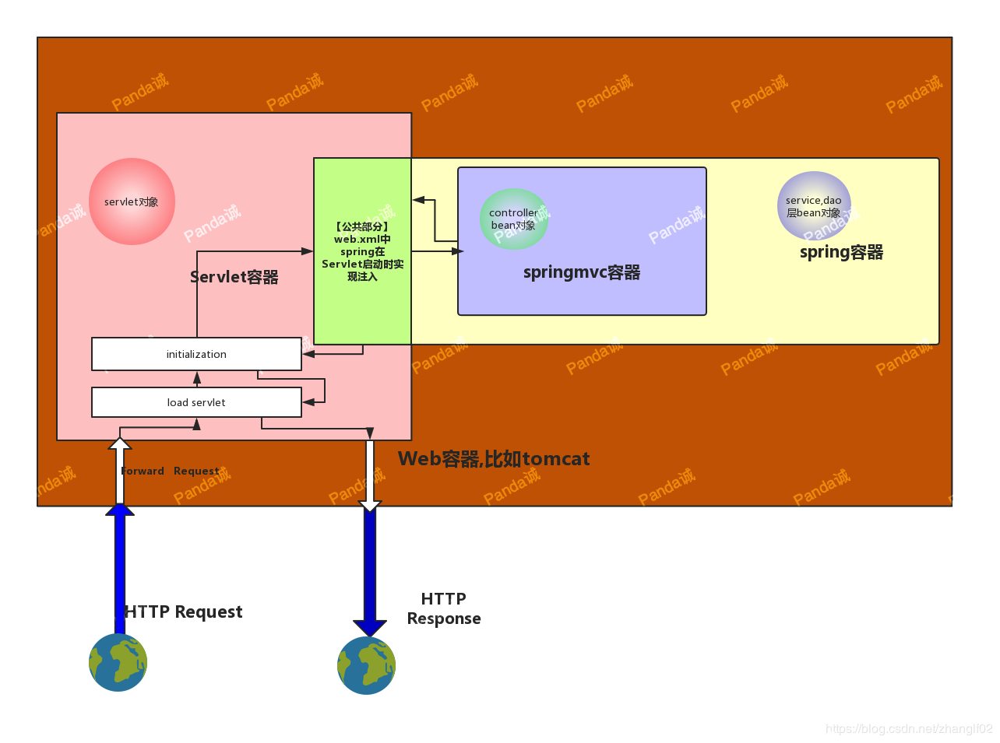
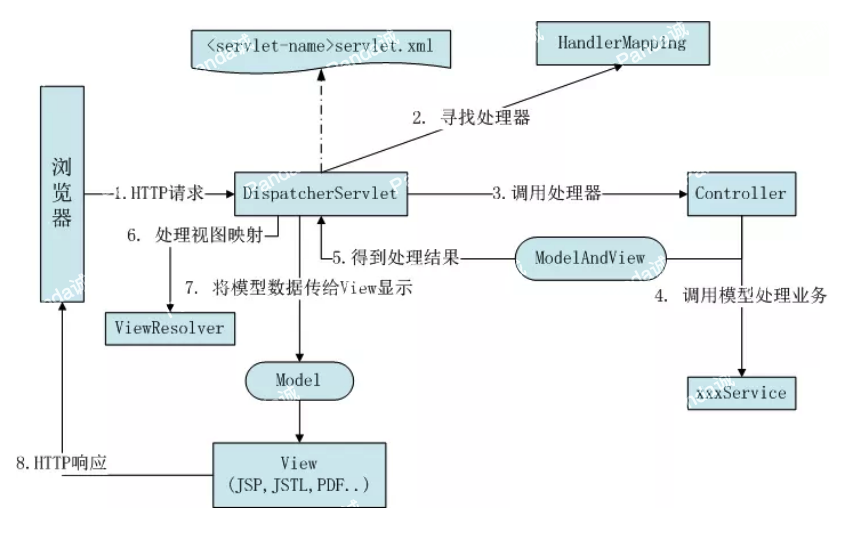
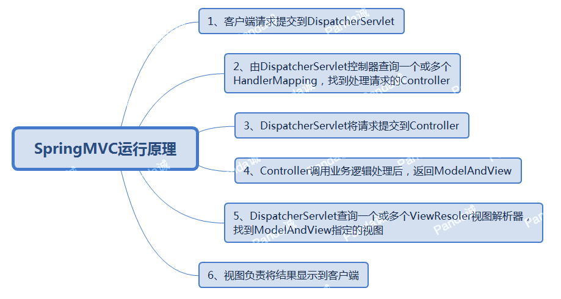

## 起因

一开始我想看Spring Boot源码并写一些学习文章，然后发现我得先看Spring的代码。接着我又编译搭建了Spring的环境并结合书籍展开了学习，但是过程中又发现了很多疑问，不把这些疑问捋顺，心里很难受。

- 怎么就使用了一个Spring-boot就起来了一个Web应用了？好，我可能自己会回答因为它内置了Tomcat/Jetty...容器的。
- 怎么仍一个war到Tomcat里，就部署起来了一个Web应用了？
- 我知道Servlet，以前大学里写过一点jsp、servlet，怎么就现在那样不用写了？
- .....

话说二战时期人们造出了计算机，为了更好用出现了操作系统、因特网，同时操作系统开始支持了单机的进程间通信，因为因特网的出现又推动支持了网络间进程通信，过程中出现了很多意义重大影响深远的协议。紧接着为了更易用，万维网出现了(HTML被发明了出来)，我们也正式开始了WEB时代，后来我们不满足静态网站，又推动着出现了动态网站(后端服务)，这时候出现了我们Java比较耳闻能熟的jsp、servlet，而之后为了更方便有了Struts、EJB等等，直到Spring全家桶。

通过百度百科等资料，以下把WEB的发展历史大概捋了一下主线，但每个阶段都有很多的内容，但我们没必要过多的深究，略过细节。

## 计算机的诞生

第一台计算机诞生于1946年，它叫ENIAC，是宾夕法尼亚大学的William Mauchley和他的学生J.Presper Eckert在二战期间建造的，`起初就是为了缩短计算弹道的时间`。

1.  第一代计算机：真空管计算机 1945年~1955年
2.  第二代计算机：晶体管和大型机 1955年~1965年
3.  第三代计算机：集成电路和小型机 1965年~1980年
4.  第四代计算机：个人计算机和移动终端 1980年~至今

## 操作系统的出现

- 1946年第一台计算机诞生--20世纪50年代中期，还未出现操作系统，计算机工作采用手工操作方式。
- 批处理系统：加载在计算机上的一个系统软件，在它的控制下，计算机能够自动地、成批地处理一个或多个用户的作业（这作业包括程序、数据和命令）。
- 多道程序系统：所谓多道程序设计技术，就是指允许多个程序同时进入内存并运行。即同时把多个程序放入内存，并允许它们交替在CPU中运行，它们共享系统中的各种硬、软件资源。当一道程序因I/O请求而暂停运行时，CPU便立即转去运行另一道程序。
- 分时系统：由于CPU速度不断提高和采用分时技术，一台计算机可同时连接多个用户终端，而每个用户可在自己的终端上联机使用计算机，好象自己独占机器一样。
- 实时系统：虽然多道批处理系统和分时系统能获得较令人满意的资源利用率和系统响应时间，但却不能满足实时控制与实时信息处理两个应用领域的需求。于是就产生了实时系统，即系统能够及时响应随机发生的外部事件，并在严格的时间范围内完成对该事件的处理。
- 通用操作系统：具有多种类型操作特征的操作系统。可以同时兼有多道批处理、分时、实时处理的功能，或其中两种以上的功能。
- ...

从上世纪60年代中期，国际上开始研制一些大型的通用操作系统。这些系统试图达到功能齐全、可适应各种应用范围和操作方式变化多端的环境的目标。但是，这些系统过于复杂和庞大，不仅付出了巨大的代价，且在解决其可靠性、可维护性和可理解性方面都遇到很大的困难。相比之下，`UNIX操作系统却是一个例外`。这是一个通用的多用户分时交互型的操作系统。它首先建立的是一个精干的核心，而其功能却足以与许多大型的操作系统相媲美，在核心层以外，可以支持庞大的软件系统。它很快得到应用和推广，并不断完善，对现代操作系统有着重大的影响。至此，操作系统的基本概念、功能、基本结构和组成都已形成并渐趋完善。

### Unix

- 1965年左右⻉尔实验室加⼊了麻省理⼯学院以及通⽤电⽓合作的计划 —— 该计划要建⽴⼀套多使⽤者(multi－user)、多任务(multi－processor)、多层次(multi－level)的 MULTICS操作系统，想让⼤型主机⽀持 300 台终端
- 1969年前后这个项⽬进度缓慢，资⾦短缺，⻉尔实验室退出了研究
- 1969年从这个项⽬中退出的 Ken Thompson 当时在实验室⽆聊时，为了让⼀台空闲的电脑上能够运⾏ "星际旅⾏（Space Travel）" 游戏，在 8 ⽉份左右趁着其妻⼦探亲的时间，⽤了 1 个⽉的时间，使⽤汇编写出了 Unix 操作系统的原型
- 1970年，美国⻉尔实验室的 Ken Thompson，以BCPL语⾔为基础，设计出很简单且很接近硬件的B语⾔（取BCPL的⾸字⺟），并且他⽤ B 语⾔ 写了第⼀个 UNIX 操作系统
- 1971 年，同样酷爱"星际旅⾏（Space Travel）"的Dennis M.Ritchie 为了能早点⼉玩上游戏，加⼊了Thompson的开发项⽬，合作开发UNIX，他的主要⼯作是改造B语⾔，因为B语⾔的跨平台性较差
- 1972 年，Dennis M.Ritchie 在B语⾔的基础上最终设计出了⼀种新的语⾔，他取了BCPL的第⼆个字⺟作为这种语⾔的名字，这就是 C 语⾔
- 1973 年初，C 语⾔的主体完成，Thompson 和 Ritchie 迫不及待地开始⽤它完全重写了现在⼤名鼎鼎的 Unix 操作系统

Unix的输入输出(IO)系统遵循Open-Read-Write-Close这样的操作范本。当一个用户进程进行IO操作之前，它需要调用Open来指定并获取待操作文件或设备读取或写入的权限。一旦IO操作对象被打开，那么这个用户进程可以对这个对象进行一次或多次的读取或写入操作。Read操作用来从IO操作对象读取数据，并将数据传递给用户进程。Write操作用来将用户进程中的数据传递（写入）到IO操作对象。 当所有的Read和Write操作结束之后，用户进程需要调用Close来通知系统其完成对IO对象的使用。

在Unix开始支持`进程间通信`（InterProcess Communication，简称IPC）时，IPC的接口就设计得类似文件IO操作接口。在Unix中，一个进程会有一套可以进行读取写入的IO描述符。IO描述符可以是文件，设备或者是通信通道（socket套接字）。一个文件描述符由三部分组成：创建（打开socket），读取写入数据（接受和发送到socket）还有销毁（关闭socket）。

在Unix系统中，BSD版本的IPC接口是作为`TCP和UDP协议之上的一层`进行实现的。消息的目的地使用socket地址来表示。一个socket地址是由网络地址和端口号组成的通信标识符。

>BSD (Berkeley Software Distribution，伯克利软件套件)是Unix的衍生系统

`进程间通信操作需要一对儿socket`。进程间通信通过在一个进程中的一个socket与另一个进程中得另一个socket进行数据传输来完成。当一个消息执行发出后，这个消息在发送端的socket中处于排队状态，直到下层的网络协议将这些消息发送出去。当消息到达接收端的socket后，其也会处于排队状态，直到接收端的进程对这条消息进行了接收处理。

### 进程间通信

`进程通信的概念最初来源于单机系统`。由于每个进程都在自己的地址范围内运行，为保证两个相互通信的进程之间既互不干扰又协调一致工作，操作系统为进程通信提供了相应设施，如UNIX BSD有：管道（pipe）、命名管道（named pipe）软中断信号（signal)。UNIX system V有：消息（message）、共享存储区（shared memory）和信号量（semaphore)等.但是他们都仅限于用在本机进程之间通信。

`网间进程通信要解决的是不同主机进程间的相互通信问题（可把同机进程通信看作是其中的特例）`。为此，首先要解决的是网间进程标识问题。同一主机上，不同进程可用进程号（process ID）唯一标识。但在网络环境下，各主机独立分配的进程号不能唯一标识该进程。例如，主机A赋于某进程号5，在B机中也可以存在5号进程，因此，“5号进程”这句话就没有意义了。 其次，操作系统支持的网络协议众多，不同协议的工作方式不同，地址格式也不同。因此，网间进程通信还要解决多重协议的识别问题。 

`其实TCP/IP协议族已经帮我们解决了这个问题`，网络层的`ip地址`可以唯一标识网络中的主机，而传输层的`协议+端口`可以唯一标识主机中的应用程序（进程）。这样利用三元组（ip地址，协议，端口）就可以标识网络的进程了，网络中的进程通信就可以利用这个标志与其它进程进行交互。

使用TCP/IP协议的应用程序通常采用应用编程接口：UNIX BSD的套接字（socket）和UNIX System V的TLI（已经被淘汰），来实现网络进程之间的通信。就目前而言，几乎所有的应用程序都是采用socket，而现在又是网络时代，网络中进程通信是无处不在，这就是为什么说`一切皆socket`。

## 因特网的出现

因特网是`Internet`的中文译名，它起源于美国的五角大楼，它的前身是美国国防部高级研究计划局（ARPA）主持研制的ARPAnet。

- 20世纪50年代末，正处于冷战时期。当时美国军方为了自己的计算机网络在受到袭击时，即使部分网络被摧毁，其余部分仍能保持通信联系，便由美国国防部的高级研究计划局（ARPA）建设了一个军用网，叫做“阿帕网”（ARPAnet）。阿帕网于1969年正式启用，当时仅连接了4台计算机，供科学家们进行计算机联网实验用，这就是因特网的前身。
- 到70年代，ARPAnet已经有了好几十个计算机网络，但是每个网络只能在网络内部的计算机之间互联通信，不同计算机网络之间仍然不能互通。为此， ARPA又设立了新的研究项目，支持学术界和工业界进行有关的研究，研究的主要内容就是想用一种新的方法将不同的计算机局域网互联，形成“互联网”。`研究人员称之为“internetwork”，简称“Internet”`，这个名词就一直沿用到。
- 1974年，出现了连接分组网络的协议，其中就包括了`TCP/IP——著名的网际互联协议IP和传输控制协议TCP`。这两个协议相互配合，其中，IP是基本的通信协议，TCP是帮助IP实现可靠传输的协议。
- ARPA在1982年接受了TCP/IP，选定Internet为主要的计算机通信系统，并把其它的军用计算机网络都转换到TCP/IP。1983年，ARPAnet分成两部分：一部分军用，称为MILNET；另一部分仍称ARPAnet，供民用。
- 1986年，美国国家科学基金组织（NSF）将分布在美国各地的5个为科研教育服务的超级计算机中心互联，并支持地区网络，形成NSFnet。
- 1988 年，NSFnet替代ARPAnet成为Internet的主干网。NSFnet主干网利用了在ARPAnet中已证明是非常成功的TCP/IP技术，准许各大学、政府或私人科研机构的网络加入。1989年，ARPAnet解散，Internet从军用转向民用。
- Internet的发展引起了商家的极大兴趣。1992年，美国IBM、MCI、MERIT三家公司联合组建了一个高级网络服务公司（ANS），建立了一个新的网络，叫做ANSnet，成为Internet的另一个主干网。它与NSFnet不同，NSFnet是由国家出资建立的，而ANSnet则是ANS 公司所有，从而使Internet开始走向商业化。
- 1995年4月30日，NSFnet正式宣布停止运作。而此时Internet的骨干网已经覆盖了全球91个国家，主机已超过400万台。在最近，因特网更以惊人的速度向前发展，很快就达到了的规模。因特网的产生信息资源共享的理想对于因特网产生的确切时间，存在不同说法。一些人认为，1972年ARPAnet 实 验性连网的成功标志着因特网的诞生。另一些人则将1993年所有与ARPAnet连接的网络实现向TCP/IP的转换作 为因特网产生的时间。但是无论如何，`因特网的产生不是一个孤立偶然的现象，它是人类对信息资源共享理想不断追求的一个必然结果`，因此关于因特网的起源还可以追溯到更早一些时候。

### 基本服务

最初的因特网只是为了`互联`，而随着时代的发展，出现了很多服务。

**WWW服务**

万维网(World Wide Web,简称WWW)是Internet上集文本、声音、图像、视频等多媒体信息于一身的全球信息资源网络，是Internet上的重要组成部分。浏览器(Browser)是用户通向WWW的桥梁和获取WWW信息的窗口，通过浏览器，用户可以在浩瀚的Internet海洋中漫游，搜索和浏览自己感兴趣的所有信息。

WWW的网页文件是`超文件标记语言HTML(Hyper Text Markup Language)`编写，并在`超文件传输协议HTTP(Hype Text Transmission Protocol)`支持下运行的。超文本中不仅含有文本信息，还包括图形、声音、图像、视频等多媒体信息（故超文本又称超媒体），更重要的是超文本中隐含着指向其它超文本的链接，这种链接称为超链（Hyper Links）。利用超文本，用户能轻松地从一个网页链接到其它相关内容的网页上，而不必关心这些网页分散在何处的主机中。

HTML并不是一种一般意义上的程序设计语言，它将专用的标记嵌入文档中，对一段文本的语义进行描述，经解释后产生多媒体效果，并可提供文本的超链。

还有`电子邮件服务` `文件传输服务` `远程登录服务` 等等等等...(省略其他服务)

### 协议

有关互联网的协议可以分为3层

#### 最底层
`最底层的是IP协议`，是用于报文交换网络的一种面向数据的协议，这一协议定义了数据包在网际传送时的格式。目前使用最多的是IPv4版本，这一版本中用32位定义IP地址，尽管地址总数达到43亿，但是仍然不能满足现今全球网络飞速发展的需求，因此IPv6版本应运而生。在IPv6版本中，IP地址共有128位，“几乎可以为地球上每一粒沙子分配一个IPv6地址”。IPv6目前并没有普及，许多互联网服务提供商并不支持IPv6协议的连接。但是，可以预见，将来在IPv6的帮助下，任何家用电器都有可能连入互联网。

#### 上一层

`上一层是UDP协议和TCP协议`，它们用于控制数据流的传输。UDP是一种不可靠的数据流传输协议，仅为网络层和应用层之间提供简单的接口。而TCP协议则具有高的可靠性，通过为数据报加入额外信息，并提供重发机制，它能够保证数据不丢包、没有冗余包以及保证数据报的顺序。对于一些需要高可靠性的应用，可以选择TCP协议；而相反，对于性能优先考虑的应用如流媒体等，则可以选择UDP协议。

#### 最顶层

最顶层的是一些应用层协议，这些协议定义了一些用于通用应用的数据报结构，其中包括：

- DNS：域名服务；
- FTP：服务使用的是文件传输协议；
- `HTTP：所有的Web页面服务都是使用的超级文本传输协议；`
- POP3：邮局协议；
- SMTP：简单邮件传输协议；
- Telnet：远程登陆等。
- ...

## TCP/IP

`TCP/IP（Transmission Control Protocol/Internet Protocol，传输控制协议/网际协议）是指能够在多个不同网络间实现信息传输的协议簇。`TCP/IP协议不仅仅指的是TCP 和IP两个协议，而是指一个由FTP、SMTP、TCP、UDP、IP等协议构成的协议簇， 只是因为在TCP/IP协议中TCP协议和IP协议最具代表性，所以被称为TCP/IP协议。

- 1973年，卡恩与瑟夫开发出了TCP/IP协议中最核心的两个协议：TCP协议和IP协议。
- 1974年12月，卡恩与瑟夫正式发表了TCP/IP协议并对其进行了详细的说明。同时，为了验证TCP/IP协议的可用性，使一个数据包由一端发出，在经过近10万km的旅程后到达服务端。在这次传输中，数据包没有丢失一个字节，这充分说明了TCP/IP协议的成功。
- 1983年元旦，TCP/IP协议正式替代NCP(ARPAnet采用的网络控制协议)，从此以后TCP/IP成为大部分因特网共同遵守的一种网络规则。
- 1984年，TCP/IP协议得到美国国防部的肯定，成为多数计算机共同遵守的一个标准。
- 2005年9月9日卡恩和瑟夫由于他们对于美国文化做出的卓越贡献被授予总统自由勋章。

`TCP/IP协议`是`Internet`最基本的协议,其中`应用层`的主要协议有`Http`、`Telnet`、`FTP`、`SMTP`等，是用来接收来自传输层的数据或者按不同应用要求与方式将数据传输至传输层；`传输层`的主要协议有`UDP`、`TCP`，是使用者使用平台和计算机信息网内部数据结合的通道，可以实现数据传输与数据共享；`网络层`的主要协议有`ICMP`、`IP`、`IGMP`，主要负责网络中数据包的传送等；而`网络访问层`，也叫`网路接口层`或`数据链路层`，主要协议有ARP、RARP，主要功能是提供链路管理错误检测、对不同通信媒介有关信息细节问题进行有效处理等。

### TCP/IP协议的组成

TCP/IP协议在一定程度上参考了OSI的体系结构。OSI模型共有七层，从下到上分别是`物理层、数据链路层、网络层、运输层、会话层、表示层和应用层`。但是这显然是有些复杂的，所以在TCP/IP协议中，它们被简化为了四个层次。

- `应用层、表示层、会话层`三个层次提供的服务相差不是很大，所以在TCP/IP协议中，它们被合并为`应用层`一个层次
- 由于`运输层`和`网络层`在网络协议中的地位十分重要，所以在TCP/IP协议中它们被作为独立的两个层次
- 因为数据链路层和物理层的内容相差不多，所以在TCP/IP协议中它们被归并在`网络接口层`一个层次里。只有四层体系结构的TCP/IP协议，与有七层体系结构的OSI相比要简单了不少，也正是这样，TCP/IP协议在实际的应用中效率更高，成本更低。

- 应用层：是TCP/IP协议的第一层，是直接为应用进程提供服务的。
- 运输层：作为TCP/IP协议的第二层，运输层在整个TCP/IP协议中起到了中流砥柱的作用。且在运输层中，TCP和UDP也同样起到了中流砥柱的作用。
- 网络层：网络层在TCP/IP协议中的位于第三层。在TCP/IP协议中网络层可以进行网络连接的建立和终止以及IP地址的寻找等功能。
- 网络接口层：在TCP/IP协议中，网络接口层位于第四层。由于网络接口层兼并了物理层和数据链路层所以，网络接口层既是传输数据的物理媒介，也可以为网络层提供一条准确无误的线路。

## 万维网的出现

1989年，欧洲粒子物理实验室(CERN)的蒂姆·伯纳斯一李(Tim Berners-Lee)和罗伯特·卡利奥( Robert Calliau)开始着手改进实验室的研究档案处理程序。CERN当时连入因特网已有两年时间了，但科学家想找到更好的方法在全球的高能物理研究领域交流他们的科学论文和数据。他们俩各自提出了一个超文本开发计划。

在接下来的两年，`伯纳斯一李开发出了超文本服务器程序代码`，`并使之适用于因特网`。`超文本服务器是一种储存超文本标记语言(HTML)文件的计算机，其他计算机可以连入这种服务器并读取这些HTML文件。`今天在WWW上使用的超文本服务器通常被称为WWW服务器。

超文本标记语言是附加在文本上的一套代码（标记）语言。这些代码描述了文本元素之间的关系。例如，HTML中的标记说明了哪个文本是标题元素的一部分，哪个文本是段落元素的一部分，哪个文本是项目列表元素的一部分。其中一种重要的标记类型是文本链接标记。超文本链接( hyperlink)可以指向同-HTML文件的其他位置或其他HTML文件。

读取HTML文件的方式有很多，但大部分人所用的WWW浏览器是网景公司的Navigator或微软公司的InternetExplorer。WWW浏览器是一种软件界面，它可以使用户读取或浏览HTML文件，也可以使用户利用每个文件上附加的超文本链接标记从一个HTML文件转移到另一个HTML文件。如果这些HTML文件放在连入因特网的计算机上，用户就可以利用WWW浏览器从一台计算机上的一个HTML文件移到因特网上另一台计算机上的一个HTML文件。HTML的基础是标准通用标记语言(SGML)，多年来各种机构一直用这种语言来管理大型的文档管理系统。

WWW浏览器在其图形用户界面上以一种易读的方式把HTML文件显示出来。图形用户界面是一种向用户显示程序控制功能和输m结果的显示方式。它显示图片、图符和其他图形元素，而不仅仅显示文本。现在几乎所有的个人计算机都使用了微软的Windows或Macintosh等图形用户界面。

`伯纳斯·李把他设计的超文本链接的HTML文件构成的系统称为WWW。`WWW迅速在科学研究领域普及开来，但在此领域之外，几乎没有人有可以读取HTML文件的软件。1993年，伊利诺斯大学的马克·安德列森( MarcAndreessen)领着一群学生写出了Mosaic，这是第一个可以读取HTML文件的程序，它用HTML超文本链接在因特网上的任意计算机页面之间实现自由遨游。Mosaic是第一个广泛用于个人电脑的WWW浏览器。

1994年，安德列森和伊利诺斯大学Mosaic小组的其他成员同SGI公司的詹姆斯·克拉克(JamesClark)合作成立了网景公司。公司的第一个产品，基于Mosaic的网景Navigator浏览器，立即获得极大的成功。网景公司成为有史以来发展最快的一家软件公司。看到网景公司的成功，微软也不甘示弱，随即开发出了InternetExplorer浏览器。虽然还有其他的一些WWW浏览器供应商，但目前的浏览器市场几乎为这两种产品所垄断。

WWW网站数目的增长速度甚至超过了因特网自身的发展速度。据估计，全球的WWW网站已超过亿万家，WWW文件数可能已经不计其数。每个网站都可能含有数百甚至数千个独立的WWW页面。

## Web服务器

Web服务器一般指网站服务器(站在现在的角度称那个时候的Web服务器为`HTTP 服务器`可能清晰一点)，是指驻留于因特网上某种类型计算机的程序，可以处理浏览器等Web客户端的请求并返回相应响应，也可以放置网站文件，让全世界浏览；可以放置数据文件，让全世界下载。目前最主流的三个Web服务器是`Apache`、 `Nginx` 、`IIS`。WEB服务器也称为WWW(WORLD WIDE WEB)服务器，主要功能是提供网上信息浏览服务。 WWW 是 Internet 的多媒体信息查询工具，是 Internet 上近年才发展起来的服务，也是发展最快和目前用的最广泛的服务。正是因为有了WWW工具，才使得近年来 Internet 迅速发展，且用户数量飞速增长。

1.  [应用层](https://baike.baidu.com/item/%E5%BA%94%E7%94%A8%E5%B1%82)使用[HTTP协议](https://baike.baidu.com/item/HTTP%E5%8D%8F%E8%AE%AE)。
2.  使用HTML（[标准通用标记语言](https://baike.baidu.com/item/%E6%A0%87%E5%87%86%E9%80%9A%E7%94%A8%E6%A0%87%E8%AE%B0%E8%AF%AD%E8%A8%80)下的一个应用）文档格式。
3.  浏览器使用[统一资源定位器](https://baike.baidu.com/item/%E7%BB%9F%E4%B8%80%E8%B5%84%E6%BA%90%E5%AE%9A%E4%BD%8D%E5%99%A8)（[URL](https://baike.baidu.com/item/URL)）。
4.  `安全套接字层超文本传输协议HTTPS`:为了数据传输的安全，HTTPS在HTTP的基础上加入了SSL协议，SSL依靠证书来验证服务器的身份，并为浏览器和服务器之间的通信加密。

## Web 容器

早期的 Web 应用主要用于浏览新闻等静态页面，HTTP 服务器（比如 Apache、Nginx）向浏览器返回静态 HTML，浏览器负责解析 HTML，将结果呈现给用户。

随着互联网的发展，我们已经不满足于仅仅浏览静态页面，还希望通过一些交互操作，来获取动态结果，因此也就需要一些扩展机制能够让 HTTP 服务器调用服务端程序。

`于是 Sun 公司推出了 Servlet 技术`。你可以把 Servlet 简单理解为运行在服务端的 Java 小程序，但是 Servlet 没有 main 方法，不能独立运行，因此必须把它部署到 Servlet 容器中，由容器来实例化并调用 Servlet。而 `Tomcat 和 Jetty 就是一个 Servlet 容器`。为了方便使用，它们也具有 HTTP 服务器的功能，因此 `Tomcat 或者 Jetty 就是一个“HTTP 服务器 + Servlet 容器”，我们也叫它们 Web 容器。`

## Servlet

HTTP 服务器怎么知道要调用哪个 Java 类的哪个方法呢。有一伙人就定义了一个接口，各种业务类都必须实现这个接口，这个接口就叫 `Servlet 接口`，有时我们也把实现了 Servlet 接口的业务类叫作 Servlet。还有一个问题，对于特定的请求，HTTP 服务器如何知道由哪个 Servlet 来处理呢？Servlet 又是由谁来实例化呢？显然 HTTP 服务器不适合做这个工作，否则和业务类耦合了。

于是，还是那伙人又发明了 `Servlet 容器`，`Servlet 容器`用来加载和管理业务类。`HTTP 服务器不直接跟业务类打交道，而是把请求交给 Servlet 容器去处理，Servlet 容器会将请求转发到具体的 Servlet`，如果这个 Servlet 还没创建，就加载并实例化这个 Servlet，然后调用这个 Servlet 的接口方法。因此 Servlet 接口其实是 Servlet 容器跟具体业务类之间的接口。

`Servlet 接口`和 `Servlet 容器`这一整套规范叫作 `Servlet 规范`。Tomcat 和 Jetty 都按照 Servlet 规范的要求实现了 Servlet 容器，同时它们也具有 HTTP 服务器的功能。作为 Java 程序员，如果我们要实现新的业务功能，只需要实现一个 Servlet，并把它注册到 Tomcat（Servlet 容器）中，剩下的事情就由 Tomcat 帮我们处理了。

## 工作流程

当客户请求某个资源时，浏览器按照HTTP协议组织请求信息，遵照传输协议(TCP)把请求信息发送给WEB服务器，WEB服务器统一遵照传输协议接收数据，按照HTTP协议解析请求信息，然后服务器会用一个` ServletRequest 对象`把客户的请求信息封装起来，然后调用 `Servlet 容器`的 `service 方法`，Servlet 容器拿到请求后，根据`请求的 URL 和 Servlet 的映射关系`，找到相应的 `Servlet`，如果 Servlet 还没有被加载，就用反射机制创建这个 Servlet，并调用 Servlet 的 init 方法来完成初始化，接着调用 Servlet 的 service 方法来处理请求，把 ServletResponse 对象返回给 HTTP 服务器，HTTP 服务器会把响应发送给客户端。

## 目录结构

`Servlet 容器`会`实例化和调用 Servlet`，那 Servlet 是怎么注册到 Servlet 容器中的呢？一般来说，我们是以 Web 应用程序的方式来部署 Servlet 的，而根据` Servlet 规范`，Web 应用程序有一定的目录结构，在这个目录下分别放置了 Servlet 的类文件、配置文件以及静态资源，Servlet 容器通过读取配置文件，就能找到并加载 Servlet。Web 应用的目录结构大概是下面这样的：

```properties

| -  MyWebApp
      | -  WEB-INF/web.xml        -- 配置文件，用来配置Servlet等
      | -  WEB-INF/lib/           -- 存放Web应用所需各种JAR包
      | -  WEB-INF/classes/       -- 存放你的应用类，比如Servlet类
      | -  META-INF/              -- 目录存放工程的一些信息
```

Servlet 规范里定义了 `ServletContext` 这个接口来对应一个 Web 应用。Web 应用部署好后，Servlet 容器在启动时会加载 Web 应用，并为每个 Web 应用创建唯一的 `ServletContext` 对象。你可以把 `ServletContext` 看成是一个全局对象，一个 Web 应用可能有多个 Servlet，这些 Servlet 可以通过全局的 `ServletContext` 来共享数据，这些数据包括 Web 应用的初始化参数、Web 应用目录下的文件资源等。由于 `ServletContext` 持有所有 Servlet 实例，你还可以通过它来实现 Servlet 请求的转发。

## spring mvc

>很遗憾，我没有学过用过Struts、EJB和早期的Spring什么的，所以从jsp+servlet直接跳到Spring 4+了。

虽然现在几乎没人使用jsp、servlet，但是我们大概会有印象怎么在XML文件中去配置`请求的 URL 和 Servlet 的映射关系`。但是等到我们使用Spring的时候，我们就基本告别在xml中去配置servlet跟URL的映射关系了。

通过一张图片，我们就可以看到Spring MVC 是怎么跟Servlet容器挂钩的。



通过上面的图我们看到Spring MVC容器把那些Controller bean注入到了Servlet容器了，那么在Servlet容器接收到一个请求，这个请求是如何找到对应的那个Controller呢？(我们现在常常写的用注解标注的`@RestController @RequestMapping @GetMapping`等等)我们通过两张图来简单看一下。





通过上面的两张图我们看到，刚才那个疑问的答案就是`DispatcherServlet了`，当然，我们现在都使用前后端分离，没有JSP或其他服务器端模板引擎，只是在HTTP上传输的JSON交互，那么就更简单了，使用@RestController等等注解就可以了。

## 最后

其实在写这篇文章的过程中，有了一些或者加深了一些体会，我自己的性格就比较`落地`的，比如说Spring有什么什么功能，按我的性格是最好追根究底，找到那行代码！但其实有时候是比较浪费时间的，这也是为什么很多教材、教学视频带领我们看Spring源码的时候重点强调去看那几个`核心接口`。有的时候，我们其实掌握了那几个`接口`、`协议`、`规范`就足够了。(当然，有的时候还是要落地的，这里只是针对我有时候转牛角尖过于纠结代码浪费时间的反思)

从Spring 5开始，大量引入了Reactive概念，也就是响应式思想，现在有了一个与Spring MVC并列同时存在的新的编程模型，Spring WebFlux。但我才疏学浅，还未涉猎，而Spring Boot的话，一是因为大家用的都很多了很熟了，二是我的好奇我的疑问都是基于我要看Spring Framework的文档、源码产生的，我觉得以上已经满足了我的好奇心了，所以，就到这吧。

这下感觉舒坦了，可以继续手撕Spring官方文档了和学习Spring源码了，到时也会把自己记录下来的官方文档文档中文版PDF分享给大家。


- https://blog.csdn.net/zhanglf02/article/details/89791797
- https://baike.baidu.com
- https://www.cnblogs.com/randysun/p/11203000.html
- https://www.cnblogs.com/dubo-/p/5675151.html
- https://cloud.tencent.com/developer/article/1053142


