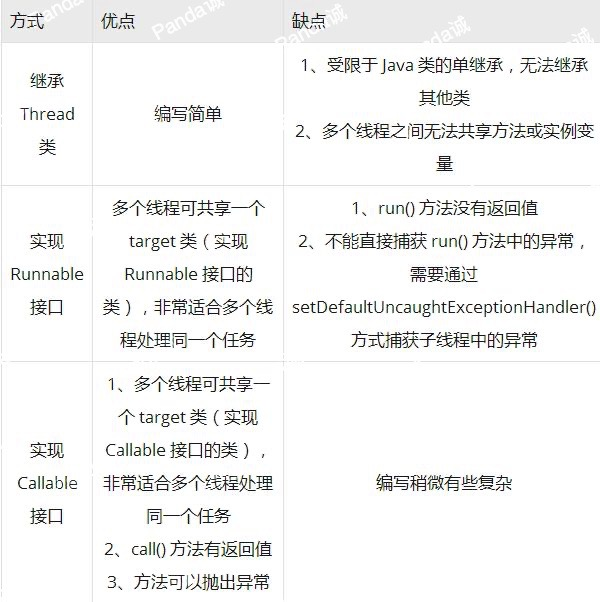
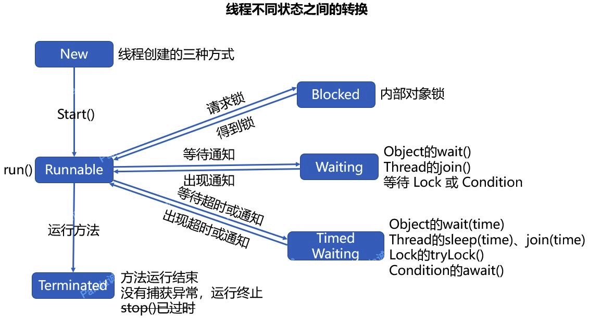
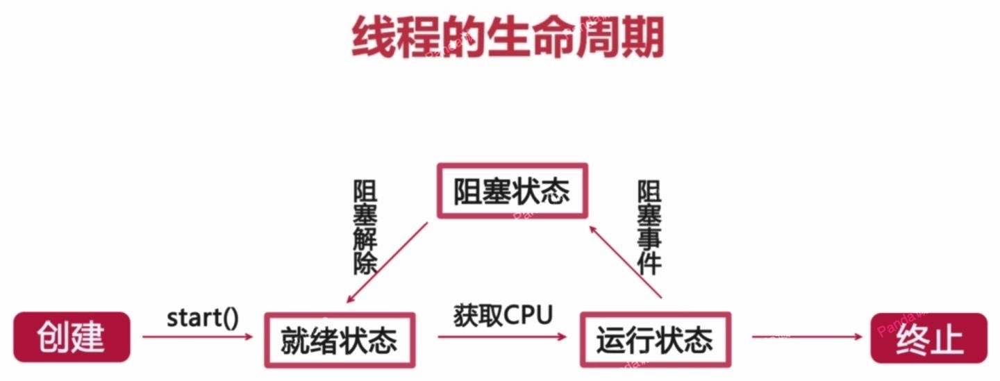

## 基础概念

**并发**：在**一段时间**内多个任务同时执行，或者说是在一段很短的时间内可以执行多条程序指令，微观上看起来好像是可以同时运行多个进程，**单核处理器**就可以做到。

**并行**：在**同一时刻**多个任务同时执行，或者说是在同一时刻可以执行多条程序指令，**多核处理器**才可以做到。

**单核处理器**：顾名思义处理器只有一个逻辑核心，单核处理器并不是一个长久以来存在的概念，在近年来多核心处理器逐步普及之后，单核心的处理器为了与双核和四核对应而提出。要说明的一点是，目前大多数的操作系统教材中的单处理器都是指的单核处理器。

>对于单核单处理器（CPU）的，为了运行所有这些线程，操作系统为每个独立线程安排一些CPU时间，操作系统以轮换方式向线程提供时间片，这就给人一种假象，好象这些线程都在同时运行。由此可见，如果两个非常活跃的线程为了抢夺对CPU的控制权，在线程切换时会消耗很多的CPU资源，反而会降低系统的性能。

**多核处理器**：多核是指一个CPU有多个核心处理器，处理器之间通过CPU内部总线进行通讯。

**多CPU**：多CPU是指简单的多个CPU工作在同一个系统上，多个CPU之间的通讯是通过主板上的总线进行的。

**进程**：进程是程序的一次执行过程，是系统运行程序的基本单位，打开 Windows 的任务管理器就可以看到很多进程。

**线程**：线程与进程相似，但线程是一个比进程更小的执行单位，一个进程在其执行的过程中可能产生多个线程。

>进程和线程都是操作系统的概念。进程是应用程序的执行实例，每个进程是由私有的虚拟地址空间、代码、数据和其它各种系统资源组成，即进程是操作系统进行资源分配的最小单元。进程在运行过程中创建的资源随着进程的终止而被销毁，所使用的系统资源在进程终止时被释放或关闭。
>线程是进程内部的一个执行单元。系统创建好进程后，实际上就启动执行了该进程的主执行线程**，主执行线程以函数地址形式，比如说main或WinMain函数，将程序的启动点提供给Windows系统。主执行线程终止了，进程也就随之终止。

**多进程**：每个进程都拥有自己独立的资源，多个进程可在单核处理器上并发执行，在多核处理器上并行执行。

**多线程**：一个进程可由多个线程组成，多个线程共享进程内资源，多个线程可在单核处理器上并发执行，在多核处理器并行执行。

**超线程技术**：CPU有个超线程的概念，是有对应实体的，是在一个核心同时运行两个物理线程。大致是有一个运算单元配合两套逻辑处理单元，寄存器等，有时候会出现某个线程仅需要其中一部分资源时，可以使两个线程并行执行。但是这个核心上的两个线程恰巧用到了只有一套的部分（比如某个处理单元），那么就得有一个等待。所以超线程大部分应用只能提供大概5-15%的性能提升，和任务相关。所以会有像2核2线程的i3，或者4核8线程的i7这种区别。主要还是靠核心，任务一定是运行在实际处理单元上的。

>在多核处理器上，并发和并行同时存在，处理器上的每个核同一时刻同时执行多个任务，每个核在很短的时间段内又同时执行多个任务，对多任务粗略划分是多个进程，对进程划分可能又是多个线程。同一时刻，处理器的每个核只能运行一个进程中的一个线程中的一条指令（Intel 的超线程技术，如双核四线程，四核八线程，处理器的线程（硬件上）和进程中的线程（软件上）不是一个概念，这个所谓的超线程技术也并不能达到真正的多核效果，只是提高了处理器的吞吐量核利用率）。

>进程和线程都是提高程序并发性和系统性能的手段，但并不是说进程越多或线程越多，性能越高，还要结合硬件设备和操作系统来看。CPU利用率100%，和程序最高运行效率是有区别的，合理安排不同线程，才能即充分利用CPU资源，又提高效率。不恰当的比喻就是，你一个线程弄个空的while循环，它肯定能占满一个核心，但是程序效率并没有提升。

## 创建线程的三种方式

* 继承 Thread 类，覆写父类中的 run() 方法，新线程类创建线程
* 实现 Runnable 接口，实现接口中的 run() 方法，Thread 类创建线程
* 实现 Callable 接口，FutureTask 类构造创建方法体，Thread 类创建线程

## 线程的六种状态

Thread.State 枚举类中的定义

* NEW：还没开始运行的线程处于这种状态
* RUNNABLE：在 Java 虚拟机中可运行的线程（正在运行也可能没在运行）处于这种状态
* BLOCKED：被阻塞而等待监视锁的线程处于这种状态
* WAITING：无限期的等待另一个线程执行特定方法的线程处于这种状态
* TIMED_WAITING：在指定等待时间内等待另一个线程执行特定的方法的线程处于这种状态
* TERMINATED：已经退出（运行结束）的线程处于这种状态

## 线程的生命周期

## 线程的分类

- 非守护线程：主线程的结束不影响线程的执行的线程，也叫用户线程。

- 守护线程：后台线程，运行在后台为其他线程提供服务，如果所有的前台线程都死亡，后台线程也自动死亡。当整个虚拟机中只剩下后台线程，虚拟机也没有继续运行的必要了，虚拟机也就退出了。

应用：JVM 虚拟机启动后的后台检测线程，数据库连接池中的检测线程。

最常见的守护线程：虚拟机中的垃圾回收线程，可以通过 jconsole，jvisualvm 等工具查看。

## 线程中的常用方法说明

* start()：  
    在使用 new 关键字创建一个线程后（New 状态），并不表现出任何的线程活动状态（非 New、Terminated 状态，可以使用 isAlive 方法检测线程的活动状态），CPU 也不会执行线程中的代码。  
    只有在 start() 方法执行后，才表示这个线程可运行了（Runnable 状态），至于何时真正运行还要看线程调度器的调度。  
    在线程死亡后，不要再次调用 start() 方法。只能对新建状态的线程调用且只能调用一次 start() 方法，否则将抛出 IllegalThreadStateException 异常。
* run()：  
    启动线程是 start() 方法，而不是 run() 方法。  
    如果直接调用 run() 方法，这个线程中的代码会被立即执行，多个线程就无法并发执行了。
* join()：  
    等待该线程完成的方法，其他线程将进入等待状态（Waiting 状态），通常由使用线程的程序（线程）调用，如将一个大问题分割为许多小问题，要等待所有的小问题处理后，再进行下一步操作。
* sleep()：  
    主动放弃占用的处理器资源，该线程进入阻塞状态（Blocked 状态），指定的睡眠时间超时后，线程进入就绪状态（Runnable），等待线程调度器的调用。
* yield()：  
    主动放弃占用的处理器资源，线程直接进入就绪状态（Runnable），等待线程调度器的调用。  
    可能的情况是当线程使用 yield 方法放弃执行后，线程调度器又将该线程调度执行。
* interrupt()：  
    没有任何强制线程终止的方法，这个方法只是请求线程终止，而实际上线程并不一定会终止，在调用 sleep() 方法时可能会出现 InterruptedException 异常，你可能会想在异常捕获后（try-catch语句中的catch）请求线程终止，而更好的选择是不处理这个异常，抛给调用者处理，所以这个方法并没有实际的用途，还有 isInterrupted() 方法检查线程是否被中断。
* setDaemon()：  
    设置守护进程，该方法必须在 start() 方法之前调用，判断一个线程是不是守护线程，可以使用 isDaemon() 方法判断。
* setPriority()：  
    设置线程的优先级，理论上来说，线程优先级高的线程更容易被执行，但也要结合具体的系统。  
    每个线程默认的优先级和父线程（如 main 线程、普通优先级）的优先级相同，线程优先级区间为 1~10，三个静态变量：MIN_PRIORITY = 1、NORM_PRIORITY = 5、MAX_PRIORITY = 10。  
    使用 getPriority() 方法可以查看线程的优先级。
* isAlive()：  
    检查线程是否处于活动状态，如果线程处于就绪、运行、阻塞状态，方法返回 true，如果线程处于新建和死亡状态，方法返回 false。

参考：

- https://www.jianshu.com/p/0917b5109ecf
- https://zhuanlan.zhihu.com/p/52657152
- https://www.zhihu.com/question/269329998
