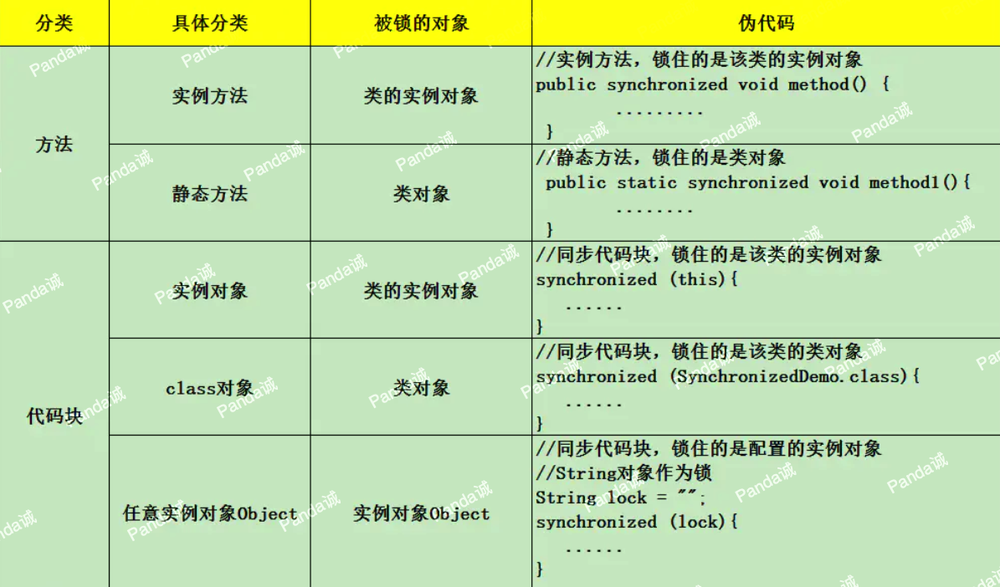

## synchronized简介

在学习知识前，我们先来看一个现象：

```java
public class SynchronizedDemo implements Runnable {
    private static int count = 0;

    public static void main(String[] args) {
        for (int i = 0; i < 10; i++) {
            Thread thread = new Thread(new SynchronizedDemo());
            thread.start();
        }
        try {
            Thread.sleep(500);
        } catch (InterruptedException e) {
            e.printStackTrace();
        }
        System.out.println("result: " + count);
    }

    @Override
    public void run() {
        for (int i = 0; i < 1000000; i++)
            count++;
    }
}
```
开启了10个线程，每个线程都累加了1000000次，如果结果正确的话自然而然总数就应该是10 * 1000000 = 10000000。可就运行多次结果都不是这个数，而且每次运行结果都不一样。这是为什么了？有什么解决方案了？这就是我们今天要聊的事情。

在另一篇博文中我们已经了解了[Java内存模型原理](./Java内存模型原理.md)的一些知识，并且已经知道出现线程安全的主要来源于JMM的设计，主要集中在**主内存和线程的工作内存**而导致的**内存可见性问题**，以及**重排序导致的问题**，进一步知道了**happens-before规则**。线程运行时拥有自己的栈空间，会在自己的栈空间运行，如果多线程间没有共享的数据也就是说多线程间并没有协作完成一件事情，那么，多线程就不能发挥优势，不能带来巨大的价值。那么共享数据的线程安全问题怎样处理？很自然而然的想法就是每一个线程依次去读写这个共享变量，这样就不会有任何数据安全的问题，因为每个线程所操作的都是当前最新的版本数据。那么，在java关键字synchronized就具有使每个线程依次排队操作共享变量的功能。很显然，这种同步机制效率很低，但synchronized是其他并发容器实现的基础，对它的理解也会大大提升对并发编程的感觉，从功利的角度来说，这也是面试高频的考点。好了，下面，就来具体说说这个关键字。

## 一、synchronized的特性

**1.1 原子性**

**所谓原子性就是指一个操作或者多个操作，要么全部执行并且执行的过程不会被任何因素打断，要么就都不执行。**

在Java中，对基本数据类型的变量的读取和赋值操作是原子性操作，即这些操作是不可被中断的，要么执行，要么不执行。但是像i++、i+=1等操作字符就不是原子性的，它们是分成**读取、计算、赋值**几步操作，原值在这些步骤还没完成时就可能已经被赋值了，那么最后赋值写入的数据就是脏数据，无法保证原子性。

被synchronized修饰的类或对象的所有操作都是原子的，因为在执行操作之前必须先获得类或对象的锁，直到执行完才能释放，这中间的过程无法被中断（除了已经废弃的stop()方法），即保证了原子性。

**注意！面试时经常会问比较synchronized和volatile，它们俩特性上最大的区别就在于原子性，volatile不具备原子性。**

**1.2 可见性**

**可见性是指多个线程访问一个资源时，该资源的状态、值信息等对于其他线程都是可见的。**

synchronized和volatile都具有可见性，其中synchronized对一个类或对象加锁时，一个线程如果要访问该类或对象必须先获得它的锁，而这个锁的状态对于其他任何线程都是可见的，并且在释放锁之前会将对变量的修改刷新到主存当中，保证资源变量的可见性，如果某个线程占用了该锁，其他线程就必须在锁池中等待锁的释放。

而volatile的实现类似，被volatile修饰的变量，每当值需要修改时都会立即更新主存，主存是共享的，所有线程可见，所以确保了其他线程读取到的变量永远是最新值，保证可见性。

**1.3 有序性**

**有序性值程序执行的顺序按照代码先后执行。**

synchronized和volatile都具有有序性，Java允许编译器和处理器对指令进行重排，但是指令重排并不会影响单线程的顺序，它影响的是多线程并发执行的顺序性。synchronized保证了每个时刻都只有一个线程访问同步代码块，也就确定了线程执行同步代码块是分先后顺序的，保证了有序性。

**1.4 可重入性**

synchronized和ReentrantLock都是可重入锁。当一个线程试图操作一个由其他线程持有的对象锁的临界资源时，将会处于阻塞状态，但当一个线程再次请求自己持有对象锁的临界资源时，这种情况属于重入锁。通俗一点讲就是说一个线程拥有了锁仍然还可以重复申请锁。

## synchronized的使用

在java代码中synchronized可以使用在代码块和方法中，根据Synchronized用的位置可以有这些使用场景：



如图，synchronized可以用在**方法**上也可以使用在**代码块**中，其中方法是实例方法和静态方法分别锁的是该类的实例对象和该类的对象。而使用在代码块中也可以分为三种，具体的可以看上面的表格。这里的需要注意的是：**如果锁的是类对象的话，尽管new多个实例对象，但他们仍然是属于同一个类依然会被锁住，即线程之间保证同步关系**。

现在我们已经知道了怎样synchronized了，看起来很简单，拥有了这个关键字就真的可以在并发编程中得心应手了吗？爱学的你，就真的不想知道synchronized底层是怎样实现了吗？

```java
public class Test {

    private int i = 0;
    private static int j = 0;
    private static final Test instance = new Test();

    //执行前获取Test实例对象锁
    public synchronized void add1(){
        i++;
    }

    //执行前获取Test类的锁
    public static synchronized void add2(){
        j++;
    }

    public void method(){
        synchronized (Test.class){
            //同步代码块 执行前获取Test类的锁
        }

        synchronized (instance){
            //同步代码块 执行前获取Test实例对象锁
        }
    }

}
```
首先我们知道被`static`修饰的静态方法、静态属性都是归类所有，同时该类的所有实例对象都可以访问。但是普通成员属性、成员方法是归实例化的对象所有，必须实例化之后才能访问，这也是为什么静态方法不能访问非静态属性的原因。我们明确了这些属性、方法归哪些所有之后就可以理解上面几个synchronized的锁到底是加给谁的了。

首先看第一个synchronized所加的方法是`add1()`，该方法没有被`static`修饰，也就是说该方法是归实例化的对象所有，那么这个锁就是加给Test类所实例化的对象。

然后是`add2()`方法，该方法是静态方法，归Test类所有，所以这个锁是加给Test类的。

最后是`method()`方法中两个同步代码块，第一个代码块所锁定的是`Test.class`，通过字面意思便知道该锁是加给Test类的，而下面那个锁定的是`instance`，这个instance是Test类的一个实例化对象，自然它所上的锁是给instance实例化对象的。

## synchronized的实现原理

synchronized有两种形式上锁，一个是对**方法上锁**，一个是构造**同步代码块**。他们的底层实现其实都一样，在进入同步代码之前先获取锁，获取到锁之后锁的计数器+1，同步代码执行完锁的计数器-1，如果获取失败就阻塞式等待锁的释放。只是他们在同步块**识别方式上有所不一样**，从class字节码文件可以表现出来，**一个是通过方法flags标志，一个是monitorenter和monitorexit指令操作**。

### 同步方法

首先来看在方法上上锁，我们就新定义一个同步方法然后进行反编译，查看其字节码：
```java
public class Test3 {

    private int i = 0;

    public synchronized void add() {
        i++;
    }
}
```
反编译
```java
public synchronized void add();
    descriptor: ()V
    flags: ACC_PUBLIC, ACC_SYNCHRONIZED
    Code:
      stack=3, locals=1, args_size=1
         0: aload_0
         1: dup
         2: getfield      #2                  // Field i:I
         5: iconst_1
         6: iadd
         7: putfield      #2                  // Field i:I
        10: return
      LineNumberTable:
        line 8: 0
        line 9: 10
      LocalVariableTable:
        Start  Length  Slot  Name   Signature
            0      11     0  this   Lorg/apache/nifi/Test3;
```
可以看到在add方法的flags里面多了一个`ACC_SYNCHRONIZED`标志，这标志用来告诉JVM这是一个同步方法，在进入该方法之前先获取相应的锁，锁的计数器加1，方法结束后计数器-1，如果获取失败就阻塞住，知道该锁被释放。

### 同步代码块

我们新定义一个同步代码块，编译出class字节码，然后找到method方法所在的指令块，可以清楚的看到其实现上锁和释放锁的过程

```java
public class Test4 {

    private static int i = 0;

    public void add() {
        i--;
        synchronized (Test4.class) {
            i++;
        }
    }
}
```
反编译
```java
public void add();
    descriptor: ()V
    flags: ACC_PUBLIC
    Code:
      stack=2, locals=3, args_size=1
         0: getstatic     #2                  // Field i:I
         3: iconst_1
         4: isub
         5: putstatic     #2                  // Field i:I
         8: ldc           #3                  // class org/apache/nifi/Test4
        10: dup
        11: astore_1
        12: monitorenter
        13: getstatic     #2                  // Field i:I
        16: iconst_1
        17: iadd
        18: putstatic     #2                  // Field i:I
        21: aload_1
        22: monitorexit
        23: goto          31
        26: astore_2
        27: aload_1
        28: monitorexit
        29: aload_2
        30: athrow
        31: return
      Exception table:
         from    to  target type
            13    23    26   any
            26    29    26   any
      LineNumberTable:
        line 8: 0
        line 9: 8
        line 10: 13
        line 11: 21
        line 12: 31
      StackMapTable: number_of_entries = 2
        frame_type = 255 /* full_frame */
          offset_delta = 26
          locals = [ class org/apache/nifi/Test4, class java/lang/Object ]
          stack = [ class java/lang/Throwable ]
        frame_type = 250 /* chop */
          offset_delta = 4
```
从反编译的同步代码块可以看到同步块是由monitorenter指令进入，然后monitorexit释放锁，在执行monitorenter之前需要尝试获取锁，如果这个对象没有被锁定，或者当前线程已经拥有了这个对象的锁，那么就把锁的计数器加1。当执行monitorexit指令时，锁的计数器也会减1。当获取锁失败时会被阻塞，一直等待锁被释放。

但是为什么会有两个monitorexit呢？其实第二个monitorexit是来处理异常的，仔细看反编译的字节码，正常情况下第一个monitorexit之后会执行`goto`指令，而该指令转向的就是23行的`return`，也就是说正常情况下只会执行第一个monitorexit释放锁，然后返回。而如果在执行中发生了异常，第二个monitorexit就起作用了，它是由编译器自动生成的，在发生异常时处理异常然后释放掉锁。

## synchronized锁的底层实现

在理解锁实现原理之前先了解一下Java的对象头和Monitor，在JVM中，对象是分成三部分存在的：对象头、实例数据、对其填充。


实例数据和对其填充与synchronized无关，这里简单说一下（我也是阅读《深入理解Java虚拟机》学到的，读者可仔细阅读该书相关章节学习）。**实例数据**存放类的属性数据信息，包括父类的属性信息，如果是数组的实例部分还包括数组的长度，这部分内存按4字节对齐；**对其填充**不是必须部分，由于虚拟机要求对象起始地址必须是8字节的整数倍，对齐填充仅仅是为了使字节对齐。

对象头是我们需要关注的重点，它是synchronized实现锁的基础，因为synchronized申请锁、上锁、释放锁都与对象头有关。对象头主要结构是由`Mark Word` 和 `Class Metadata Address`组成，**其中**`**Mark Word**`**存储对象的hashCode、锁信息或分代年龄或GC标志等信息**，`**Class Metadata Address**`**是类型指针指向对象的类元数据，JVM通过该指针确定该对象是哪个类的实例**。

锁也分不同状态，JDK6之前只有两个状态：无锁、有锁（重量级锁），而在JDK6之后对synchronized进行了优化，新增了两种状态，总共就是四个状态：**无锁状态、偏向锁、轻量级锁、重量级锁**，其中无锁就是一种状态了。锁的类型和状态在对象头`Mark Word`中都有记录，在申请锁、锁升级等过程中JVM都需要读取对象的`Mark Word`数据。

每一个锁都对应一个monitor对象，在HotSpot虚拟机中它是由ObjectMonitor实现的（C++实现）。每个对象都存在着一个monitor与之关联，对象与其monitor之间的关系有存在多种实现方式，如monitor可以与对象一起创建销毁或当线程试图获取对象锁时自动生成，但当一个monitor被某个线程持有后，它便处于锁定状态。

```cpp
ObjectMonitor() {
    _header       = NULL;
    _count        = 0;  //锁计数器
    _waiters      = 0,
    _recursions   = 0;
    _object       = NULL;
    _owner        = NULL;
    _WaitSet      = NULL; //处于wait状态的线程，会被加入到_WaitSet
    _WaitSetLock  = 0 ;
    _Responsible  = NULL ;
    _succ         = NULL ;
    _cxq          = NULL ;
    FreeNext      = NULL ;
    _EntryList    = NULL ; //处于等待锁block状态的线程，会被加入到该列表
    _SpinFreq     = 0 ;
    _SpinClock    = 0 ;
    OwnerIsThread = 0 ;
  }
```

>该段摘自：https://blog.csdn.net/javazejian/article/details/72828483
  ObjectMonitor中有两个队列_WaitSet和_EntryList，用来保存ObjectWaiter对象列表(每个等待锁的线程都会被封装ObjectWaiter对象)，_owner指向持有ObjectMonitor对象的线程，当多个线程同时访问一段同步代码时，首先会进入_EntryList 集合，当线程获取到对象的monitor 后进入 _Owner 区域并把monitor中的owner变量设置为当前线程同时monitor中的计数器count加1，若线程调用 wait() 方法，将释放当前持有的monitor，owner变量恢复为null，count自减1，同时该线程进入 WaitSe t集合中等待被唤醒。若当前线程执行完毕也将释放monitor(锁)并复位变量的值，以便其他线程进入获取monitor(锁)。
  monitor对象存在于每个Java对象的对象头中(存储的指针的指向)，synchronized锁便是通过这种方式获取锁的，也是为什么Java中任意对象可以作为锁的原因，同时也是notify/notifyAll/wait等方法存在于顶级对象Object中的原因(关于这点稍后还会进行分析)

## JVM对synchronized的优化

从最近几个jdk版本中可以看出，Java的开发团队一直在对synchronized优化，其中最大的一次优化就是在jdk6的时候，新增了两个锁状态，通过锁消除、锁粗化、自旋锁等方法使用各种场景，给synchronized性能带来了很大的提升。

### 锁膨胀

上面讲到锁有四种状态，并且会因实际情况进行膨胀升级，其膨胀方向是：**无锁——>偏向锁——>轻量级锁——>重量级锁**，并且膨胀方向不可逆。

#### 偏向锁

一句话总结它的作用：**减少统一线程获取锁的代价**。在大多数情况下，锁不存在多线程竞争，总是由同一线程多次获得，那么此时就是偏向锁。

**核心思想：**

如果一个线程获得了锁，那么锁就进入偏向模式，此时`Mark Word`的结构也就变为偏向锁结构，**当该线程再次请求锁时，无需再做任何同步操作，即获取锁的过程只需要检查**`**Mark Word**`**的锁标记位为偏向锁以及当前线程ID等于**`**Mark Word**`**的ThreadID即可**，这样就省去了大量有关锁申请的操作。

#### 轻量级锁

轻量级锁是由偏向锁升级而来，当存在第二个线程申请同一个锁对象时，偏向锁就会立即升级为轻量级锁。注意这里的第二个线程只是申请锁，不存在两个线程同时竞争锁，可以是一前一后地交替执行同步块。

#### 重量级锁

重量级锁是由轻量级锁升级而来，当**同一时间**有多个线程竞争锁时，锁就会被升级成重量级锁，此时其申请锁带来的开销也就变大。

重量级锁一般使用场景会在追求吞吐量，同步块或者同步方法执行时间较长的场景。

### 锁消除

消除锁是虚拟机另外一种锁的优化，这种优化更彻底，在JIT(just-in-time compilation即时编译)编译时，对运行上下文进行扫描，去除不可能存在竞争的锁。比如下面代码的add方法，因为object锁是私有变量，不存在所得竞争关系。

```java
public class Test4 {

    private static int i = 0;

    public void add() {
        Object object = new Object();
        synchronized (object) {
            i++;
        }
    }
    
    //针对上面的add方法，JIT时优化 去除了不必要的锁 变成了optimizedAdd
    public void optimizedAdd() {
        Object object = new Object();
        i++;
    }

}
```

### 锁粗化

锁粗化是虚拟机对另一种极端情况的优化处理，通过扩大锁的范围，**避免反复加锁和释放锁**。比如下面add方法。

```java
public class Test4 {

    private static int i = 0;

    public void add() {
        for (int j = 0; j < 10000; j++) {
            synchronized (Test4.class) {
                i++;
            }
        }
    }

    //针对上面的add方法，JIT时优化 将锁的范围扩大了 变成了optimizedAdd
    public void optimizedAdd() {
        synchronized (Test4.class) {
            for (int j = 0; j < 10000; j++) {
                i++;
            }
        }
    }

}
```

### 自旋锁与自适应自旋锁

轻量级锁失败后，虚拟机为了避免线程真实地在操作系统层面挂起，还会进行一项称为自旋锁的优化手段。

**自旋锁**：许多情况下，共享数据的锁定状态持续时间较短，切换线程不值得，通过让线程执行循环等待锁的释放，不让出CPU。如果得到锁，就顺利进入临界区。如果还不能获得锁，那就会将线程在操作系统层面挂起，这就是自旋锁的优化方式。但是它也存在缺点：如果锁被其他线程长时间占用，一直不释放CPU，会带来许多的性能开销。

**自适应自旋锁**：这种相当于是对上面自旋锁优化方式的进一步优化，它的自旋的次数不再固定，其自旋的次数由前一次在同一个锁上的自旋时间及锁的拥有者的状态来决定，这就解决了自旋锁带来的缺点。

参考：
- https://www.jianshu.com/p/d53bf830fa09
- https://cloud.tencent.com/developer/article/1465413