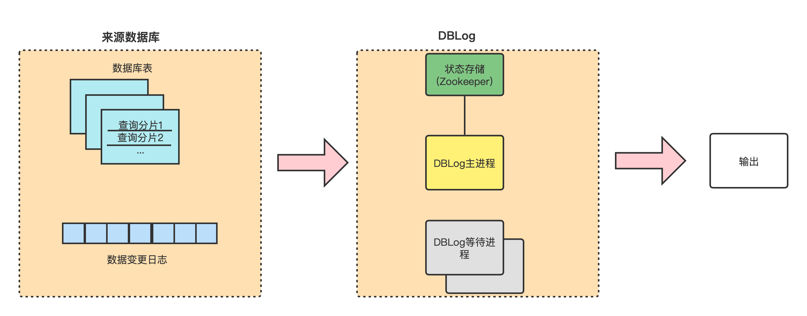
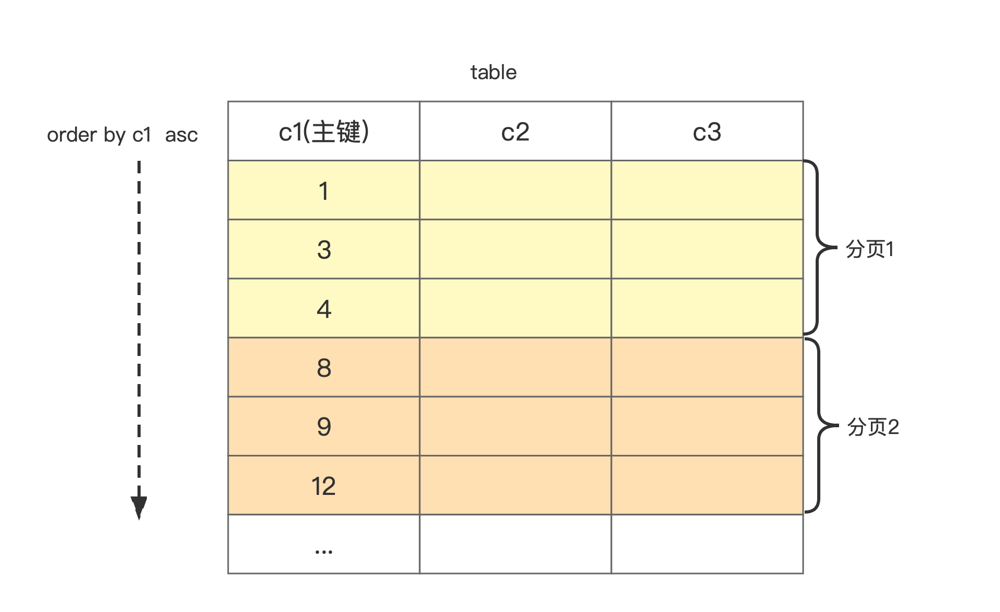
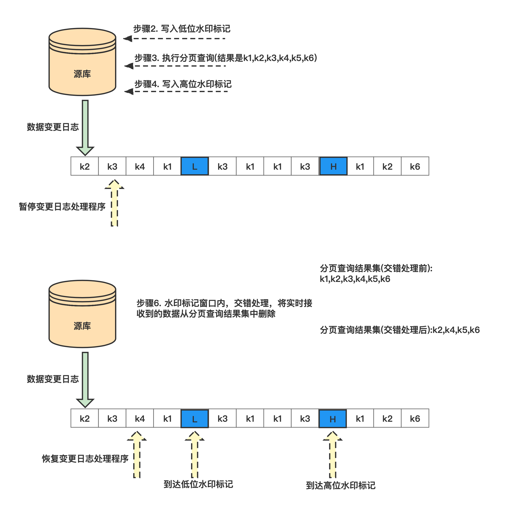

原文：[DBLog: A Watermark Based Change-Data-Capture Framework](https://arxiv.org/pdf/2010.12597v1.pdf)

## 概要

对于应用系统来说，使用不同的异构数据库来满足特定的场景需求是很常见的模式，比如说用合适的数据库来存储标准的数据或者提供高效的查询能力。因此，对于这样的应用程序而言，多个数据库之间保持同步就是非常必要的。

人们尝试了一系列的方法来解决这个同步问题，例如双写和分布式事务，然而，这些方法在可行性、稳健性和可维护性方面都存在着局限。

最近出现的一种解决方案是利用CDC框架，从数据库的事务日志中捕获数据变更的事件，并低延迟地将它们发送到下游系统。为了达到数据一致的效果，除了捕获实时的数据变更事件，还需要同步库表的全量历史数据，但事务日志通常是不包含库表完整的变更历史记录的。同时，某些应用场景下还得要求数据同步任务具有高可用性，以使数据库之间尽可能地保持数据一致。

为了解决上述问题，我们开发了一种新型CDC框架——DBLog。DBLog使用了一种基于 ==水印标记== 的方法，该方法允许我们将捕获的数据变更事件和获取的库表历史数据交错在一起处理，最终来实现捕获库表的完整状态。我们的解决方案可以在处理查询库表全量历史数据操作时，让捕获数据变更事件持续进行而不中断。可以在任意时间对所有表、特定表或表的特定主键执行查询操作，DBLog将查询操作分成若干个分页SQL来执行，并跟踪记录整体的进度，且期间允许暂停和恢复操作。基于水印标记的方法不会使用到表锁，并且对数据源的影响很小。目前，DBLog已经在Netflix生产环境的数十个微服务中投入了使用。

## 1. 简介

Netfix的数百个微服务每天在数据层面上要执行数万亿个操作。由于没有任何一类数据库可以适配满足所有的场景，所以基于不同的使用场景每个微服务都会使用不同的异构数据库。例如，一个服务可以使用MySQL、PostgreSQL、Aurora或Cassandra进行数据管理，而同时又使用Elasticsearch提供索引的能力。为了能够保持多个数据库间的数据同步，我们开发了一个叫 ==Delta== 的数据处理和同步平台，其中有个关键需求就是要求从来源数据库到目标存储的数据同步延迟要低，并且同步具有高可用。为了实现这一点，一个核心要求是要具有捕获数据变更事件的能力（CDC），它可以几乎实时地从数据库中捕获数据变更的事件，并最终将这些事件发送到下游。CDC解决了传统技术（如双写和分布式事务）中存在的挑战，在需要保持多个异构数据库同步的场景中越来越受欢迎。

在数据库系统中，事务日志一般都会定期删除，事务日志无法保证包含完整的库表变更历史记录。因此，做数据库间的数据同步还需要捕获数据库表的完整历史数据。在Netflix数据同步的实际场景中，我们确定了一些捕获库表全量历史数据的需求:

- 首先，我们希望可以随时触发全量历史数据的获取，因为我们不仅在数据同步任务初始化阶段需要全量数据获取，在随后同步任务运行态的任何时间点都可能需要。例如，从备份中恢复数据库，或者下游有数据丢失或损坏需要进行数据修复，再比如下游明确了需要修复数据的一个子集(eg带where条件的SQL查询)。
- 其次，我们需要能够在任意时间点暂停或恢复全量历史数据获取的动作，以便在同步任务重启后，不需要再从头开始捕获大表的完整状态。
- 此外，我们需要同时捕获事务日志事件和全量历史数据，而不是先执行一个操作同时阻塞住另一个操作。
- 有些场景下我们还需要数据同步任务的高可用，以便尽可能的保证低延迟地同步数据。
- 同时通过保留历史事件的顺序来防止 time-travel，避免下游数据库出现旧数据覆盖新数据的情况，因此我们还需要一个方案来完美地集成处理实时的数据变更事件和全量历史数据捕获的数据集，并将其融入平台对外提供服务。
- 此外我们要最大的减少对源数据库的影响，比如不能有锁表操作，否则对于较大流量的场景我们这个平台将很难被选择采用。
- 最后，为了平台能够支持多种关系数据库管理系统（RDMBS）（例如MySQL、PostgreSQL、Aurora等），平台的实现中我们需要避免使用到特定于某个数据库的功能。

基于这些需求，我们开发了DBLog。DBLog启动运行一个进程，利用水印标记的方法，将实时的数据变更事件与我们直接从表中查询到的数据集进行合并，最终实现获取数据库表的完整状态。我们的这个解决方案可以在不阻塞捕获处理实时的数据变更事件的同时，去执行全量历史数据的查询，并且在同步过程中的任意时间点，都可以触发对所有表或者指定表甚至特定的主键的查询。

DBLog将查询切分成多个分页SQL，并在状态存储中(目前使用的是Zookeeper)来记录跟踪查询操作的进度，这种有状态跟踪的查询方式就可以支持查询操作的暂停和恢复。此外，水印标记的方法不使用表锁，对源数据库的影响最小。无论是实时的数据变更还是全量历史数据，DBLog都会使用统一的数据格式进行输出，输出的目标可以是kafka(如果下游有多个事件的消费者，则Kafka是一个常见的选择)，也可以是数据库或者一些应用系统的API。此外，DBLog在设计时也考虑到了高可用性（HA），我们采用了 ==主动-被动架构== ，其中一个DBLog进程处于活动状态，而其余多个被动进程处于待机状态，被动进程可以在需要时转变为主动进程接管工作。这样，同步任务就会比较稳定和让人放心，源数据被更改后下游消费者就会很快地收到变更数据。



## 2. 解决方案横向比较

我们评估了一系列现有的解决方案，例如：Databus、Debezium、Maxwell、MySQLStreamer、SpinalTap和Wormhole。现有的解决方案在从事务日志中捕获数据变更事件方面都比较相似，并且利用与MySQL的binlog复制协议或PostgreSQL的复制插槽相似的底层协议和API。捕获的事件被序列化为专有的事件格式并输出到通常为Kafka的下游。像SpinalTap和Wormhole这样的解决方案仅提供实时数据变更事件的处理，没有内置获取数据库表全量历史数据的功能，在这种情况下，只能借助外部处理方式来获取库表的全量历史数据。其余的方案倒是内置了获取库表全量历史数据的能力，但各自的实现也不尽相同，下面我们来概略的了解一下:

>注：原论文发表时间较早，对于各个方案的阐述与最新实现肯定有差异，以方案各自的官方文档描述为准。

- Databus具有一个Bootstrap服务，它从源库中读取数据变更事件并将它们存储在一个单独的数据库中，下游消费者需要初始化或进行修复的时候可以访问Bootstrap服务。引导完成后，消费者开始处理来自引导之前的数据变更事件，可能有重叠的数据变更事件，但不会有事件被遗漏。这可能导致某一段时间内发生time-travel，但最终数据将是一致的。
> 博主猜测(并没有研读Databus`无限回溯`功能相关的源码和细节)，在Bootstrap服务使用的这个独立数据库中，维护的应该是库表的全量历史数据，且每行数据是带版本号的(比如scn号)，Databus在内存中维护最近的数据变更事件，消费者可以从Databus内存中获取到最新的实时数据变更，同时Databus内部也会将实时的数据变更同步到这个独立数据库中。同时每个消费者消费的位置也会被记录下来(比如scn)，如果一个消费者的数据更新大幅落后，它要的数据就不在Databus内存中了，这时就去请求Bootstrap服务，返回的将会是自消费者上次处理变更之后的所有数据变更快照。

- Debezium在获取全量历史数据会先锁表，完成全量历史数据的查询后，开始捕获实时的数据变更事件变更并同事解锁，最终达到数据同步一致的目的。
- 在Maxwell中，通过暂停对实时的数据变更事件的处理(暂存)，然后查询表的全量历史数据之后，恢复对数据变更事件的处理。这种方法容易出现time-travel，当然最终数据将是一致的。
- MySQLStreamer是在来源数据库上为每个表创建复制表，复制表使用MySQL黑洞引擎创建，以便数据插入时不占用表空间，但同时insert操作仍然可以生成binlog。然后，从原始表中分页查询数据并写入到复制表中，从而在binlog中生成了含有全量历史数据变更的记录。创建完复制表后需要锁住原表来确保数据变更事件的顺序，然后，MySQLStreamer服务消费binlog日志，并将复制表的事件转记为原始表的事件。这样，下游消费者就可以接收到库表全量完整的数据变更事件。

下面的表格记录了我们在第1节中提出的对捕获全量历史数据的需求，并在现有方案之间进行了比较。我们发现现有方案中没有一个可以满足所有的需求，一些限制是由方案设计带来的，例如暂停对实时的数据变更事件处理，同步库表全量历史数据后再予以恢复。再比如使用了特定数据库的能力（例如MySQL黑洞引擎），如此的话代码将无法通用到所有数据库CDC的实现。还有一些解决方案使用了表锁，这可能会短时间或长时间阻塞应用程序的数据写入。基于这些现况，我们决定实现一种新的方式来做实时数据同步中全量历史数据的捕获，以满足我们所有的需求。

|  | Databus | Debezium | Maxwell | MySQLStreamer | DBLog |
|--|--|--|--|--|--|
| 任意时间触发 | Yes | NO | Yes | Unknown | Yes |
| 可以停止和恢复 | Yes | NO | NO | Unknown | Yes |
| 不暂停对实时数据变更的处理 | NO | NO | NO | Yes | Yes |
| 保证数据变更事件的顺序 | NO | Yes | NO | Yes | Yes |
| 不使用表锁 | Yes | NO | Yes | NO | Yes |
| 不使用特定数据库的能力 | NO | NO | Yes | NO | Yes |

## 3. DBLog

DBLog是一个基于Java的框架，能够从数据库的事务日志中捕获数据的变更事件，也能通过对表执行查询来获取数据库表的全量历史数据。DBLog会执行库表的分页查询SQL获取数据集，获得的数据集与实时数据变更事件交错处理，避免了暂停处理实时的数据变更事件带来的长时间等待。

DBLog采用基于水印标记的方法实现了这个能力，可以在初始化任务时或者任务运行态需要修补数据时通过API触发DBLog捕获全量历史数据。如果输出是启用日志压缩的Kafka，那么下游消费者可以通过从Kafka来读取事件，Kafka将包含完整的数据集和实时的数据变更事件。对于只有一个消费者的场景，DBLog还可以直接向数据存储或API发送事件。

我们的设计尽可能地最小化了对数据库的影响。查询操作可以在需要时暂停和恢复，这对于同步任务的失败恢复和在数据库达到瓶颈时停止查询操作都是非常必要的。我们不需要表锁，避免了阻塞应用程序的数据写入。我们使用Zookeeper来存储实时数据变更事件处理和全量数据分页查询相关的进度。我们还使用Zookeeper进行leader选举，来确定活跃的主进程和其他备用进程。选择Zookeeper是因为它很成熟，它的读写延迟很低，它支持在任何需要的时候都可以线性化的读取，并且只要仲裁选举出leader就有对外部提供写入的能力了。同时我们构建DBLog时也考虑了状态存储机制的可插拔性，允许按需替换实现，例如将Zookeeper替换为其他数据存储。

以下各小节详细解释了实时数据变更事件的获取和全量历史数据的获取。

### 3.1 捕获事务日志

框架要求数据库按照commit顺序为每一行的数据变更发出一个事件，在MySQL和PostgreSQL中存在一种复制协议，在该协议中，数据库在commit时间后不久会通过TCP套接字将对应的事件传递给DBLog。这个事件可以是insert、update或delete类型。对于我们的使用场景，我们是希望一个事件包含了操作发生时对应数据的所有列值。但是，如果你只是想获取部分列的数据，也是可以使用DBLog的。我们假设每个事件上有一个日志序列号(LSN)，序列化是编码为8字节单调递增的数字，它是该事件在事务日志上的偏移量。

每个事件都被序列化为DBLog格式，并追加到输出缓冲区中，该缓冲区保存在内存中，是DBLog进程的一部分。然后，另一个线程从输出缓冲区中消费事件并按顺序将它们发送到实际的输出目标中。输出的接口设计非常简单，允许实现了接口的插件将事件发生到任务目标，例如一个流、数据存储或应用服务的API。

我们还捕获schema的更改(表结构变更)，不同数据库捕获schema更改的方式有所不同，因此日志中可能存在schema变更信息，可能在每个发出的事件中带上schema信息。由于篇幅限制，本文不讨论在DBLog中实现schema捕获的方法。

### 3.2 获取全量历史数据

事务日志通常只保留有限的时间，因此不能用它们来获取到完整的库表数据。当尝试解决这个问题时，主要的挑战是确保日志处理不会停滞，并且保留数据变更发生的顺序。此问题的一个现有解决方案是在源数据库中为每个表创建一个复制表，并从源表中分页查询写入到复制表中，复制的行将以正确的顺序出现在事务日志中。然后可以使用事务日志事件并接收全量历史数据和数据的变更。然而，这种解决方案会在源处消耗写入I/O，并需要额外的磁盘空间，当然也可以使用特定于供应商的功能来防止占用额外的表空间，例如MySQL黑洞引擎。

我们为这个问题提出了一个解决方案，只使用到了常见的数据库特性，并尽可能少地影响源数据库。我们不是实际地将行的最新状态写入事务日志，而是分页SQL从表中查询数据，并将查询到的数据集放置在内存里我们从事务日志中捕获的数据变更事件旁边，这样做可以保留日志事件的历史记录。

解决方案允许通过 API 在任何时候触发对所有表、特定表或特定主键的表的查询。查询语句是根据配置生成的分页SQL，分页SQL按升序排序主键，并含有主键大于上一个分页SQL查询到的主键最大值的where条件。为了最小化对源数据库的影响，必须使此查询高效地运行。因此，DBLog 要求数据库提供一个高效的主键范围扫描，并且我们只允许在具有主键的表上进行查询。下面的图用一个简单的例子说明了分页SQL的生成过程。



我们将每个表上一次执行分页SQL查询到的最后一行数据存储在zookeeper，基于这样的状态跟踪，我们就可以实现获取全量数据任务的暂停和恢复能力。在实时变更数据事件和全量历史数据集的交错处理过程中，我们要保证全量分页查询的数据不能覆盖掉对应主键值的实时变更数据，如此便达到了保留数据发生顺序的效果。为了实现这一点，我们使用了 ==水印标记（watermark）== 的方式，首先我们在源库创建了一张独特的`水印标记表`，通过变更这张表的唯一一行数据值(UUID)进而在事务日志中创建出了可识别的`水印标记事件`，利用这种方式我们在分页SQL查询全量数据的前后分别插入水印标志，进而保证了我们可识别出哪一阶段(窗口)的实时数据变更事件有全量历史数据查询的行为发生，然后使用下面的算法来保证数据发生顺序。

如下算法设计描述了在同步任务运行态时，程序接收到全量数据获取的命令，然后基于水印标记的方式去执行库表的分页查询，最终将交错处理后的数据发送到下游。

首先暂停对实时数据变更事件的处理(步骤1)，通过更新水印标记表来生成水印标记事件(步骤2和4)，分页SQL查询发生在两个水印标记之间(步骤3)，在写入高位置水印标记(hw)后我们恢复对实时数据变更事件的处理。将接收的实时变更输出到下游并等待低位水印标记事件的出现，而一旦接收到低位水印事件(lw)，对于接下来的数据实时变更事件，我们会按照变更事件对应主键值去删除分页查询的数据集，最后一旦我们接收到高位水印事件，我们就将现存的分页SQL查询到的数据集发送到下游，而后继续顺序的处理数据的实时变更事件。

1 暂停对实时数据变更的处理，设值两个窗口临界值 lw := uuid() hw := uuid() 
2 update水印标记表，设值为 lw
3 chunk := 分页查询表数据
4 update水印标记表，设值为 hw
5 恢复对实时数据变更的处理
6 窗口内对分页查询到的数据集和数据实时变更事件交错处理

```java
// 近似真实的伪代码，忽略了一些严格的判断逻辑
boolean inwindows = false;  // 初始化设置窗口变量 
String lw = UUID.randomUUID();
String rw = UUID.randomUUID();
Map<String, Row> chunkRowMap = null;
while(true) { // 模拟运行态，循环处理实时变更数据(重点关注实时数据和历史数据的交错处理，不去考虑整体的调度运行方式)
    // 运行态判断是否需要查询全量历史数据
    boolean fullCapture = needFullCapture();
    if (fullCapture) {
        lw = UUID.randomUUID();
        updateWaterMark(lw); // 更新水印标记表的主键值
        chunkRowMap = handleChunk(); // 分页查询一批数据，这部分操作耗时应当尽可能的短
        rw = UUID.randomUUID(); // 更新水印标记表的主键值
        updateWaterMark(rw);
    }
    Row row = nextChangeEvent(); // 获取实时变更数据，伪代码忽略空值
    if (!fullCapture) { 
        output(row); // 没有执行分页查询，直接输出
    }
    String rowPkVal = getPkValueOfRow(row); // 对应的主键值
    if (!inwindows) {
        if (!lw.equals(rowPkVal)) {
            // 当前变更事件不在水印标记窗口内，输出此数据到下游
            output(row);
        } else if (lw.equals(rowPkVal)) {
            inwindows = true;
        }
    } else {
        // 当前变更事件在水印标记的窗口内，尝试从分页查询的结果集中移除对应主键值的行数据
        if (!rw.equals(rowPkVal)) {
            if (chunkRowMap.contains(rowPkVal)) {
                chunkRowMap.remove(row);
            }
            output(row);
        }
        if (rw.equals(rowPkVal)) {
            // 窗口结束，将分页查询的结果集输出到下游
            for (Row chunkRow : chunkRowMap.values()) {
                output(row);
            }
            break;
        }
    }
}
```

步骤3分页查询历史数据需要能够在事务日志中精确地确定出一个范围，通常事务日志中不会出现关于select查询的信息(MariaDB是一个例外)，我们的核心思路是在事务日志中创建出一个 ==水印标记窗口== ，这个窗口包含了分页查询历史数据的过程。在开始分页查询前先写入一个低位的水印标记，在完成分页查询后再写入一个高位的水印标记，然后我们将这个窗口内发生的实时数据变更事件与分页查询结果集交错处理，按主键值去删除结果集中的数据，这样就保证了分页查询到的数据不会覆盖实时变更的数据，所以在实际实现中我们必须能够在事务日志中识别出窗口的水印标记，我们将这种读取方式称之为`non-stale reads`

下面这张图说明了水印标记分页查询历史数据的处理过程，假设一张表有主键k1到k6，数据变更日志中有携带者主键信息的create、update或delete事件。



需要注意的是，在水印标记窗口间可能会有大量的事务日志，比如说在窗口期间应用向数据库提交了大量的事务，因为是基于主键的分页查询，预计步骤3是耗时很少的，而步骤4会恢复对数据变更事件的处理，再考虑到一般数据库保留日志的时间，这些日志也不会丢失，所以也不需要缓存事件条目。最后接收到高位的水印标记后，分页查询的结果集就可以按顺序的输出到缓冲区中，最终传递输出出去(输出到缓冲区是非阻塞操作，另有一个单独的线程从缓冲区中将数据发送到下游)。

下图示例说明了像输出缓冲区写入事件的顺序。首先添加低位水印标记之前的数据变更事件，然后添加分页查询的数据（字体红色部分），最后是高位水印标记之后的数据变更事件。


### 3.3 数据库支持

为了使用DBLog，数据库需要按照commit顺序线性记录事务日志并可以发出事件，并支持我们方案的“non-stale reads”。MySQL、PostgreSQL、MariaDB等数据库系统都可以满足，因此DBLog可以应用到这些数据库。

到目前为止，DBLog已经支持MySQL、PostgreSQL和Aurora数据库。在这些数据库中，数据变更的日志事件都按commit顺序提供，通过read committed隔离级别可以实现`non-stale reads`。对于MySQL，我们使用实现了MySQL binlog复制协议的二进制日志连接器来获取数据变更事件。对于PostgreSQL，我们使用配置了wal2json插件的复制插槽，数据变更事件是通过PostgreSQL Java Database Connectivity（JDBC）驱动程序实现的流复制协议接收的。对于MySQL和PostgreSQL表元数据信息的捕获是不同的。在PostgreSQL中，数据变更事件本身就会包含列名和类型以及列值。而在MySQL中，数据变更事件本身不包含表元数据信息，需要初始化时查询表元数据信息和在运行态捕获表更改的binlog事件，本地维护相应的表元数据信息。

全量历史数据的捕获是通过使用 SQL 和 JDBC 进行的，只需要实现分页查询和水印标记的更新即可。实现的代码通用于 MySQL 和 PostgreSQL，并且也可用于其他支持 JDBC 的数据库。转储处理本身不依赖于 SQL 或 JDBC，并且允许集成满足 DBLog 框架要求的数据库(即使它们不是关系型数据库)。

## 4 DBLOG生产实践

DBLog 是 Netflix 公司 MySQL 和 PostgreSQL 连接器的基础。这两个连接器用于我们的数据同步和数据处理平台(Delta)。DBLog 自 2018 年以来一直在生产环境中运行，截至本文写作之时，已在 Netflix 约30个生产服务中部署运行。这些使用场景涵盖了`异构数据复制`、`数据库活动日志记录`和`schema迁移`等领域。

**异构数据复制**：为了跟踪制作，搜索所有与电影相关的数据是至关重要的。这涉及到不同的团队管理的数据，每个团队都拥有不同的业务实体，如情节、人才和交易等等。这些服务在AWSRDS中使用MySQL或PostgreSQL来存储数据。DBLog被部署到每个相关的数据存储中，并将完整的数据集和实时更改捕获到输出流中，然后，这些流被输出存储到ElasticSearch中的一个公共搜索索引中，提供跨所有相关实体的搜索。

**数据库活动日志记录**：DBLog 还用于记录数据库活动，以便可以查看数据库发生了什么样的变化。在这种情况下，捕获更改的行并将其传递到一个流中。然后，流处理器会将事件传播到 ElasticSearch（用于短期存储）和 Hive（用于长期存储）。在 ElasticSearch 中使用 Kibana 构建活动仪表板，以便团队可以检查每个表上发生的操作数量，这个可以应用到比如某个微服务更新后出现问题要回滚，此时可以用这个平台把服务更新时插入的数据逆向删除掉。

**schema迁移**：当一个团队正在将一个MySQL数据库迁移到另一个数据库，并且第二个数据库使用了新的表结构时，需要在旧数据库上部署 DBLog 来捕获全量历史数据以及实时的数据变更，并将它们写入流。然后，一个 Flink 作业消费这些数据，将数据转换为新的表结构格式，并将它们写入新数据库。这样，可以在新的schema上读取数据进行验证，而写入仍然发生在旧schema中。在随后的步骤中，数据写入也可以切换到在新模式中，而旧数据库上的读写可以停止。

## 5 结论

本文介绍了一种基于水印标记的CDC框架DBLog。DBLog不仅可以从数据库事务日志中实时提取实时的数据变更事件，还可以作为集成式产品提取数据库表的全部历史数据。此外，DBLog提供API让用户随时触发全量历史数据的获取，而不会阻塞实时事件的处理。通过分页查询表数据操作并将获取的数据集与实时变更事件交错处理，以使两者均能有进展。同时，由于基于水印标记的方法，整个流程会始终保留原始历史变更记录的顺序，而无需在源数据库上使用表锁。此外，还设置了控件，允许节流分页查询或在需要时暂停和恢复，尤其当在非常大的表上捕获全部历史数据并且失败时非常有用。DBLog旨在可以将事件传递到任何输出，无论是数据库、流还是API，DBLog的这些功能在同步多个数据系统方面开辟了新途径。

由于 Netflix 运营着数百个具有独立数据需求的微服务，DBLog 已成为 Netflix 数据同步和数据处理平台的基础。它消除了应用程序开发人员在维护多个数据存储方面的复杂性。DBLog 及其基于水印标记的方法旨在适用于 RDBMS 数据库。下一步，我们正在开发其他 CDC 框架，以支持不属于 DBLog 框架的数据库，例如 Apache Cassandra 等多主 NoSQL 数据库。目标是支持与 DBLog 类似的功能，即：随时捕获全量历史数据，与实时数据变更事件交错，并对源库的影响最小。


