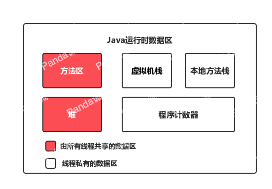
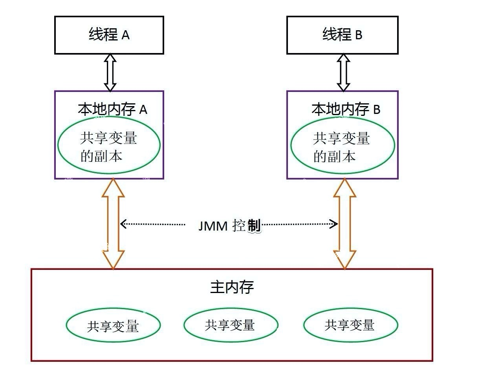

## 6.1 并发编程模型的两个关键问题

* 线程间如何通信？即：线程之间以何种机制来交换信息
* 线程间如何同步？即：线程以何种机制来控制不同线程间操作发生的相对顺序

有两种并发模型可以解决这两个问题：

* 消息传递并发模型
* 共享内存并发模型  

这两种模型之间的区别如下表所示：

**在Java中，使用的是共享内存并发模型**。

## 6.2 Java内存模型的抽象结构

### 6.2.1  运行时内存的划分

先谈一下运行时数据区，下面这张图相信大家一点都不陌生： 

对于每一个线程来说，栈都是私有的，而堆是共有的。

也就是说在栈中的变量（局部变量、方法定义参数、异常处理器参数）不会在线程之间共享，也就不会有内存可见性（下文会说到）的问题，也不受内存模型的影响。而在堆中的变量是共享的，本文称为共享变量。

所以，内存可见性是针对的**共享变量**。

### 6.2.2 既然堆是共享的，为什么在堆中会有内存不可见问题？

这是因为现代计算机为了高效，往往会在高速缓存区中缓存共享变量，因为cpu访问缓存区比访问内存要快得多。

> 线程之间的共享变量存在主内存中，每个线程都有一个私有的本地内存，存储了该线程以读、写共享变量的副本。本地内存是Java内存模型的一个抽象概念，并不真实存在。它涵盖了缓存、写缓冲区、寄存器等。

Java线程之间的通信由Java内存模型（简称JMM）控制，从抽象的角度来说，JMM定义了线程和主内存之间的抽象关系。JMM的抽象示意图如图所示：

从图中可以看出： 1. 所有的共享变量都存在主内存中。 2. 每个线程都保存了一份该线程使用到的共享变量的副本。 3. 如果线程A与线程B之间要通信的话，必须经历下面2个步骤： 1. 线程A将本地内存A中更新过的共享变量刷新到主内存中去。 2. 线程B到主内存中去读取线程A之前已经更新过的共享变量。

**所以，线程A无法直接访问线程B的工作内存，线程间通信必须经过主内存。**

注意，根据JMM的规定，**线程对共享变量的所有操作都必须在自己的本地内存中进行，不能直接从主内存中读取**。

所以线程B并不是直接去主内存中读取共享变量的值，而是先在本地内存B中找到这个共享变量，发现这个共享变量已经被更新了，然后本地内存B去主内存中读取这个共享变量的新值，并拷贝到本地内存B中，最后线程B再读取本地内存B中的新值。

那么怎么知道这个共享变量的被其他线程更新了呢？这就是JMM的功劳了，也是JMM存在的必要性之一。**JMM通过控制主内存与每个线程的本地内存之间的交互，来提供内存可见性保证**。

> Java中的volatile关键字可以保证多线程操作共享变量的可见性以及禁止指令重排序，synchronized关键字不仅保证可见性，同时也保证了原子性（互斥性）。在更底层，JMM通过内存屏障来实现内存的可见性以及禁止重排序。为了程序员的方便理解，提出了happens-before，它更加的简单易懂，从而避免了程序员为了理解内存可见性而去学习复杂的重排序规则以及这些规则的具体实现方法。这里涉及到的所有内容后面都会有专门的章节介绍。

### 6.2.3 JMM与Java内存区域划分的区别与联系

上面两小节分别提到了JMM和Java运行时内存区域的划分，这两者既有差别又有联系：

* 区别

    两者是不同的概念层次。JMM是抽象的，他是用来描述一组规则，通过这个规则来控制各个变量的访问方式，围绕原子性、有序性、可见性等展开的。而Java运行时内存的划分是具体的，是JVM运行Java程序时，必要的内存划分。

* 联系

    都存在私有数据区域和共享数据区域。一般来说，JMM中的主内存属于共享数据区域，他是包含了堆和方法区；同样，JMM中的本地内存属于私有数据区域，包含了程序计数器、本地方法栈、虚拟机栈。

**实际上，他们表达的是同一种含义，这里不做区分。**

**参考资料**

* 《Java并发编程的艺术》
* 《实战Java高并发程序设计》

